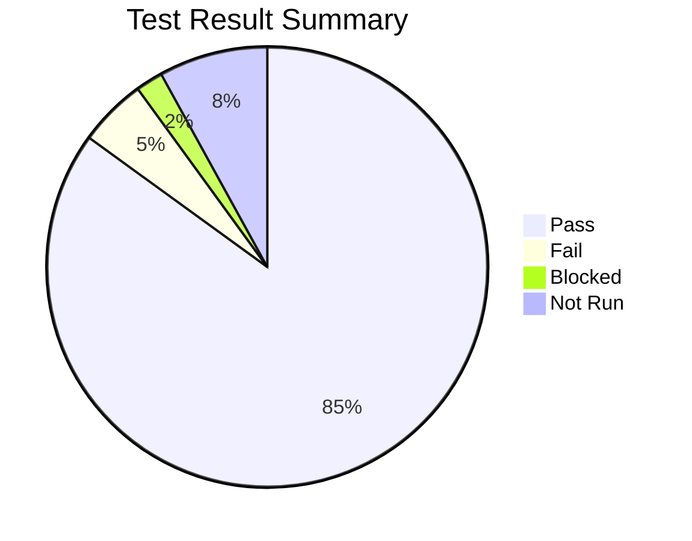

Parent: [[078.테스트_프로세스(Test_Process)]]

# 테스트 결과 보고서

> [!info] **테스트 결과 보고서란?**
> 테스트 수행 결과를 요약하고, 목표 대비 품질 달성 수준을 분석하여 시스템의 **오픈 여부(Go/No-Go)**를 결정하기 위한 최종 의사결정 지원 문서입니다. **ISO/IEC/IEEE 29119-3**에서 형식을 정의하고 있습니다.

---

## 1. 테스트 결과 보고서의 개요
### 가. 테스트 결과 보고서의 정의
- 계획된 테스트 활동의 수행 결과와 발견된 결함 현황, 그리고 잔존 리스크를 정량적으로 정리한 보고서

### 나. 작성 목적 및 필요성 (Why)
1. **의사결정 지원**: 품질 목표 달성 여부를 근거로 배포(Release) 가능 여부 판단
2. **품질 수준 가시화**: 현재 시스템의 안정성과 신뢰성을 수치로 표현하여 이해관계자에게 공유
3. **잔존 리스크 식별**: 미해결 결함이나 미실행 테스트로 인한 잠재적 위험 공유
4. **프로세스 개선**: 테스트 효율성 분석을 통해 향후 프로젝트를 위한 교훈(Lessons Learned) 도출

---

## 2. 테스트 결과 보고서의 주요 구성 요소 (What & How)
### 가. 품질 지표 시각화 (Mermaid)

### 나. 보고서 핵심 내용

| 구성 항목 | 상세 내용 | 비고 |
| :--- | :--- | :--- |
| **테스트 개요** | 테스트 범위, 기간, 인력, 환경 정보 | 계획 대비 차이점 명시 |
| **수행 현황** | 계획 대비 실행 건수, 합격/불합격 비율 | **진척률, 합격률** |
| **결함 통계** | 심각도별/모듈별 결함 수, 수정/재검토 현황 | **결함 밀도, 결함 수정률** |
| **종료 조건 평가** | 계획 시 수립한 종료 기준 달성 여부 확인 | Exit Criteria 만족 여부 |
| **종안 및 권고** | 품질 종합 평가 및 배포 가부 의견 (Go/No-Go) | 최종 인사이트 |

---

## 3. 품질 지표 분석 및 리스크 평가
### 가. 핵심 품질 지표 (Metrics)
- **테스트 통과율**: (합격 건수 / 전체 실행 건수) × 100
- **결함 밀도 (Defect Density)**: (발견된 결함 수 / 소스 코드 라인 수 또는 FP)
- **결함 수정 주기**: 결함 발견 시점부터 수정 및 확인(Confirm)까지 걸리는 시간

### 나. 잔존 리스크 분석
- **미해결 결함**: 치명적(Critical) 결함 존재 여부 및 우회 방안(Workaround) 유무
- **미수행 영역**: 일정 부족 등으로 테스트하지 못한 모듈의 위험도 평가

---

## 4. 기술사적 제언 및 실무 적용 방안
### 가. 데이터 기반의 객관적 보고
- "품질이 양호함"과 같은 주관적 표현 대신, **"요구사항 대비 테스트 커버리지 100%, 치명적 결함 잔존 0건"**과 같은 정량적 지표를 제시해야 함

### 나. 기술사적 인사이트
- **Go/No-Go 의사결정**: 보고서의 가장 중요한 목적은 의사결정임. 단순히 수치만 나열하지 말고, **"현재 품질 수준에서 오픈할 경우 예상되는 리스크와 대응 방안"**을 명확히 제시하는 컨설팅 역량이 필요함
- **대시보드 활용**: 문서 형태의 보고를 넘어, Jira/Confluence 등 ALM 도구와 연계된 실시간 품질 대시보드를 운영하여 프로젝트 내내 품질 관점의 투명성을 확보해야 함

---

## Related Notes
- [[078.테스트_프로세스(Test_Process)]]
- [[080.테스트_케이스(Test_Case)]]
- [[042.개발_방법론_테일러링(Tailoring)]]
