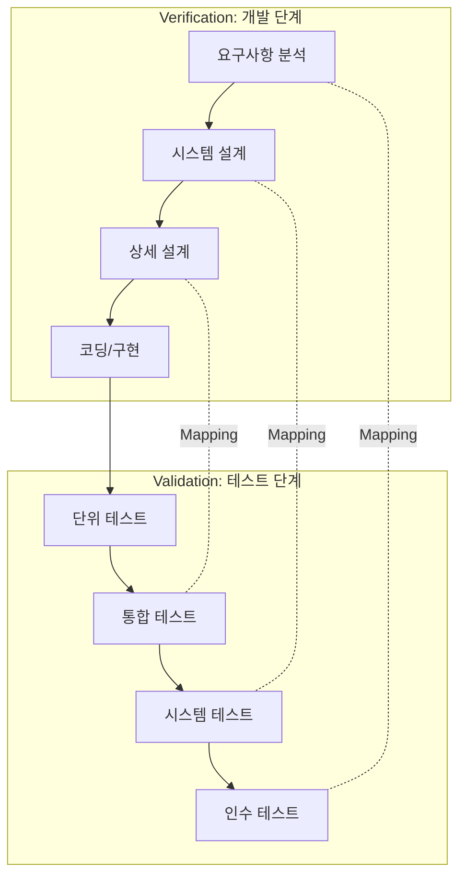

Parent: [[024.폭포수_모델(Waterfall_Model)]]

# V-모델(V-Model)

> [!info] **V-모델이란?**
> 폭포수 모델에 기반하여 **개발 단계(Development)**와 **테스트 단계(Testing)**를 1:1로 매핑하여 소프트웨어 품질을 보증하는 모델입니다. 개발의 흐름은 하향식으로, 테스트의 흐름은 상향식으로 진행되어 'V'자 형태를 띠며 **검증(Verification)**과 **확인(Validation)**을 강조합니다.

---

## 1. V-모델의 개요 및 배경
### 가. V-모델의 정의
- 소프트웨어 개발 생명주기(SDLC)의 각 단계에 대응하는 테스트 단계를 정의하여 **추적성(Traceability)**을 강화한 모델

### 나. 등장 배경 및 필요성
1. **폭포수 모델 보완**: 테스트 단계가 마지막에 집중되는 폭포수 모델의 단점을 극복하고 조기 결함 발견 유도
2. **품질 보증 강화**: 개발 단계마다 테스트 계획을 수립하여 요구사항과 설계의 오류를 조기에 식별
3. **V&V 프레임워크 제공**: 명세 중심의 검증(Verification)과 사용자 요구사항 중심의 확인(Validation) 체계 정립

---

## 2. V-모델의 아키텍처 및 매핑 메커니즘
### 가. V-모델 개념도 (Mermaid)

### 나. 개발 단계와 테스트 단계의 매핑 (Traceability Matrix)

| 개발 단계 | 테스트 단계 | 핵심 검증/확인 대상 |
| :--- | :--- | :--- |
| **요구사항 분석** | **인수 테스트** | 사용자 요구사항 충족 여부 확인 (Validation) |
| **시스템 설계** | **시스템 테스트** | 전체 시스템의 기능 및 품질 속성(성능, 보안 등) 확인 |
| **상세 설계** | **통합 테스트** | 모듈 간의 인터페이스 및 상호작용 확인 |
| **코딩 / 구현** | **단위 테스트** | 개별 모듈/컴포넌트의 내부 로직 및 알고리즘 검증 (Verification) |

---

## 3. V-모델의 심화: V&V 및 주요 특징
### 가. Verification(검증) vs Validation(확인)

| 구분 | 검증 (Verification) | 확인 (Validation) |
| :--- | :--- | :--- |
| **질문** | "Are we building the product right?" | "Are we building the right product?" |
| **관점** | 개발자/설계자 관점 (명세서 준수) | 사용자 관점 (요구사항 만족) |
| **활동** | 리뷰, 인스펙션, 워크스루, 단위 테스트 | 시스템 테스트, 인수 테스트, 시뮬레이션 |
| **목표** | 논리적 오류 제거 및 설계 정합성 확보 | 비즈니스 목적 달성 및 사용자 가치 입증 |

### 나. V-모델의 주요 특징
- **높은 가시성**: 개발과 테스트의 연관 관계가 명확하여 프로젝트 관리가 용이함
- **결함 예방**: 개발 초기 단계에서 테스트 계획을 수립하므로 설계 단계의 오류를 조기 발견 가능
- **엄격한 구조**: 각 단계가 완료되어야 다음 단계로 진행되는 순차적 모델의 특성을 가짐

---

## 4. 기술사적 제언 및 실무 적용 방안
### 가. 실무 도입 시 고려사항 (Governance)
1. **Shift-Left Testing 적용**: V-모델의 정신을 살려 테스트 설계 활동을 개발 초기 단계(요구사항 분석 시점)부터 시작하여 결함 수정 비용을 최소화해야 함
2. **RTM(요구사항 추적표) 활용**: 요구사항과 테스트 케이스 간의 매핑을 관리하여 테스트 누락을 방지하고 품질 커버리지를 확보해야 함

### 나. 기술사적 인사이트 및 향후 전망
- **Agile과의 융합**: 엄격한 V-모델은 변화에 취약하므로, 최근에는 스프린트 내에서 작은 V-모델을 반복하는 **Agile Testing** 형태로 변모하고 있음
- **Continuous V&V**: DevOps 파이프라인(CI/CD) 내에서 정적 분석(검증)과 자동화 테스트(확인)를 통합하여 실시간으로 품질을 피드백하는 구조로 발전 중
- 결론적으로 V-모델은 단순히 테스트 단계를 나열한 것이 아니라, **요구사항과 구현물 간의 정합성을 보장하는 가장 강력한 품질 거버넌스 도구**임

---

## Related Notes
- [[024.폭포수_모델(Waterfall_Model)]]
- [[075.SW_테스트_일반]]
- [[078.테스트_프로세스(Test_Process)]]
- [[082.SW_테스트_유형]]
