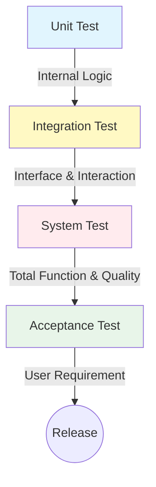

Parent: [[083.V-모델(V-Model)]]

# 테스트 단계 분류

> [!info] **테스트 단계 분류란?**
> 소프트웨어 개발 생명주기(SDLC)의 각 개발 단계에 대응하여 수행되는 테스트 활동의 계층적 분류입니다. 각 단계는 고유한 **테스트 목적, 대상, 범위**를 가지며, 하위 단계에서 상위 단계로 진행됨에 따라 검증의 범위가 넓어집니다.

---

## 1. 테스트 단계 분류의 개요
### 가. 테스트 단계 분류의 정의
- 개발 공정의 산출물과 연계하여 단위(Unit), 통합(Integration), 시스템(System), 인수(Acceptance) 단계로 체계화한 테스트 체계

### 나. 단계별 분류의 필요성 (Why)
1. **결함 조기 발견**: 개발 초기 단계(단위)부터 결함을 식별하여 수정 비용(Rework Cost) 최소화
2. **품질 가시성 확보**: 단계별 **종료 조건(Exit Criteria)**을 설정하여 프로젝트 품질 상태를 정량적으로 파악
3. **리스크 관리**: 시스템 전체의 복잡도를 단계별로 나누어 검증함으로써 통합 리스크 완화
4. **추적성(Traceability) 확보**: 요구사항부터 구현 코드까지 누락 없는 검증 체계 구축

---

## 2. 테스트 단계별 핵심 메커니즘 (What & How)
### 가. 테스트 단계별 관계도 (Mermaid)

### 나. 단계별 주요 특징 비교 분석

| 분류 | 테스트 대상 | 주요 목적 | 주체 |
| :--- | :--- | :--- | :--- |
| **단위 테스트** | 개별 모듈, 함수, 클래스 | 내부 로직 오류 발견 및 알고리즘 검증 | 개발자 |
| **통합 테스트** | 모듈 간 인터페이스, 데이터 흐름 | 컴포넌트 간 상호작용 및 인터페이스 결합 | 개발자/설계자 |
| **시스템 테스트** | 전체 시스템 (H/W + S/W) | 요구사항 충족 여부 및 품질 속성(성능 등) 검증 | 독립적 QA팀 |
| **인수 테스트** | 최종 인도 제품 | 비즈니스 목적 달성 및 사용자 만족도 확인 | 실제 사용자 |

---

## 3. 심화: 통합 테스트 및 인수 테스트의 전략
### 가. 통합 테스트 방법론
- **빅뱅 통합**: 모든 모듈을 한꺼번에 통합 (소규모 적합)
- **상향식(Bottom-up)**: 하위 모듈부터 통합. **드라이버(Driver)** 필요
- **하향식(Top-down)**: 상위 모듈부터 통합. **스텁(Stub)** 필요
- **샌드위치 통합**: 상향식과 하향식의 혼합 (중복 및 비용 발생 주의)

### 나. 인수 테스트의 유형
- **알파 테스트**: 개발자 환경에서 사용자가 수행 (통제된 환경)
- **베타 테스트**: 실제 운영 환경에서 불특정 다수 사용자가 수행 (비통제 환경)
- **규정 인수 테스트**: 법적 규제나 표준 준수 여부 확인

---

## 4. 기술사적 제언 및 실무 적용 방안
### 가. 단계별 Entry / Exit Criteria 관리
- 단순히 일정이 되었다고 다음 단계로 넘어가는 것이 아니라, **코드 커버리지 80% 달성**, **미해결 결함 0건** 등의 엄격한 **종료 조건**을 준수해야 품질 저하가 다음 단계로 전이되는 것을 방지할 수 있음

### 나. 기술사적 인사이트
- **Continuous Integration (CI)**: 최근의 현대적 개발에서는 단계별 구분을 넘어 코드 커밋 시마다 단위/통합 테스트를 자동화하여 수행하는 CI 체계가 필수임
- **Test Double 활용**: 단위 테스트의 고립성(Isolation)을 확보하기 위해 Mock, Stub, Fake 등의 **Test Double**을 적절히 활용하여 테스트 효율을 극대화해야 함
- **인수 테스트 자동화**: 사용자 시나리오 기반의 인수 테스트를 자동화(Selenium, Appium 등)하여 배포 시마다 리그레션 리스크를 최소화하는 전략이 필요함

---

## Related Notes
- [[083.V-모델(V-Model)]]
- [[075.SW_테스트_일반]]
- [[082.SW_테스트_유형]]
