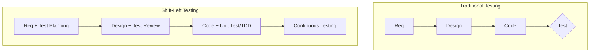

Parent: [[075.SW_테스트_일반]]

# Shift-Left Testing

> [!info] **Shift-Left Testing이란?**
> 소프트웨어 개발 생명주기(SDLC)에서 테스트 활동을 가급적 **초기 단계(왼쪽)**로 전진 배치하는 전략입니다. 요구사항 정의 및 설계 단계부터 테스트 관점을 도입하여 결함을 조기에 발견하고 수정 비용을 획기적으로 절감하는 것을 목적으로 합니다.

---

## 1. Shift-Left Testing의 개요
### 가. Shift-Left Testing의 정의
- 테스트를 개발 프로세스의 마지막 단계가 아닌, 시작 단계부터 수행하여 품질을 조기에 확보하는 품질 우선 전략

### 나. 등장 배경 및 필요성 (Why)
1. **결함 수정 비용 곡선**: 개발 후반부(운영 단계)에서 발견된 결함 수정 비용은 초기 대비 **기하급수적으로 증가**함 (Boehm의 법칙)
2. **품질 병목 현상**: 개발 완료 후에만 테스트를 수행할 경우, 결함 수정을 위한 재작업으로 인해 출시 일정 지연 발생
3. **Agile & DevOps**: 빠른 반복 주기와 지속적 배포를 위해서는 개발과 테스트의 긴밀한 통합이 필수적임

---

## 2. Shift-Left Testing의 메커니즘 및 활동 (What & How)
### 가. 전통적 테스팅 vs Shift-Left 테스팅 비교 (Mermaid)

### 나. 단계별 주요 활동

| 단계 | Shift-Left 활동 내용 | 핵심 효과 |
| :--- | :--- | :--- |
| **요구사항** | 요구사항 명세서 리뷰, 테스트 가시성 확인, 수락 기준 정의 | 모호한 요구사항 제거, 검증 가능성 확보 |
| **설계** | 아키텍처 리뷰, 품질 속성 시나리오 도출, 테스트 설계 병행 | 구조적 결함 예방, 리스크 조기 식별 |
| **구현** | **TDD(Test Driven Development)**, 정적 분석, 단위 테스트 자동화 | 코드 품질 확보, 결함 유입 원천 차단 |
| **통합** | **CI(Continuous Integration)** 연계 자동화 테스트 | 변경 사항의 즉각적 품질 피드백 |

---

## 3. Shift-Left Testing의 심화 기술 및 도구
### 가. 핵심 기술 요소
- **정적 테스트(Static Testing)**: 코드를 실행하지 않고 인스펙션, 워크스루 등을 통해 문서와 코드의 논리적 오류 식별
- **테스트 자동화(Test Automation)**: 단위 및 API 테스트를 자동화하여 개발자의 즉각적인 품질 확인 지원
- **가상화(Service Virtualization)**: 미구현된 상위/하위 시스템을 가상화하여 조기 통합 테스트 환경 구축

### 나. 기대 효과 (Benefit)
- **Time-to-Market 단축**: 재작업 최소화를 통한 전체 개발 기간 단축
- **신뢰성 향상**: 반복적인 검증을 통한 견고한 시스템 구축
- **개발 문화 개선**: "품질은 QA의 몫"이 아닌 "모두의 책임"이라는 인식 확산

---

## 4. 기술사적 제언 및 실무 적용 방안
### 가. 실무 도입 시 고려사항 (Obstacles)
1. **인식의 전환**: 개발자의 추가적인 업무 부담으로 느껴질 수 있으므로, 초기 투자(TDD 등)가 장기적으로 이익임을 설득해야 함
2. **도구 및 인프라**: 자동화 테스트를 수행할 수 있는 CI/CD 환경과 테스트베드가 선제적으로 구축되어야 함

### 나. 기술사적 인사이트
- **Zero Defect 지향**: Shift-Left는 단순히 테스트를 빨리하는 것이 아니라, 결함이 유입되지 않도록 하는 **Preventive QA**의 핵심임
- **Shift-Right와의 조화**: Left만 강조하면 운영 환경의 실전 리스크를 놓칠 수 있으므로, **Shift-Right(운영 단계 테스팅)**와 상호 보완적인 체계를 갖추는 것이 진정한 고득점 포인트임
- 결론적으로 Shift-Left는 **'품질의 내재화(Quality at Source)'**를 실현하는 소프트웨어 공학의 정수임

---

## Related Notes
- [[075.SW_테스트_일반]]
- [[054.테스트_주도_개발(TDD)]]
- [[086.Shift-Right_Testing]]
