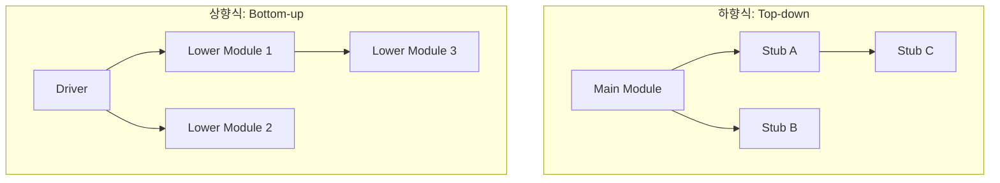

Parent: [[084.테스트_단계_분류]]

# 통합 테스트(Integration Test)

> [!info] **통합 테스트란?**
> 단위 테스트가 완료된 개별 모듈들을 결합하여, 모듈 간의 **인터페이스(Interface)** 및 **상호작용(Interaction)**이 설계된 대로 올바르게 동작하는지 검증하는 단계입니다. 소프트웨어 상세 설계 단계의 정합성을 확인하는 과정입니다.

---

## 1. 통합 테스트의 개요
### 가. 통합 테스트의 정의
- 개별적으로 검증된 소프트웨어 유닛들을 논리적인 구조에 따라 결합하여 데이터 흐름과 인터페이스의 오류를 식별하는 활동

### 나. 통합 테스트의 필요성 (Why)
1. **인터페이스 오류 발견**: 개별 모듈은 정상이나, 결합 시 발생하는 데이터 타입 불일치, 파라미터 누락 등을 식별
2. **상호작용 검증**: 모듈 간의 호출 순서, 타이밍 이슈, 전역 변수 충돌 등 동적인 문제 해결
3. **비기능적 요소 확인**: 모듈 결합 후의 전체적인 성능 저하나 자원 경합 상태를 조기 파악
4. **상세 설계 정합성**: V-모델 관점에서 상세 설계(Detail Design)가 올바르게 구현되었는지 입증

---

## 2. 통합 테스트의 주요 방법론 및 메커니즘 (What & How)
### 가. 하향식 vs 상향식 통합 메커니즘 (Mermaid)

### 나. 통합 전략별 비교 분석 (Comparison)

| 구분 | 하향식 통합 (Top-down) | 상향식 통합 (Bottom-up) |
| :--- | :--- | :--- |
| **통합 방향** | 제어 계층의 최상위에서 하위로 | 최하위 모듈에서 상위로 |
| **핵심 도구** | **스텁 (Stub)**: 하위 모듈 모킹 | **드라이버 (Driver)**: 상위 모듈 시뮬레이션 |
| **장점** | 주요 제어 로직 조기 검증, 결함 조기 발견 | 하위 모듈의 충분한 테스트 가능, 구현 순서대로 진행 |
| **단점** | 하위 모듈의 상세 기능 테스트가 늦어짐 | 상위 모듈의 인터페이스 결함 발견이 늦어짐 |
| **적용 기법** | 깊이 우선 / 너비 우선 통합 | 클러스터(Cluster) 단위 통합 |

---

## 3. 심화: 비점진적 통합 및 하이브리드 전략
### 가. 비점진적 통합: 빅뱅 테스트 (Big-bang Test)
- 모든 모듈이 개발 완료된 후 한꺼번에 통합하는 방식
- **특징**: 단기간 수행 가능하나, 결함 발생 시 원인 파악(Isolating)이 매우 어렵고 리스크가 높음 (소규모 프로젝트용)

### 나. 하이브리드 통합: 샌드위치 테스트 (Sandwich Test)
- 상위 계층은 하향식, 하위 계층은 상향식으로 동시에 통합하여 중간 계층에서 만나는 방식
- **특징**: 두 방식의 장점을 결합하여 효율을 높이지만, 관리가 복잡하고 비용이 증가할 수 있음

### 다. 지속적 통합 (Continuous Integration, CI)
- 개발자가 코드를 커밋할 때마다 자동화된 빌드와 테스트를 통해 즉각적으로 통합 결함을 식별하는 현대적 기법

---

## 4. 기술사적 제언 및 실무 적용 방안
### 가. 통합 테스트 자동화 및 효율화
1. **API 기반 테스트**: UI가 완성되기 전이라도 REST/gRPC 인터페이스에 대한 자동화된 스크립트를 통해 통합 정합성을 상시 검증해야 함
2. **가상화 서비스(Service Virtualization)**: 타 팀이 개발 중이거나 비용이 발생하는 외부 API(결제 등)를 가상화하여 테스트 대기 시간을 단축해야 함

### 나. 기술사적 인사이트
- **MSA 환경의 통합**: 모놀리식과 달리 MSA에서는 네트워크를 통한 호출이 잦으므로, 단순 통합 테스트를 넘어 **계약 기반 테스트(Consumer-Driven Contract Testing)**를 통해 서비스 간 규약 준수를 확인하는 것이 고득점 포인트임
- **Shift-Left의 실천**: 통합 테스트는 개발 완료 후의 단계가 아니라, 설계 단계에서 정의된 인터페이스 명세를 바탕으로 **테스트 케이스를 먼저 작성(TDD 관점)**하여 설계의 모순을 조기에 바로잡는 활동임
- 결론적으로 통합 테스트는 **'모듈의 합이 전체 시스템의 동작으로 이어지는 신뢰의 다리(Bridge of Trust)'** 역할을 수행해야 함

---

## Related Notes
- [[084.테스트_단계_분류]]
- [[083.V-모델(V-Model)]]
- [[085.Shift-Left_Testing]]
- [[009.Microservices_Architecture]]
