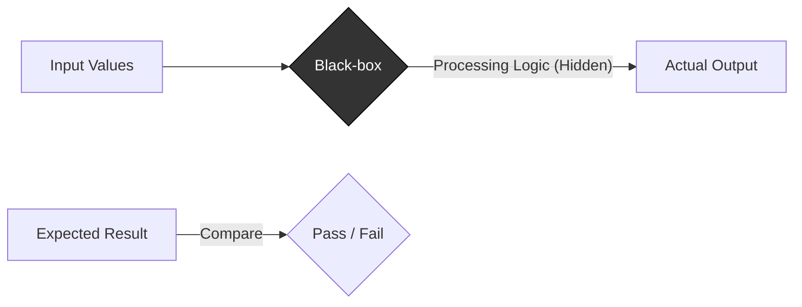

Parent: [[082.SW_테스트_유형]]

# 블랙박스 테스트(Black-box Testing)

> [!info] **블랙박스 테스트란?**
> 소프트웨어 내부 소스 코드를 보지 않고, 사용자의 관점에서 **요구사항 명세서**에 기술된 기능이 올바르게 동작하는지 검증하는 테스트 방식입니다. **입력(Input)**에 따른 **출력(Output)**의 결과가 기대값과 일치하는지를 확인하는 것이 핵심입니다.

---

## 1. 블랙박스 테스트의 개요
### 가. 블랙박스 테스트의 정의
- 프로그램 내부 구조나 구현 로직에 대한 지식 없이, 외부 인터페이스를 통해 기능을 검증하는 사양 중심의 테스트

### 나. 블랙박스 테스트의 필요성 (Why)
1. **사용자 경험(UX) 보장**: 실제 사용자가 시스템을 사용하는 방식과 가장 유사하게 결함 발견 가능
2. **요구사항 정합성**: 개발자가 명세서를 오해하여 잘못 구현한 기능(Missing Functions) 식별
3. **독립적 품질 검증**: 개발 코드에 의존하지 않으므로 코드의 변경에 상관없이 동일한 비즈니스 로직 검증 가능
4. **객관성 확보**: 개발자와 독립된 QA팀이나 실제 사용자가 수행하여 품질의 객관성 확보

---

## 2. 블랙박스 테스트의 주요 기법 (What & How)
### 가. 입력 데이터 분석 메커니즘 (Mermaid)

### 나. 블랙박스 테스트 핵심 설계 기법 (Test Design Techniques)

| 기법 | 상세 내용 | 핵심 포인트 |
| :--- | :--- | :--- |
| **동등 분할 (Equivalence Partitioning)** | 입력 범위를 유효/무효 영역으로 나누어 대표값을 선정 | 테스트 케이스 수 최소화 |
| **경계값 분석 (Boundary Value Analysis)** | 입력 조건의 경계 부근에서 결함이 많이 발생한다는 원리에 착안 | **결함 발견율이 가장 높음** |
| **결정 테이블 (Decision Table)** | 복잡한 논리적 조건과 행위를 테이블로 구성 | 누락 없는 조건 조합 검증 |
| **상태 전이 (State Transition)** | 객체의 상태 변화와 이벤트에 따른 동작 확인 | 순서와 상태가 중요한 로직 검토 |
| **오류 추정 (Error Guessing)** | 테스터의 경험과 직관으로 결함 예상 부위 선정 | 탐색적 테스트와 연계 |

---

## 3. 블랙박스 테스트 vs 화이트박스 테스트 비교
### 가. 비교 분석표 (Comparison)

| 비교 항목 | 블랙박스 테스트 (Black-box) | 화이트박스 테스트 (White-box) |
| :--- | :--- | :--- |
| **테스트 대상** | 비즈니스 요구사항, 인터페이스 | 소스 코드 내부 로직, 제어 흐름 |
| **핵심 관점** | "What it does" (무엇을 하는가?) | "How it works" (어떻게 동작하는가?) |
| **주체** | 사용자, 독립된 QA 조직 | 개발자 |
| **테스트 단계** | 주로 시스템, 인수 테스트 단계 | 주로 단위, 통합 테스트 단계 |
| **결함 유형** | 명세 누락, 데이터 오류, 비정상 동작 | 로직 결함, 무한 루프, 데드 코드 |

---

## 4. 기술사적 제언 및 실무 적용 방안
### 가. 리스크 기반의 기법 선정 (Tailoring)
- 모든 시나리오를 다 테스트할 수 없으므로, 비즈니스 영향도가 큰 부분은 **경계값 분석**과 **결정 테이블**을 병행하여 정밀하게 검증하고, 단순 기능은 **동등 분할**을 통해 효율성을 높여야 함

### 나. 기술사적 인사이트
- **Requirement-Driven**: 블랙박스 테스트의 품질은 곧 **요구사항 명세서(SRS)**의 품질에 의존함. 명세서가 모호하면 테스트도 부실해지므로, 설계 초기 단계에서 테스트 관점의 명세서 리뷰가 필수적임
- **Test Automation**: 반복적인 블랙박스 테스트는 **GUI 자동화 도구(Selenium 등)**를 활용하여 회귀 테스트 부담을 줄이고, 테스터는 고부가가치인 **탐색적 테스팅**에 집중해야 함
- 결론적으로 블랙박스 테스트는 **'기술적 구현이 아닌 사용자 가치 실현'**을 확인하는 최종 방어선임

---

## Related Notes
- [[082.SW_테스트_유형]]
- [[089.명세기반_테스트(Specification-based_Testing)]]
- [[055.요구공학(Requirements_Engineering)]]
