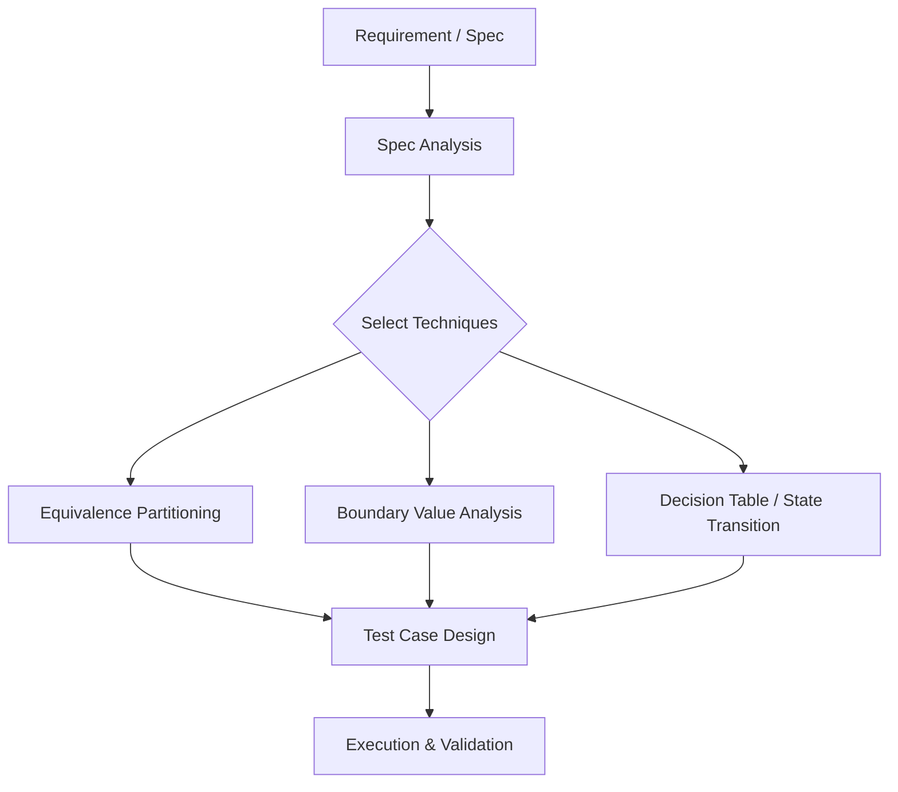

Parent: [[088.블랙박스_테스트(Black-box_Testing)]]

# 명세기반 테스트(Specification-based Testing)

> [!info] **명세기반 테스트란?**
> 소프트웨어의 내부 구조를 참조하지 않고, 주어진 **요구사항 명세서(Specification)**를 분석하여 테스트 케이스를 설계하고 검증하는 기법입니다. 블랙박스 테스트의 실질적인 구현 기법으로 분류되며, '명세(What)'에 초점을 맞춥니다.

---

## 1. 명세기반 테스트의 개요
### 가. 명세기반 테스트의 정의
- 사용자의 요구사항, 설계서, 비즈니스 규칙 등 명문화된 문서(Spec)를 근거로 테스트 시나리오를 도출하는 기법

### 나. 명세기반 테스트의 필요성 (Why)
1. **명세 결함 식별**: 테스트 케이스를 설계하는 과정에서 명세서의 모순, 누락, 모호성을 사전에 발견 가능
2. **품질 기준 확보**: "무엇을 테스트할 것인가"에 대한 명확한 기준을 문서에 근거하여 수립
3. **추적성(Traceability) 관리**: 개별 요구사항이 테스트를 통해 검증되었음을 입증 (RTM 연계 필수)
4. **구현 독립성**: 코드가 아직 작성되지 않은 상태에서도 테스트 설계를 시작할 수 있어 **Shift-Left** 실현

---

## 2. 명세기반 테스트의 핵심 기법 (What & How)
### 가. 테스트 설계 프로세스 (Mermaid)

### 나. 명세기반 주요 기법 상세 (Deep-dive)

| 기법 | 상세 메커니즘 | 적용 대상 및 사례 |
| :--- | :--- | :--- |
| **동등 분할** | 입력 범위를 대표할 수 있는 유효/무효 집합으로 구분 | 성적 입력(0~100), 월 선택(1~12) 등 |
| **경계값 분석** | 경계 영역(Min, Max, Min-1, Max+1) 위주로 테스트 | 나이 제한(19세), 비밀번호 길이 제한 등 |
| **결정 테이블** | 복잡한 비즈니스 규칙을 조건(Condition)과 행동(Action)으로 매핑 | 대출 승인 로직, 할인율 계산 규칙 등 |
| **유스케이스 테스팅** | 사용자의 실제 업무 흐름(Main/Alternative Flow) 검증 | 온라인 쇼핑 결제 프로세스 등 |

---

## 3. 명세기반 vs 구조기반 vs 경험기반 비교
### 가. 테스트 설계 기법 간의 비교 분석

| 비교 항목 | 명세기반 (Specification) | 구조기반 (Structure) | 경험기반 (Experience) |
| :--- | :--- | :--- | :--- |
| **기준 (Source)** | 요구사항 명세서, 설계서 | 소스 코드 로직, 제어 흐름 | 테스터의 지식, 직관 |
| **대표 유형** | 블랙박스 테스트 | 화이트박스 테스트 | 탐색적 테스트, 오류 추정 |
| **주요 목표** | 기능 요구사항 충족 확인 | 코드 커버리지(Coverage) 확보 | 비정형화된 특수 결함 발견 |
| **장점** | 고객 중심의 품질 보증 | 논리적 결함 발견에 탁월 | 시간 대비 결함 발견 효율성 높음 |

---

## 4. 기술사적 제언 및 실무 적용 방안
### 가. 명세기반 테스트의 한계 및 보완
- **한계**: 명세서에 없는 결함(예: 비정상적인 코드 실행 경로)은 발견하기 어려움
- **보완**: 명세기반 테스트를 기본으로 하되, 핵심 로직은 **구조기반(White-box)**으로 보완하고, 배포 직전에는 **경험기반(탐색적 테스팅)**으로 최종 방어선을 구축해야 함

### 나. 기술사적 인사이트
- **Executable Specification**: 최근에는 요구사항 명세를 그대로 테스트 코드로 변환하는 **BDD(Behavior Driven Development)** 기법을 통해 명세기반 테스트를 자동화하는 추세임
- **RTM 거버넌스**: 명세기반 테스트의 성패는 **요구사항 추적표(RTM)**의 관리 수준에 달려 있음. 모든 명세 항목이 최소 하나 이상의 테스트 케이스와 연결되어야 품질 완결성(Quality Completeness)이 확보됨
- 결론적으로 명세기반 테스트는 **'약속된 기능을 보장'**하는 가장 원칙적인 품질 활동임

---

## Related Notes
- [[088.블랙박스_테스트(Black-box_Testing)]]
- [[055.요구공학(Requirements_Engineering)]]
- [[080.테스트_케이스(Test_Case)]]
