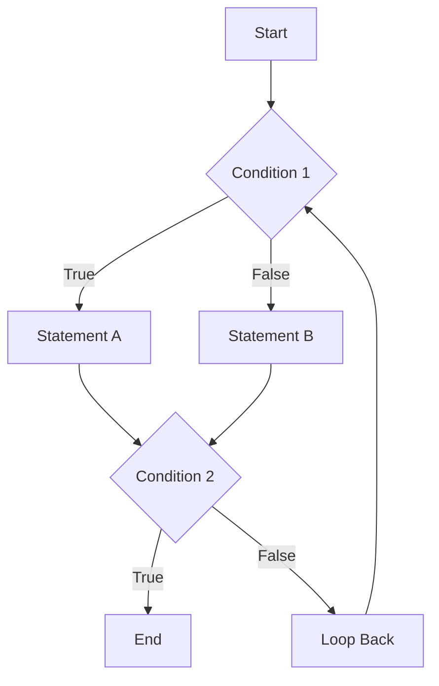

Parent: [[082.SW_테스트_유형]]

# 화이트박스 테스트(White-box Testing)

> [!info] **화이트박스 테스트란?**
> 소프트웨어의 **내부 소스 코드 구조**를 직접 확인하며 수행하는 테스트 방식입니다. 프로그램 내부의 제어 흐름(Control Flow)과 데이터 흐름(Data Flow)을 분석하여 설계된 모든 로직이 한 번 이상 실행되도록 보장하는 것이 핵심입니다.

---

## 1. 화이트박스 테스트의 개요
### 가. 화이트박스 테스트의 정의
- 프로그램의 내부 구조(로직)를 노출시킨 상태에서 코드의 모든 문장이나 조건, 결정 경로를 검증하는 테스트

### 나. 화이트박스 테스트의 필요성 (Why)
1. **로직 결함 식별**: 조건문, 반복문 등 제어 구조에서 발생할 수 있는 논리적 오류 발견
2. **코드 커버리지(Coverage) 확보**: 작성된 코드가 실제로 얼마나 테스트되었는지 정량적으로 측정
3. **불필요한 코드 제거**: 실행되지 않는 코드(Dead Code)나 도달 불가능한 경로(Unreachable Path) 식별
4. **보안성 향상**: 내부 구현상의 취약점(메모리 누수, 예외 처리 미흡 등)을 소스 수준에서 점검

---

## 2. 화이트박스 테스트의 주요 기법 및 커버리지 (What & How)
### 가. 제어 흐름 분석 메커니즘 (Mermaid)

### 나. 핵심 테스트 커버리지 (Test Coverage) 유형

| 구분 | 설명 | 핵심 포인트 |
| :--- | :--- | :--- |
| **구문 커버리지 (Statement)** | 모든 코드 라인이 최소 한 번 실행됨 | 가장 기초적인 수준 |
| **결정 커버리지 (Decision)** | 각 조건문(If 등)의 결과(T/F)가 최소 한 번씩 실행됨 | 브랜치(Branch) 커버리지 |
| **조건 커버리지 (Condition)** | 개별 조건식(A>B 등)이 각각 T/F가 되도록 실행됨 | 전체 결과와 무관하게 개별 조건 검증 |
| **변경 조건/결정 (MC/DC)** | 각 조건이 결과에 독립적으로 영향을 미치는 것을 증명 | **항공/자동차 등 고신뢰성 소프트웨어 필수** |
| **경로 커버리지 (Path)** | 프로그램 내의 가능한 모든 실행 경로를 검증 | 가장 높은 복잡도와 보장 수준 |

---

## 3. 화이트박스 테스트 vs 블랙박스 테스트 심화 비교
### 가. 비교 분석표 (Comparison)

| 비교 항목 | 화이트박스 테스트 (White-box) | 블랙박스 테스트 (Black-box) |
| :--- | :--- | :--- |
| **테스트 관점** | 개발자 관점 (Internal Logic) | 사용자 관점 (External Function) |
| **테스트 기준** | 제어 흐름도, 데이터 흐름도, 소스 코드 | 요구사항 명세서, 사용자 시나리오 |
| **주요 기법** | 구문/결정/조건/경로 커버리지 | 동등분할, 경계값분석, 결정테이블 |
| **적합 단계** | 단위 테스트, 통합 테스트 | 시스템 테스트, 인수 테스트 |
| **도구 지원** | 정적 분석 도구, 커버리지 측정 도구 | GUI 자동화 도구, 테스트 관리 도구 |

---

## 4. 기술사적 제언 및 실무 적용 방안
### 가. 적정 커버리지 수준의 결정 (Tailoring)
- 모든 경로를 100% 테스트하는 것은 비용 대비 비효율적임. 비즈니스 중요도와 리스크에 따라 핵심 모듈은 **MC/DC** 수준까지, 일반 모듈은 **결정 커버리지** 수준으로 차등 적용해야 함

### 나. 기술사적 인사이트
- **정적 분석(Static Analysis)**과의 병행: 동적 테스트(실행) 전에 정적 분석 도구(SonarQube 등)를 통해 코딩 표준 준수 여부와 잠재적 오류를 먼저 걸러내는 것이 효율적임
- **테스트 자동화와 CI/CD**: 화이트박스 테스트는 빌드 시마다 자동 수행되어야 함. **TDD**를 통해 단위 테스트 수준에서 커버리지를 상시 확보하는 체계 구축이 필수임
- 결론적으로 화이트박스 테스트는 **'소프트웨어의 내적 무결성(Inner Integrity)'**을 보장하는 가장 과학적인 검증 수단임

---

## Related Notes
- [[082.SW_테스트_유형]]
- [[091.구조기반_테스트(Structure-based_Testing)]]
- [[054.테스트_주도_개발(TDD)]]
