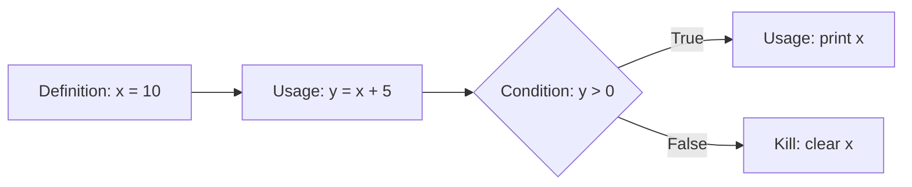

Parent: [[090.화이트박스_테스트(White-box_Testing)]]

# 구조기반 테스트(Structure-based Testing)

> [!info] **구조기반 테스트란?**
> 소프트웨어의 **내부 구현 구조(코드, 제어 흐름, 데이터 흐름)**를 분석하여 테스트 케이스를 설계하는 기법입니다. 화이트박스 테스트의 실질적인 구현 방법론으로, 코드가 얼마나 촘촘하게 테스트되었는지를 나타내는 **커버리지(Coverage)** 측정이 핵심 지표가 됩니다.

---

## 1. 구조기반 테스트의 개요
### 가. 구조기반 테스트의 정의
- 프로그램의 소스 코드나 아키텍처 구조를 바탕으로 실행 경로를 도출하고 검증하는 기법

### 나. 구조기반 테스트의 필요성 (Why)
1. **정량적 측정**: 테스트의 충분함(Adequacy)을 커버리지라는 수치로 증명 가능
2. **논리적 누락 방지**: 명세서만으로는 알 수 없는 복잡한 조건 분기나 예외 처리 경로 확인
3. **변경 영향 분석**: 코드 수정 시 영향을 받는 제어 흐름을 파악하여 회귀 테스트 범위 산정 지원
4. **고신뢰성 보장**: 미션 크리티컬 시스템(의료, 항공, 국방 등)의 안전성 입증을 위한 필수 요건

---

## 2. 구조기반 테스트의 핵심 분석 기법 (What & How)
### 가. 데이터 흐름 분석 (Data Flow Testing) 메커니즘 (Mermaid)

> [!tip] **DU-Chain(Definition-Use Chain)**: 변수가 정의된 곳부터 사용된 곳까지의 경로를 추적하여 데이터 무결성을 검증함

### 나. 주요 구조기반 설계 기법 상세

| 분류 | 기법명 | 상세 내용 |
| :--- | :--- | :--- |
| **제어 흐름 기법** | **구문 커버리지** | 모든 실행 문장을 최소 1회 실행 |
| | **결정 커버리지** | 모든 분기점의 T/F 결과를 실행 |
| | **조건 커버리지** | 개별 조건식의 T/F 결과를 실행 |
| | **MC/DC** | 다중 조건문에서 각 조건이 독립적으로 결과에 영향을 미치는지 검증 |
| **데이터 흐름 기법** | **All-Defs** | 모든 정의(Definition)가 최소 한 번의 사용(Use)에 도달하도록 함 |
| | **All-Uses** | 모든 정의가 가능한 모든 사용 위치에 도달하도록 함 |

---

## 3. 구조기반 vs 명세기반 vs 경험기반 비교
### 가. 테스트 설계 기법 간의 심화 비교

| 비교 항목 | 구조기반 (Structure) | 명세기반 (Specification) | 경험기반 (Experience) |
| :--- | :--- | :--- | :--- |
| **분석 대상** | **소스 코드, 제어/데이터 흐름** | 요구사항 명세서, 설계서 | 테스터의 지식, 직관 |
| **주요 목적** | 내부 로직 무결성 확보 | 기능적 요구사항 충족 확인 | 변칙적 결함 및 리스크 발견 |
| **수행 시점** | 단위, 통합 테스트 | 시스템, 인수 테스트 | 배포 직전, 탐색적 테스트 |
| **결함 발견 유형** | 로직 오류, 데이터 미정의 | 기능 누락, 인터페이스 오류 | 비정형 상황에서의 오동작 |

---

## 4. 기술사적 제언 및 실무 적용 방안
### 가. 구조기반 테스트의 실무적 한계 및 대응
- **한계**: 코드가 방대할 경우 모든 경로를 테스트하는 데 엄청난 비용이 발생함 (Combinatorial Explosion)
- **대응**: **리스크 기반 테스팅(RBT)**을 통해 복잡도가 높은 모듈(Cyclomatic Complexity가 높은 모듈)에 구조기반 테스트 자원을 집중 투입해야 함

### 나. 기술사적 인사이트
- **가관측성(Observability) 확보**: 구조기반 테스트의 효율을 높이기 위해 코드 내부에 적절한 로깅과 모니터링 포인트를 심어 테스트 중 내부 상태 변화를 쉽게 파악할 수 있게 해야 함
- **MC/DC의 경제성**: 조건이 n개일 때 모든 조합을 보려면 $2^n$번 테스트해야 하지만, MC/DC는 $n+1$번의 테스트로도 충분한 안전성을 보장하므로 고신뢰성 시스템 설계 시 적극 권장됨
- 결론적으로 구조기반 테스트는 **'소프트웨어 품질의 기하학적 완결성'**을 추구하는 활동임

---

## Related Notes
- [[090.화이트박스_테스트(White-box_Testing)]]
- [[089.명세기반_테스트(Specification-based_Testing)]]
- [[082.SW_테스트_유형]]
