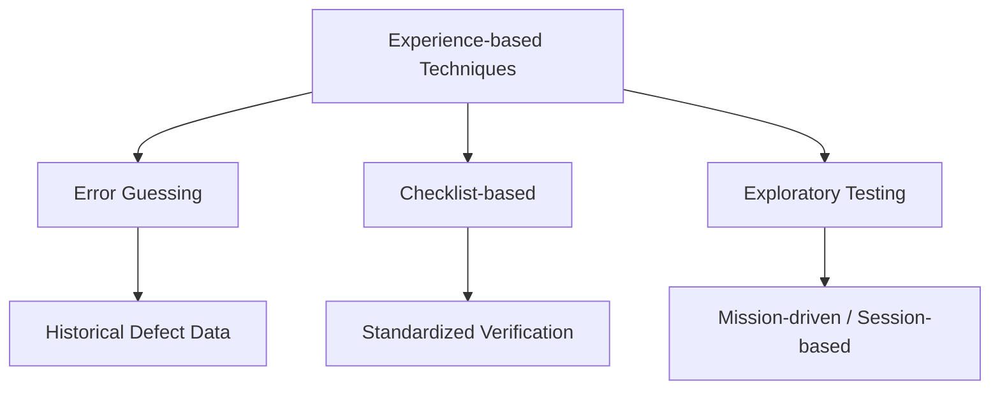

Parent: [[082.SW_테스트_유형]]

# 경험기반 기법(Experience-based Testing)

> [!info] **경험기반 기법이란?**
> 정형화된 명세서나 코드 구조보다는 테스터의 **지식, 숙련도, 직관**을 바탕으로 테스트 케이스를 설계하고 수행하는 기법입니다. 명세기반이나 구조기반 기법으로 찾기 어려운 변칙적인 결함을 발견하는 데 매우 효과적입니다.

---

## 1. 경험기반 기법의 개요
### 가. 경험기반 기법의 정의
- 테스터, 개발자, 사용자의 과거 경험과 유사 프로젝트의 결함 데이터를 활용하여 테스트를 설계하는 기법

### 나. 경험기반 기법의 필요성 (Why)
1. **정형 기법의 한계 보완**: 명세서에 기술되지 않은 예외 상황이나 복잡한 사용자 시나리오 검증 가능
2. **시간 및 비용 효율성**: 테스트 설계 시간이 부족한 상황에서 결함 가능성이 높은 부분 위주로 즉시 테스트 가능
3. **실전 결함 발견**: 실제 운영 환경에서 발생할 수 있는 '살아있는' 결함 발굴에 유리
4. **유연한 대응**: 요구사항이 빈번하게 변경되거나 명세가 부실한 프로젝트에서 품질 방어선 역할

---

## 2. 주요 경험기반 기법 상세 (What & How)
### 가. 경험기반 기법의 분류 (Mermaid)

### 나. 핵심 기법별 특징 분석

| 기법 | 상세 내용 | 적용 사례 |
| :--- | :--- | :--- |
| **오류 추정 (Error Guessing)** | 과거의 경험으로 결함이 자주 발생하는 부위를 예측하여 테스트 | Null 처리, 0으로 나누기, 중복 클릭 등 |
| **체크리스트 (Checklist-based)** | 경험을 바탕으로 작성된 표준 항목 리스트를 순차적으로 점검 | 브라우저 호환성, 필수 입력값 확인 등 |
| **탐색적 테스팅 (Exploratory)** | 테스트 설계와 실행을 동시에 수행하며 학습을 병행 | 신규 기능의 리스크 분석, 복잡한 사용자 흐름 |

---

## 3. 경험기반 vs 명세기반 vs 구조기반 비교
### 가. 테스트 설계 기법 간의 심화 비교 (Comparison)

| 비교 항목 | 경험기반 (Experience) | 명세기반 (Specification) | 구조기반 (Structure) |
| :--- | :--- | :--- | :--- |
| **핵심 자산** | **사람의 직관, 노하우** | 요구사항 명세서 | 소스 코드, 제어 흐름 |
| **테스트 시점** | 배포 직전, 긴급 테스트 | 시스템/인수 테스트 단계 | 단위/통합 테스트 단계 |
| **결함 발견율** | 특이 케이스에 강함 | 기능 누락 발견에 강함 | 로직 오류 발견에 강함 |
| **재현성** | 낮음 (테스터에 따라 다름) | 높음 (표준화된 TC) | 매우 높음 (자동화 가능) |

---

## 4. 기술사적 제언 및 실무 적용 방안
### 가. 경험기반 기법의 실무적 적용 전략
- **조합의 미학**: 명세기반 테스트로 '기본 기능'을 보장하고, 경험기반 기법을 통해 '사용자 실전 리스크'를 제거하는 **Hybrid 전략**이 필수적임
- **자산화(Knowledge Asset)**: 경험기반 테스트 중 발견된 특이 결함은 반드시 정식 테스트 케이스나 체크리스트로 업데이트하여 조직의 자산으로 남겨야 함

### 나. 기술사적 인사이트
- **테스터 역량 강화**: 경험기반 기법의 성패는 테스터의 도메인 지식에 달려 있음. 단순 테스터가 아닌 **도메인 전문가(Subject Matter Expert)** 육성이 선행되어야 함
- **SBTM (Session Based Test Management)**: 주관적일 수 있는 경험기반 테스트를 관리하기 위해, 타임박싱과 차터를 활용하여 수행 과정을 기록하고 정량화하는 체계가 필요함
- 결론적으로 경험기반 기법은 **'품질의 깊이(Depth of Quality)'**를 완성하는 최종 필터링 활동임

---

## Related Notes
- [[082.SW_테스트_유형]]
- [[093.탐색적_테스팅(Exploratory_Testing)]]
- [[079.테스트_차터(Test_Charter)]]
