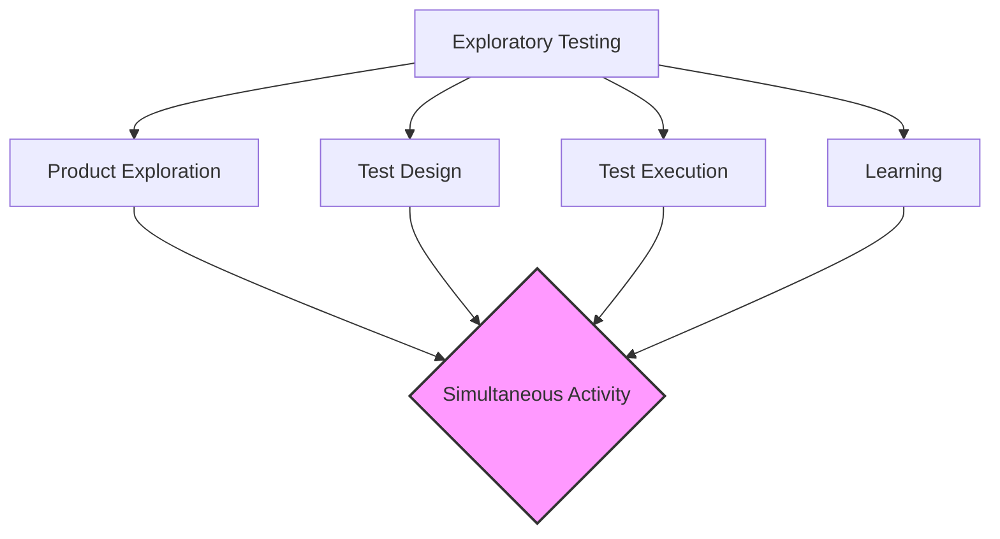

Parent: [[092.경험기반_기법(Experience-based_Testing)]]

# 탐색적 테스팅(Exploratory Testing)

> [!info] **탐색적 테스팅이란?**
> 사전에 상세한 테스트 케이스를 작성하지 않고, 테스트 **설계(Design), 실행(Execution), 학습(Learning)**을 동시에 진행하는 지능적인 테스트 기법입니다. 테스터의 직관과 비즈니스 지식을 활용하여 소프트웨어의 숨겨진 결함을 역동적으로 찾아내는 것이 핵심입니다.

---

## 1. 탐색적 테스팅의 개요
### 가. 탐색적 테스팅의 정의
- 정해진 스크립트 없이 테스트 대상 시스템을 탐구하며, 실시간으로 발견된 정보를 바탕으로 다음 테스트를 설계하고 수행하는 경험 중심 기법

### 나. 등장 배경 및 필요성 (Why)
1. **민첩성(Agility) 대응**: 짧은 개발 주기(Agile/DevOps) 내에서 방대한 테스트 케이스 작성 시간 부족
2. **살충제 패러독스 해결**: 반복적인 고정 테스트 케이스로 발견되지 않는 변칙적 결함 식별
3. **리스크 기반 집중**: 테스트 도중 발견된 취약 부위에 대해 즉시 심층 테스트(Deep-dive) 수행 가능
4. **효율적 지식 습득**: 시스템을 직접 조작하며 구조와 한계를 학습하여 품질 통찰력 확보

---

## 2. 탐색적 테스팅의 4가지 핵심 요소 및 프로세스 (What & How)
### 가. 탐색적 테스팅의 핵심 구성 요소 (Mermaid)

### 나. 수행 메커니즘: SBTM (Session Based Test Management)

| 구성 요소 | 설명 | 비고 |
| :--- | :--- | :--- |
| **테스트 차터 (Charter)** | 테스트의 목표와 범위를 정의한 가이드 | "무엇을 테스트할 것인가?" |
| **타임박싱 (Time-boxing)** | 정해진 시간(주로 60~120분) 동안 집중 수행 | 몰입도 향상 |
| **테스트 노트 (Notes)** | 수행 과정, 관찰 사항, 결함을 기록 | 재현 및 자산화 목적 |
| **디브리핑 (Debriefing)** | 세션 종료 후 아키텍트/개발자와 결과 공유 | 지식 전파 및 피드백 |

---

## 3. 스크립트 기반 테스팅 vs 탐색적 테스팅 비교
### 가. 비교 분석표 (Comparison)

| 비교 항목 | 스크립트 기반 테스팅 (Scripted) | 탐색적 테스팅 (Exploratory) |
| :--- | :--- | :--- |
| **사전 계획** | 상세한 테스트 케이스(TC) 필수 | 최소한의 테스트 차터(Charter) |
| **수행 방식** | 정의된 절차 준수 (Passive) | 실시간 판단 및 경로 수정 (Active) |
| **학습 시점** | 테스트 설계 단계에서 학습 | 테스트 실행 중에 실시간 학습 |
| **주요 가치** | 요구사항 충족 확인 (Confirm) | 숨겨진 리스크 및 결함 발견 (Explore) |
| **측정 지표** | TC 통과율, 커버리지 | 발견 결함의 질, 리스크 완화 정도 |

---

## 4. 기술사적 제언 및 실무 적용 방안
### 가. 탐색적 테스팅의 성공 전략
- **차터의 명확성**: 막연한 탐색이 되지 않도록 **"어떤 기능을, 어떤 관점에서, 어떤 도구로"** 테스트할지 차터에 명시해야 함
- **역량 있는 테스터 배치**: 시스템 구조와 도메인을 잘 아는 시니어 테스터가 수행할 때 효과가 극대화됨

### 나. 기술사적 인사이트
- **하이브리드 테스팅**: 회귀 테스트(Regression)는 자동화 스크립트로 처리하고, 신규 기능이나 복잡한 비즈니스 로직은 **탐색적 테스팅**으로 검증하는 이원화 전략이 현대적 QA의 정석임
- **Crowd Testing과의 연계**: 다양한 환경과 시각을 가진 외부 테스터들에게 탐색적 테스팅을 맡겨 실제 사용 환경의 다양성을 확보할 수 있음
- 결론적으로 탐색적 테스팅은 **'테스터의 두뇌를 최대한 활용하는 품질 탐사 활동'**임

---

## Related Notes
- [[092.경험기반_기법(Experience-based_Testing)]]
- [[079.테스트_차터(Test_Charter)]]
- [[076.소프트웨어_테스트_7대_원리]]
