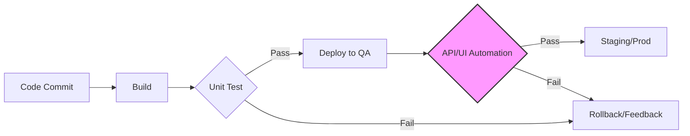

Parent: [[075.SW_테스트_일반]]

# 테스트 자동화(Test Automation)

> [!info] **테스트 자동화란?**
> 테스트 수행에 필요한 도구와 스크립트를 활용하여 테스트 케이스를 자동으로 실행하고, 결과를 확인 및 보고하는 활동입니다. 반복적인 **회귀 테스트(Regression Test)**의 효율성을 극대화하고 **CI/CD** 파이프라인 내에서 품질 피드백을 가속화하는 핵심 기술입니다.

---

## 1. 테스트 자동화의 개요
### 가. 테스트 자동화의 정의
- 사람이 수동으로 수행하던 테스트 절차를 스크립트나 자동화 도구를 통해 기계적으로 처리하여 정확성과 속도를 확보하는 품질 활동

### 나. 테스트 자동화의 필요성 (Why)
1. **반복 테스트 효율화**: 빈번하게 발생하는 회귀 테스트의 인적/시간적 오버헤드 절감
2. **배포 속도 향상 (Time-to-Market)**: 지속적 통합/배포(CI/CD) 환경에서 즉각적인 품질 피드백 제공
3. **정확성 및 일관성**: 사람의 실수(Human Error)를 배제하고 동일한 조건에서 테스트 재현성 확보
4. **테스트 커버리지 확대**: 수동으로 수행하기 어려운 대규모 부하 테스트 및 복잡한 데이터 조합 검증 가능

---

## 2. 테스트 자동화 아키텍처 및 프레임워크 (What & How)
### 가. CI/CD 파이프라인 내 테스트 자동화 흐름 (Mermaid)

### 나. 테스트 자동화 프레임워크 유형

| 유형 | 상세 내용 | 특징 및 장점 |
| :--- | :--- | :--- |
| **데이터 주도 (Data-driven)** | 테스트 로직과 데이터를 분리하여 관리 | 다양한 입력값에 대한 재사용성 높음 |
| **키워드 주도 (Keyword-driven)** | 동작(Action)을 키워드로 정의하여 시나리오 구성 | 비전공자도 테스트 설계 참여 가능 |
| **모듈 기반 (Module-based)** | 공통 기능을 모듈화하여 스크립트 작성 | 유지보수 효율성 및 중복 코드 방지 |
| **하이브리드 (Hybrid)** | 위 방식들을 혼합하여 유연하게 적용 | 가장 보편적이고 강력한 성능 제공 |

---

## 3. 심화: 테스트 자동화 피라미드 및 ROI 분석
### 가. 테스트 자동화 피라미드 (Test Automation Pyramid)
- **UI/End-to-End**: 상단부. 유지보수 비용 높음, 실행 속도 느림 (최소화)
- **Service/API**: 중간부. 비즈니스 로직 중심, 안정성 확보
- **Unit Test**: 하단부. 실행 속도 가장 빠름, 결함 조기 발견 (최대화)
> [!tip] 피라미드 구조를 유지해야 자동화의 **ROI(Return on Investment)**가 극대화됨

### 나. 수동 테스트 vs 자동화 테스트 비교

| 비교 항목 | 수동 테스트 (Manual) | 자동화 테스트 (Automation) |
| :--- | :--- | :--- |
| **적합 대상** | 신규 기능, UI/UX, 탐색적 테스트 | 반복적인 회귀 테스트, 부하 테스트 |
| **초기 투자** | 낮음 (즉시 수행 가능) | 높음 (스크립트 및 환경 구축) |
| **수행 속도** | 느림 | 매우 빠름 |
| **유지보수** | 불필요 (TC만 수정) | 필수적 (코드 변경 시 스크립트 수정) |

---

## 4. 기술사적 제언 및 실무 적용 방안
### 가. 성공적인 테스트 자동화를 위한 전략
1. **선별적 자동화**: 모든 것을 자동화하려 하지 말고, **Business Critical**하고 반복 횟수가 많은 시나리오부터 우선 적용해야 함
2. **테스트 부채(Test Debt) 관리**: 코드 변경 시 자동화 스크립트도 즉시 업데이트되지 않으면 '깨진 테스트'가 되어 신뢰도를 떨어뜨리므로 지속적인 리팩토링이 필요함

### 나. 기술사적 인사이트 및 향후 전망
- **Shift-Left 연계**: 자동화 테스트를 개발 초기 단계로 전진 배치하여 **결함 유입 원천 차단** 체계를 구축해야 함
- **AI-driven Testing**: 최근에는 AI를 활용하여 코드 변경 시 스크립트를 스스로 수정하는 **Self-healing** 기술이나, 테스트 데이터를 생성하는 지능형 자동화로 발전 중
- 결론적으로 테스트 자동화는 단순한 '도구 도입'이 아니라, **'품질 가시성을 확보하고 개발 생산성을 높이는 조직적 거버넌스'**로 접근해야 함

---

## Related Notes
- [[075.SW_테스트_일반]]
- [[005.CI_CD]]
- [[085.Shift-Left_Testing]]
- [[093.탐색적_테스팅(Exploratory_Testing)]]
