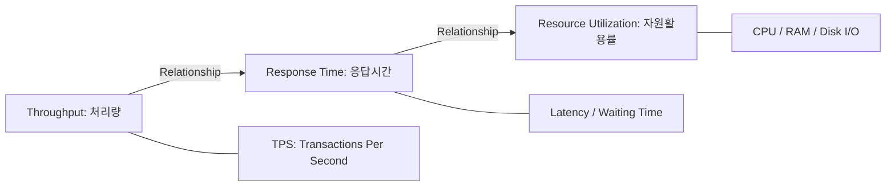

Parent: [[082.SW_테스트_유형]]

# 성능 테스트(Performance Testing)

> [!info] **성능 테스트란?**
> 시스템이 특정 부하(Load) 조건에서 얼마나 빠르고 안정적으로 동작하는지 검증하는 비기능 테스트입니다. **응답 시간(Response Time), 처리량(Throughput), 자원 활용률(Resource Utilization)** 등을 측정하여 시스템의 병목 현상(Bottleneck)을 식별하고 해결하는 것이 핵심입니다.

---

## 1. 성능 테스트의 개요
### 가. 성능 테스트의 정의
- 시스템의 가용성, 신뢰성, 확장성을 보장하기 위해 실제 운영 환경과 유사한 부하를 발생시켜 성능 지표를 측정하는 활동

### 나. 성능 테스트의 필요성 (Why)
1. **장애 예방**: 대규모 트래픽 발생 시 시스템 다운이나 응답 지연을 사전에 방지
2. **용량 산정 (Capacity Planning)**: 현재 인프라가 지원할 수 있는 최대 사용자 수 파악 및 증설 계획 수립
3. **병목 현상 식별**: DB 쿼리 부하, 네트워크 대역폭, 메모리 누수 등 성능 저하의 근본 원인(Root Cause) 발견
4. **SLA(Service Level Agreement) 준수**: 계약된 응답 시간 및 가용성 목표 달성 여부 입증

---

## 2. 성능 테스트의 유형 및 지표 (What & How)
### 가. 성능 테스트의 주요 유형 (Comparison)

| 유형 | 상세 내용 | 핵심 목적 |
| :--- | :--- | :--- |
| **부하 테스트 (Load Test)** | 시스템의 설계 범위 내에서 부하를 지속적으로 증가 | 정상 부하에서의 응답 시간 및 처리량 확인 |
| **스트레스 테스트 (Stress Test)** | 임계치 이상의 과부하를 주어 시스템 파괴 시점 확인 | 한계 부하에서의 복구 능력(Resilience) 검증 |
| **스파이크 테스트 (Spike Test)** | 단시간에 급격한 부하 유입 시 시스템 반응 확인 | 선착순 이벤트 등 급증 트래픽 대응력 확인 |
| **내구성 테스트 (Soak Test)** | 장시간 동안 일정한 부하를 지속적으로 가함 | 메모리 누수(Leak) 및 누적된 자원 잠금 현상 식별 |

### 나. 주요 성능 지표 메커니즘 (Mermaid)

---

## 3. 심화: 성능 테스트 프로세스 및 병목 분석
### 가. 성능 테스트 5단계 절차
1. **분석 및 계획**: 품질 목표(SLA) 설정, 테스트 시나리오 도출
2. **환경 구축**: **테스트베드(Testbed)** 준비, 부하 발생기 설정
3. **테스트 설계**: 부하 모델링(Vuser 산정), 스크립트 작성
4. **테스트 실행**: 부하 발생 및 실시간 모니터링
5. **분석 및 튜닝**: 병목 구간 식별, 성능 최적화(Tuning) 수행

### 나. 병목 구간별 튜닝 전략
- **Application**: 알고리즘 개선, 캐싱(Redis) 도입, 비동기 처리
- **Database**: 인덱스 최적화, 쿼리 리팩토링, DB Connection Pool 조정
- **Infrastructure**: 스케일 업(Scale-up) / 스케일 아웃(Scale-out), 로드밸런싱 설정

---

## 4. 기술사적 제언 및 실무 적용 방안
### 가. 성공적인 성능 테스트를 위한 전략
- **Early Performance Testing**: 개발 완료 후가 아니라, 핵심 API 개발 시점부터 조기에 단위 성능 테스트를 수행하여 리스크를 분산해야 함
- **가상화 서비스 활용**: 연동된 외부 시스템이 부하를 견디지 못할 경우, **Service Virtualization**을 통해 내부 시스템만의 성능을 독립적으로 측정해야 함

### 나. 기술사적 인사이트
- **Cloud-Native Scalability**: 클라우드 환경에서는 고정된 사양보다는 오토 스케일링(Auto-scaling) 임계치가 적절한지 검증하는 것이 더 중요함
- **Observability 연계**: 단순 모니터링을 넘어 분산 트래킹(Distributed Tracing) 도구를 활용하여 마이크로서비스 간의 지연 구간을 정밀 타격 분석해야 함
- 결론적으로 성능 테스트는 **'사용자의 인내심을 기술적 안정성으로 변환'**하여 비즈니스 지속성을 확보하는 전략적 활동임

---

## Related Notes
- [[082.SW_테스트_유형]]
- [[077.테스트베드(Testbed)]]
- [[094.테스트_자동화(Test_Automation)]]
- [[009.Microservices_Architecture]]
