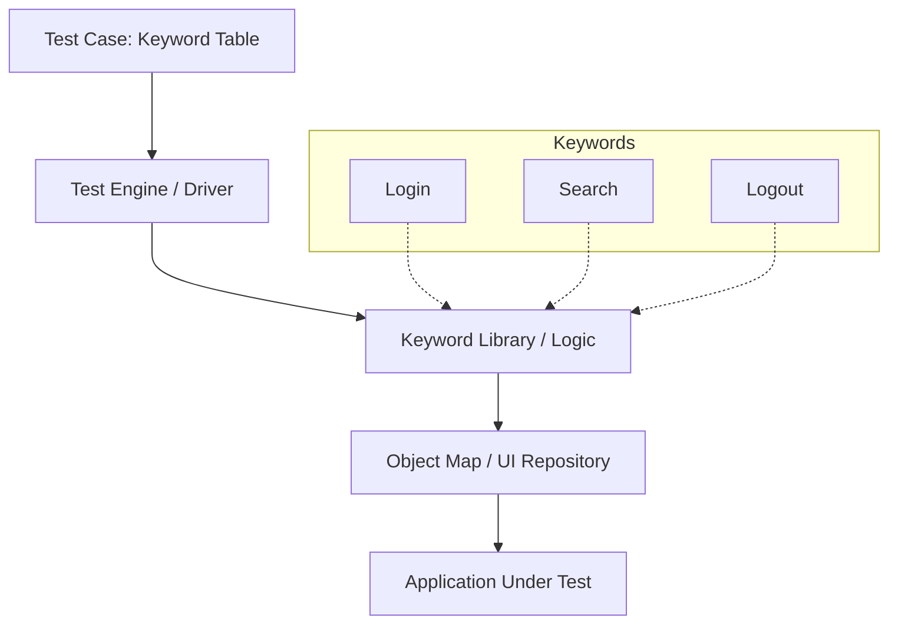

Parent: [[094.테스트_자동화(Test_Automation)]]

# 키워드 기반 테스팅(Keyword-driven Testing)

> [!info] **키워드 기반 테스팅이란?**
> 테스트 수행 동작(Action)을 **키워드(Keyword)**로 정의하고, 테스트 데이터와 실행 로직을 분리하여 관리하는 테스트 자동화 프레임워크 기법입니다. '무엇을 할 것인가'를 정의한 키워드 시나리오를 통해 비기술자도 쉽게 자동화 테스트를 설계할 수 있게 합니다.

---

## 1. 키워드 기반 테스팅의 개요
### 가. 키워드 기반 테스팅의 정의
- 특정 기능을 수행하는 하부 스크립트를 키워드(예: Login, Click, Select)로 추상화하여, 스프레드시트 등의 테이블 형태로 테스트 케이스를 구성하는 기법

### 나. 등장 배경 및 필요성 (Why)
1. **스크립트 유지보수 부담**: 코드 기반의 자동화는 UI 변경 시 모든 스크립트를 수정해야 하는 오버헤드 발생
2. **협업의 한계**: 프로그래밍 지식이 없는 현업 사용자나 수동 테스터가 자동화 테스트 설계에 참여하기 어려움
3. **재사용성 저하**: 유사한 테스트 단계가 반복됨에도 불구하고 코드 중복이 발생하여 관리 효율 저하

---

## 2. 키워드 기반 테스팅의 아키텍처 및 메커니즘 (What & How)
### 가. KDT 프레임워크 구조 (Mermaid)

### 나. 핵심 구성 요소

| 요소 | 설명 | 비고 |
| :--- | :--- | :--- |
| **키워드 테이블** | 비즈니스 로직을 키워드와 데이터의 조합으로 기술 | Excel, CSV, DB |
| **키워드 라이브러리** | 실제 자동화 동작을 수행하는 저수준(Low-level) 코드 | Selenium, Appium 등 |
| **테스트 엔진** | 키워드 테이블을 읽어 해당 라이브러리 함수를 호출 | 스크립트 실행기 |
| **오브젝트 맵** | 화면 요소(ID, XPath 등)를 논리적 명칭으로 매핑 | UI 변경 시 이곳만 수정 |

---

## 3. 심화: 데이터 주도 테스팅(DDT) vs 키워드 주도 테스팅(KDT)
### 가. 자동화 프레임워크 비교 분석 (Comparison)

| 비교 항목 | 데이터 주도 테스팅 (DDT) | 키워드 주도 테스팅 (KDT) |
| :--- | :--- | :--- |
| **분리 대상** | 테스트 스크립트와 입력 데이터 분리 | 테스트 로직(키워드)과 스크립트 코드 분리 |
| **핵심 가치** | 동일 로직에 다양한 데이터 적용 (Efficiency) | 비기술자의 테스트 설계 및 높은 재사용성 (Agility) |
| **복잡도** | 상대적으로 낮음 | 초기 프레임워크 구축 비용 높음 |
| **적합한 상황** | 계산 로직, 대량의 데이터 입력 검증 | 복잡한 사용자 시나리오, 잦은 UI 변경 |

---

## 4. 기술사적 제언 및 실무 적용 방안
### 가. 키워드 기반 테스팅 도입 전략
- **점진적 구축**: 처음부터 모든 기능을 키워드화하기보다, 가장 많이 반복되는 공통 기능(Login, Menu Navigation 등)부터 표준 키워드로 정의하여 확장해야 함
- **키워드 거버넌스**: 무분별한 키워드 생성은 또 다른 관리 부담이 되므로, 조직 차원의 **표준 키워드 명명 규칙**과 **라이브러리 관리 체계**가 필수적임

### 나. 기술사적 인사이트
- **Hybrid Framework**: 실제 현장에서는 데이터 주도(DDT)와 키워드 주도(KDT)를 혼합한 하이브리드 방식을 통해 데이터 유연성과 로직 재사용성을 동시에 확보하는 것이 대세임
- **No-Code / Low-Code와의 연계**: 최근의 노코드 자동화 도구들은 내부적으로 KDT 아키텍처를 따르고 있으며, 이는 **'테스트 설계의 민주화'**를 가속화하고 있음
- 결론적으로 키워드 기반 테스팅은 **'기술적 장벽을 제거하여 품질 활동의 범위를 전사적으로 확대'**하는 혁신적인 접근법임

---

## Related Notes
- [[094.테스트_자동화(Test_Automation)]]
- [[080.테스트_케이스(Test_Case)]]
- [[042.개발_방법론_테일러링(Tailoring)]]
