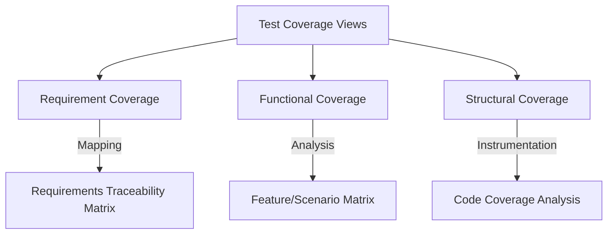

Parent: [[075.SW_테스트_일반]]

# 테스트 커버리지(Test Coverage)

> [!info] **테스트 커버리지란?**
> 테스트 수행 결과가 테스트 대상의 전체 범위를 얼마나 포함하고 있는지를 나타내는 **정량적 품질 지표**입니다. 무엇을 기준으로 삼느냐에 따라 요구사항 커버리지, 기능 커버리지, 구조(코드) 커버리지 등으로 분류됩니다.

---

## 1. 테스트 커버리지의 개요
### 가. 테스트 커버리지의 정의
- 테스트의 충분성(Adequacy)을 측정하기 위해 전체 검증 대상 중 실제 테스트가 수행된 영역의 비율을 수치화한 것

### 나. 테스트 커버리지의 필요성 (Why)
1. **정량적 품질 측정**: "테스트가 충분히 되었는가?"에 대한 객관적인 근거 자료 제공
2. **미실행 영역 식별**: 테스트가 누락된 요구사항이나 코드 경로를 발견하여 리스크 완화
3. **자원 최적화**: 커버리지가 낮은 핵심 영역에 테스트 자원을 집중 배치하여 효율성 제고
4. **의사결정 지원**: 배포 여부(Go/No-Go)를 판단하기 위한 최종 품질 기준(Exit Criteria)으로 활용

---

## 2. 테스트 커버리지의 유형 및 메커니즘 (What & How)
### 가. 커버리지 측정의 3대 관점 (Mermaid)

### 나. 주요 커버리지 분류 상세

| 분류 | 측정 기준 | 핵심 산식 | 특징 |
| :--- | :--- | :--- | :--- |
| **요구사항 커버리지** | 요구사항 명세서 (SRS) | (테스트된 요구사항 수 / 전체 요구사항 수) | **추적성(Traceability)** 중심 |
| **기능 커버리지** | 시스템 설계서, 기능 목록 | (검증된 기능 수 / 정의된 기능 수) | 사용자 관점의 완결성 확인 |
| **코드 커버리지** | 소스 코드, 제어 흐름 | (실행된 코드 단위 / 전체 코드 단위) | 로직의 무결성 검증 |

---

## 3. 심화: 커버리지 관리 및 한계점
### 가. 요구사항 추적표(RTM)를 통한 관리
- **Vertical Traceability**: 요구사항 → 설계 → 구현 → 테스트 케이스 간의 일관된 연결 고리를 확보하여 커버리지를 상시 모니터링함

### 나. 커버리지의 함정과 극복 방안
- **함정**: 커버리지가 100%라고 해서 결함이 0%인 것은 아님 (잘못된 로직이 실행만 된 경우)
- **극복**: 커버리지 수치 달성에 매몰되지 말고, **뮤테이션 테스팅(Mutation Testing)** 등을 통해 테스트 케이스의 유효성(Effectiveness)을 병행 검증해야 함

---

## 4. 기술사적 제언 및 실무 적용 방안
### 가. 리스크 기반 커버리지 전략 (RBT)
- 모든 영역의 커버리지를 100% 달성하는 것은 불가능함. 비즈니스 영향도가 높은 **Critical** 모듈은 코드 커버리지를 정밀하게(MC/DC 등) 관리하고, 부가 기능은 요구사항 커버리지 중심의 관리가 필요함

### 나. 기술사적 인사이트
- **Continuous Coverage**: CI/CD 파이프라인 내에서 커버리지 측정 도구를 자동화하여, 기준 수치(예: 80%) 미달 시 빌드를 실패(Fail)시키는 강력한 품질 게이트(Quality Gate) 운영이 필수임
- **Digital Twin & Coverage**: 복잡한 시스템에서는 실제 운영 환경의 트래픽 패턴을 분석하여, 사용자가 주로 사용하는 경로에 대해 더 높은 수준의 테스트 커버리지를 확보하는 데이터 기반 전략이 요구됨
- 결론적으로 테스트 커버리지는 **'품질의 가시성을 확보하여 프로젝트의 불확실성을 통제'**하는 거버넌스의 핵심 지표임

---

## Related Notes
- [[098.코드_커버리지(Code_Coverage)]]
- [[080.테스트_케이스(Test_Case)]]
- [[055.요구공학(Requirements_Engineering)]]
