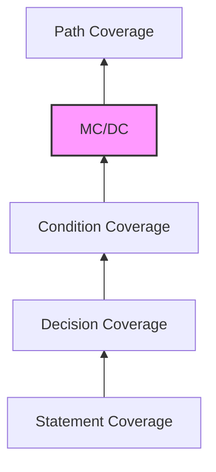

Parent: [[097.테스트_커버리지(Test_Coverage)]]

# 코드 커버리지(Code Coverage)

> [!info] **코드 커버리지란?**
> 화이트박스 테스트의 핵심 지표로, 테스트 케이스를 실행했을 때 소프트웨어의 **소스 코드가 얼마나 실행되었는지**를 나타내는 수치입니다. 코드의 제어 흐름과 데이터 흐름을 기반으로 테스트의 충분성을 정량적으로 증명합니다.

---

## 1. 코드 커버리지의 개요
### 가. 코드 커버리지의 정의
- 프로그램 소스 코드의 구문, 조건, 결정 등의 구조적 요소 중 테스트에 의해 실행된 비율

### 나. 코드 커버리지의 필요성 (Why)
1. **논리적 누락 방지**: 구현된 코드 중 한 번도 실행되지 않은 로직(Dead Code)이나 예외 처리 미흡 지점 식별
2. **테스트 유효성 검증**: 작성된 테스트 케이스가 실제 코드를 얼마나 촘촘하게 검증하고 있는지 입증
3. **고신뢰성 보장**: 항공, 자동차, 의료 등 미션 크리티컬 분야에서 안전성 보장을 위한 필수 수치
4. **리팩토링 안정성**: 충분한 커버리지가 확보된 상태에서 코드 수정을 수행하여 리그레션(Regression) 리스크 최소화

---

## 2. 코드 커버리지의 주요 유형 및 계층 (What & How)
### 가. 커버리지 강도에 따른 계층 구조 (Mermaid)

### 나. 주요 커버리지 메트릭 상세 분석

| 유형 | 설명 | 핵심 메커니즘 |
| :--- | :--- | :--- |
| **구문 커버리지 (Statement)** | 모든 코드 라인을 최소 1회 실행 | $Coverage = \frac{실행된 구문 수}{전체 구문 수}$ |
| **결정 커버리지 (Decision)** | 모든 분기(Branch)의 T/F 결과를 실행 | IF문의 Yes/No 경로를 모두 확인 |
| **조건 커버리지 (Condition)** | 각 개별 조건식의 T/F 결과를 실행 | `(A > 0 && B > 0)`에서 A와 B 각각의 T/F 확인 |
| **변경 조건/결정 (MC/DC)** | 각 조건이 결과에 독립적인 영향을 미침을 증명 | 조건의 조합 폭발 방지 및 높은 신뢰성 확보 |
| **경로 커버리지 (Path)** | 가능한 모든 실행 경로를 실행 | 루프와 중첩 분기를 포함한 전체 시나리오 |

---

## 3. 심화: 코드 커버리지 측정 기술 및 도구
### 가. 측정 방식 (Instrumentation)
- **소스 코드 삽입**: 컴파일 전 소스 코드에 카운터(Counter)를 추가
- **바이트코드 삽입**: 컴파일된 바이너리(Java Class 등)에 측정 코드를 주입하여 런타임에 수집

### 나. 대표적 커버리지 분석 도구
- **Java**: Jacoco, Cobertura
- **C/C++**: Gcov, Bullseye Coverage
- **Python**: Coverage.py

---

## 4. 기술사적 제언 및 실무 적용 방안
### 가. 현실적인 커버리지 목표 수립
- 100% 커버리지는 비용 대비 효용이 급격히 떨어짐. 일반적으로 **80% 수준**을 권장 목표(Baseline)로 설정하되, 핵심 비즈니스 로직(Core Logic)에 대해서만 정밀한 검증을 수행하는 선택과 집중이 필요함

### 나. 기술사적 인사이트
- **Coverage is not Quality**: 커버리지 수치 자체보다 **"왜 이 코드가 실행되지 않았는가?"**를 분석하는 과정이 더 중요함. 도달 불가능한 코드는 설계 결함이나 불필요한 복잡도의 증거일 수 있음
- **TDD와의 시너지**: TDD(Test Driven Development)를 충실히 수행하면 자연스럽게 90% 이상의 높은 코드 커버리지를 유지할 수 있으며, 이는 곧 시스템의 유지보수성 향상으로 직결됨
- 결론적으로 코드 커버리지는 **'품질의 바닥(Bottom Line)'**을 확인하는 지표이며, 이를 기반으로 고차원적인 기능 및 성능 테스트로 나아가야 함

---

## Related Notes
- [[097.테스트_커버리지(Test_Coverage)]]
- [[090.화이트박스_테스트(White-box_Testing)]]
- [[099.MC_DC(Modified_Condition_Decision_Coverage)]]
- [[054.테스트_주도_개발(TDD)]]
