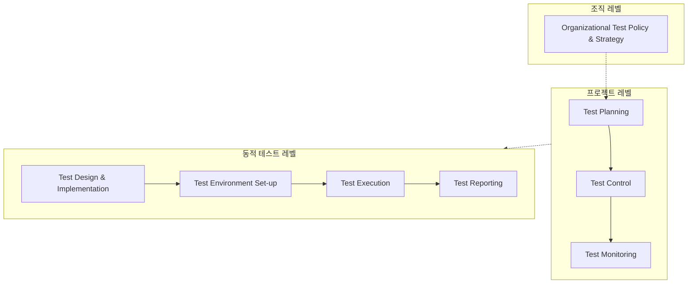

Parent: [[075.SW_테스트_일반]]

# ISO/IEC/IEEE 29119 (Software Testing Standard)

> [!info] **ISO/IEC/IEEE 29119란?**
> 소프트웨어 테스트의 전체 생명주기를 다루는 **국제 표준**입니다. 기존의 파편화되어 있던 IEEE 829(문서), IEEE 1008(단위테스트), BS 7925(기법) 등을 통합하여 정립되었으며, 프로세스 중심의 테스팅 체계를 제공합니다.

---

## 1. ISO/IEC/IEEE 29119의 개요
### 가. ISO 29119의 정의
- 소프트웨어 테스트의 용어, 프로세스, 문서, 기법을 정의한 글로벌 표준으로, 조직의 테스팅 성숙도를 높이기 위한 프레임워크

### 나. 등장 배경 및 필요성 (Why)
1. **표준 통합**: 벤더나 국가별로 상이했던 테스트 기준을 하나로 통합하여 상호운용성 확보
2. **프로세스 중심**: 결과물 중심이 아닌, 계획부터 마감까지의 **일관된 프로세스**를 통한 품질 보증
3. **리스크 기반 테스팅(RBT)**: 모든 것을 테스트할 수 없는 현실을 반영하여 리스크에 따른 자원 배분 강조
4. **글로벌 품질 경쟁력**: 국제 입찰이나 고신뢰성 시스템 개발 시 품질 증빙의 객관적 근거로 활용

---

## 2. ISO 29119의 구성 및 프로세스 아키텍처
### 가. ISO 29119의 5개 파트 (Structure)

| 파트 | 명칭 | 핵심 내용 |
| :--- | :--- | :--- |
| **Part 1** | **Concepts and Definitions** | 테스트 용어 사전 및 일반적 개념 정의 |
| **Part 2** | **Test Processes** | 조직, 프로젝트, 동적 테스트를 아우르는 3계층 프로세스 |
| **Part 3** | **Test Documentation** | 테스트 계획서, 설계서, 결과보고서 등 표준 양식 정의 |
| **Part 4** | **Test Techniques** | 명세기반, 구조기반, 경험기반 테스트 설계 기법 |
| **Part 5** | **Keyword-Driven Testing** | 키워드 기반 테스트 자동화 프레임워크 정의 |

### 나. 3계층 테스트 프로세스 모델 (Mermaid)

---

## 3. 심화: 주요 파트별 상세 기법 및 비교
### 가. Part 4: 테스트 설계 기법의 분류
- **명세기반**: 동등 분할, 경계값 분석, 결정 테이블, 상태 전이 등
- **구조기반**: 구문, 결정, 조건, MC/DC 커버리지 등
- **경험기반**: 오류 추정, 탐색적 테스팅 등

### 나. ISO 29119 vs IEEE 829 비교 (Comparison)

| 비교 항목 | ISO/IEC/IEEE 29119 | 기존 IEEE 829 (Legacy) |
| :--- | :--- | :--- |
| **관점** | **프로세스 중심 (Process-oriented)** | 산출물/문서 중심 (Document-oriented) |
| **적용 범위** | Agile, Waterfall 등 모든 모델 수용 | 주로 순차적(Waterfall) 모델에 적합 |
| **핵심 원리** | 리스크 기반 테스팅 (RBT) 강조 | 명세 기반의 순차적 검증 강조 |
| **자동화 지원** | Part 5를 통해 체계적으로 지원 | 별도의 자동화 표준 부재 |

---

## 4. 기술사적 제언 및 실무 적용 방안
### 가. ISO 29119 도입 시 고려사항
1. **Tailoring의 중요성**: 표준의 모든 프로세스를 적용하는 것은 오버헤드가 크므로, 프로젝트의 규모와 복잡도에 맞게 **경량화(Tailoring)**하는 과정이 필수적임
2. **ALM 도구 연계**: Part 3의 문서 표준을 Jira나 Confluence와 같은 도구에 템플릿화하여 자동 생성 체계를 구축해야 함

### 나. 기술사적 인사이트
- **Shift-Left와의 정렬**: ISO 29119의 테스트 프로세스는 개발 초기 단계의 '테스트 계획'을 강조하므로, 이를 **Shift-Left Testing** 전략의 근거로 활용할 수 있음
- **공급망 보안(Supply Chain Security)**: 최근 오픈소스 및 외부 컴포넌트 활용이 늘어남에 따라, 표준에 근거한 엄격한 인수 테스트(Acceptance Test) 프로세스 준수가 보안 거버넌스의 핵심이 됨
- 결론적으로 ISO 29119는 단순히 형식을 지키기 위한 것이 아니라, **'측정 가능한 품질 지표를 통해 비즈니스 리스크를 통제'**하는 품질 경영의 핵심 도구임

---

## Related Notes
- [[075.SW_테스트_일반]]
- [[078.테스트_프로세스(Test_Process)]]
- [[089.명세기반_테스트(Specification-based_Testing)]]
- [[090.화이트박스_테스트(White-box_Testing)]]
- [[096.키워드_기반_테스팅(Keyword-driven_Testing)]]
