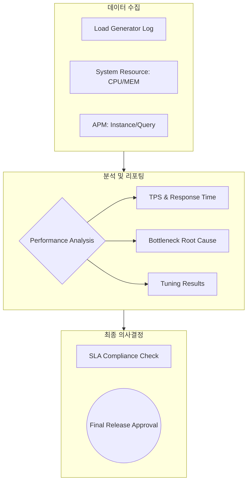

Parent: [[095.성능_테스트(Performance_Testing)]]

# 성능 시험 결과보고서

> [!info] **성능 시험 결과보고서란?**
> 성능 테스트 수행 과정을 통해 수집된 지표를 분석하여 시스템의 **처리 능력(Throughput)**, **응답 속도(Latency)**, **안정성(Stability)**을 종합적으로 평가하고, 목표 수준(SLA) 달성 여부를 확정하여 시스템 오픈의 근거로 활용하는 최종 분석 문서입니다.

---

## 1. 성능 시험 결과보고서의 개요
### 가. 성능 시험 결과보고서의 정의
- 부하/스트레스 테스트 등의 실행 결과를 정량적으로 요약하고, 발견된 병목 현상에 대한 개선(Tuning) 결과와 잔존 리스크를 기술한 문서

### 나. 작성 목적 및 필요성 (Why)
1. **의사결정 지원**: 정량적 데이터를 기반으로 시스템의 **Go/No-Go** 여부 결정
2. **SLA 검증**: 계약 및 기획 단계에서 수립한 성능 목표(예: 3초 이내 응답) 달성 증빙
3. **용량 관리 (Capacity Mgmt)**: 현재 시스템의 한계치(Saturation Point)를 파악하여 미래 증설 계획의 기초 자료로 활용
4. **튜닝 이력 관리**: 성능 개선을 위해 변경한 설정값(DB Pool, Heap Size 등)을 기록하여 운영 단계의 자산으로 활용

---

## 2. 보고서의 아키텍처 및 핵심 지표 (What & How)
### 가. 성능 분석 및 리포팅 구조 (Mermaid)

### 나. 핵심 성능 측정 지표 (Core Metrics)

| 지표 | 의미 | 분석 관점 |
| :--- | :--- | :--- |
| **TPS (Transactions Per Second)** | 초당 처리 건수 | 시스템의 실질적인 **처리량(Throughput)** 평가 |
| **Response Time (Latency)** | 요청부터 응답까지 시간 | 사용자 입장의 **체감 속도** 및 지연 구간 확인 |
| **Resource Utilization** | CPU, 메모리, Disk I/O 점유율 | 하드웨어 자원의 효율성 및 **임계치(Saturation)** 도달 여부 |
| **Error Rate** | 부하 중 발생한 오류 비율 | 시스템의 **신뢰성(Reliability)** 및 견고성 확인 |

---

## 3. 심화: 병목 분석(Bottleneck Analysis) 및 튜닝 리포팅
### 가. 성능 포화점(Saturation Point) 분석
- 부하가 증가함에 따라 TPS가 더 이상 늘어나지 않고 응답 시간이 급증하는 지점을 식별
- 해당 시점의 자원 상태(CPU Wait, DB Lock 등)를 분석하여 병목의 근본 원인(RCA) 도출

### 나. 튜닝 전/후 성능 비교 (Comparison Example)

| 비교 항목 | 튜닝 전 (Before) | 튜닝 후 (After) | 개선 효과 |
| :--- | :---: | :---: | :---: |
| **평균 응답 시간** | 5.2 sec | 1.8 sec | **65% 단축** |
| **최대 TPS** | 450 TPS | 1,200 TPS | **166% 향상** |
| **CPU 점유율** | 95% (Bottle) | 60% (Stable) | 자원 여유 확보 |
| **주요 조치 사항** | 인덱스 부재, GC 빈번 | 인덱스 추가, JVM 튜닝 | - |

---

## 4. 기술사적 제언 및 실무 적용 방안
### 가. 결과 보고 시 유의사항 (Best Practice)
1. **데이터의 객관성**: 특정 시점의 튀는 값(Spike)에 현혹되지 않도록 **평균(Average)**과 **90/95 백분위수(Percentile)**를 병행 제시해야 함
2. **Think Time 반영 여부**: 실제 사용자 패턴을 반영하기 위해 시나리오에 적절한 **Think Time**이 포함되었음을 명시하여 신뢰도 확보

### 나. 기술사적 인사이트
- **Performance Regression**: 일회성 보고에 그치지 않고, CI/CD 파이프라인과 연계하여 소스 변경 시 성능 저하 여부를 자동으로 비교 리포팅하는 체계가 필요함
- **가관측성(Observability) 연계**: 단순 보고서를 넘어 **APM(Application Performance Management)** 대시보드를 실시간 공유함으로써 운영 부서와의 지식 전이(Knowledge Transfer)를 수행해야 함
- 결론적으로 성능 시험 결과보고서는 **'기술적 수치를 비즈니스 확신으로 전환'**하는 전략적 커뮤니케이션 도구임

---

## Related Notes
- [[095.성능_테스트(Performance_Testing)]]
- [[081.테스트_결과_보고서]]
- [[077.테스트베드(Testbed)]]
- [[001.SRE(Site_Reliability_Engineering)]]
