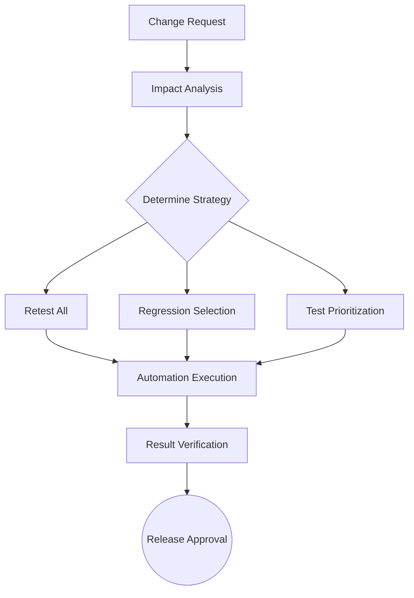

Parent: [[082.SW_테스트_유형]]

# 회귀 테스트(Regression Test)

> [!info] **회귀 테스트란?**
> 소프트웨어의 수정이나 변경(기능 추가, 버그 수정 등) 이후, 해당 변경이 기존에 정상적으로 동작하던 기능에 **의도치 않은 부작용(Side Effect)**을 일으키지 않았는지 확인하는 반복 테스트입니다.

---

## 1. 회귀 테스트의 개요
### 가. 회귀 테스트의 정의
- 시스템의 일부분을 수정한 후, 변경된 부분이 기존 시스템의 기능과 품질에 악영향을 미치지 않았음을 보장하기 위해 수행하는 테스트

### 나. 회귀 테스트의 필요성 (Why)
1. **무결성 보장**: 새로운 기능 추가 시 기존 기능의 안정성 유지
2. **결함 재발 방지**: 한 번 수정한 버그가 코드 변경 과정에서 다시 발생하는 현상 방지
3. **변경 영향 통제**: 소스 코드의 복잡도가 높아질수록 파급 효과(Ripple Effect)를 정밀하게 추적 필요
4. **지속적 배포(CD) 지원**: 빈번한 배포 환경에서 시스템의 전체적인 건강 상태(Health Check) 확인

---

## 2. 회귀 테스트의 메커니즘 및 전략 (What & How)
### 가. 변경 영향 분석 기반 회귀 테스트 흐름 (Mermaid)

### 나. 회귀 테스트 수행 전략 비교

| 전략 | 상세 내용 | 장단점 |
| :--- | :--- | :--- |
| **Retest All** | 기존의 모든 테스트 케이스를 재실행 | 신뢰성 최고, 시간 및 비용 과다 |
| **Regression Selection** | 변경 영향 범위 내의 테스트 케이스만 선별 | 효율적이나, 선별 오류 시 리스크 존재 |
| **Test Prioritization** | 중요도 및 비즈니스 영향도에 따라 우선순위 실행 | 자원이 한정된 상황에서 최적의 효과 |

---

## 3. 심화: 영향도 분석(CIA) 및 테스트 자동화
### 가. 변경 영향 분석 (Change Impact Analysis, CIA)
- **수평적 추적**: 요구사항-설계-코드 간의 관계 분석
- **수직적 추적**: 모듈 간의 의존성(Dependency) 및 호출 그래프 분석을 통해 테스트 범위 산정

### 나. 회귀 테스트 자동화의 필수성
- 회귀 테스트는 반복적이고 방대하므로 **CI/CD** 파이프라인 내에서 자동화가 필수임
- **Smoke Test**: 빌드 직후 주요 기능만 확인하는 경량 회귀 테스트
- **Sanity Test**: 특정 버그 수정 후 연관 기능의 논리적 타당성 확인

---

## 4. 기술사적 제언 및 실무 적용 방안
### 가. 회귀 테스트 효율화 전략 (Optimization)
1. **테스트 데이터 관리 (TDM)**: 반복적인 테스트를 위해 데이터 세트를 표준화하고 자동화 도구와 연계해야 함
2. **선택적 회귀 테스트 도구 활용**: 소스 코드의 변경 이력을 추적하여 연관된 테스트 케이스를 AI로 추천하는 기술 도입

### 나. 기술사적 인사이트
- **Zero-Day Regression**: 배포 당일 발생하는 회귀 결함을 막기 위해 **Canary Deployment**와 같은 점진적 배포 전략을 회귀 테스트의 연장선으로 운영해야 함
- **테스트 케이스 정제 (Cleaning)**: 오래된 테스트 케이스는 오히려 유지보수 비용을 높이므로, 정기적으로 유효성을 검토하여 삭제하거나 병합하는 관리가 필요함
- 결론적으로 회귀 테스트는 **'진화하는 소프트웨어의 품질 하한선'**을 지키는 가장 신뢰할 수 있는 품질 방어선임

---

## Related Notes
- [[094.테스트_자동화(Test_Automation)]]
- [[085.Shift-Left_Testing]]
- [[086.Shift-Right_Testing]]
- [[007.형상관리(Configuration_Management)]]
