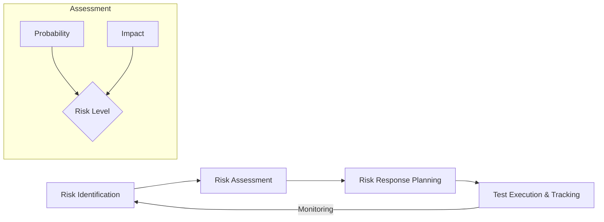

Parent: [[075.SW_테스트_일반]]

# 위험기반 테스트(Risk Based Testing)

> [!info] **위험기반 테스트(RBT)란?**
> 테스트 대상의 비즈니스 중요도와 결함 발생 가능성(위험)을 분석하여, **위험이 높은 영역에 테스트 자원을 집중 배치**하는 전략적 테스트 기법입니다. 한정된 일정과 예산 내에서 테스트 효과를 극대화하는 것을 목적으로 합니다.

---

## 1. 위험기반 테스트의 개요
### 가. 위험기반 테스트의 정의
- 식별된 리스크(장애 발생 가능성 x 영향도)를 기준으로 테스트의 우선순위와 강도를 결정하는 테스팅 방식

### 나. 위험기반 테스트의 필요성 (Why)
1. **자원 한계성**: 모든 것을 완벽하게 테스트하는 것은 불가능함 (Exhaustive Testing is impossible)
2. **효율적 의사결정**: 비즈니스에 치명적인 영향을 줄 수 있는 결함을 우선적으로 식별
3. **출시 일정 준수**: 핵심 리스크가 제거된 상태에서 전략적으로 제품을 출시 가능
4. **이해관계자 소통**: 기술적 복잡도가 아닌 '비즈니스 위험' 관점에서 품질 상태 공유

---

## 2. RBT의 리스크 분석 및 매트릭스 (What & How)
### 가. 리스크 기반 테스트 프로세스 (Mermaid)

### 나. 리스크 매트릭스 및 테스트 전략

| 리스크 등급 | 발생 가능성 | 비즈니스 영향도 | 테스트 전략 |
| :--- | :---: | :---: | :--- |
| **High (Zone 1)** | 높음 | 높음 | **정밀 테스트**: MC/DC 커버리지, 강도 높은 부하 테스트 |
| **Medium (Zone 2)** | 보통 | 높음 | **기능 테스트**: 결정 커버리지, 주요 시나리오 검증 |
| **Low (Zone 3)** | 낮음 | 낮음 | **스모크 테스트**: 기본 작동 여부만 확인, 샘플링 테스트 |

---

## 3. 심화: 리스크 식별 관점 및 정량화
### 가. 리스크의 두 가지 관점
- **비즈니스 리스크 (Product Risk)**: 기능 미작동으로 인한 금전적 손실, 사용자 이탈, 법적 분쟁 리스크
- **기술적 리스크 (Project Risk)**: 복잡한 로직, 신기술 도입, 개발자 숙련도 부족으로 인한 결함 발생 리스크

### 나. 리스크 정량화 산식
- **Risk Score = Probability (1~5) × Impact (1~5)**
- 도출된 점수를 기반으로 유틸리티 트리(Utility Tree)를 구성하여 테스트 우선순위를 정밀하게 관리

---

## 4. 기술사적 제언 및 실무 적용 방안
### 가. RBT 성공을 위한 고려사항
1. **객관적 지표 수립**: 리스크 평가가 테스터의 주관에 치우치지 않도록 이해관계자(PO, 아키텍트, 운영자)가 참여하는 **리스크 워크숍**을 정례화해야 함
2. **지속적 재평가**: 프로젝트 진행 과정에서 리스크의 수준은 변하므로, 주기적으로 리스크 매트릭스를 업데이트하는 **Dynamic RBT**가 필요함

### 나. 기술사적 인사이트
- **Pareto Principle (80/20)**: 전체 결함의 80%는 20%의 고위험 모듈에서 발견된다는 원리를 실천하는 핵심 도구가 RBT임
- **Agile과의 정렬**: 스프린트 플래닝 단계에서 사용자 스토리에 리스크 점수를 부여하여, 고위험 기능을 스프린트 초반에 배치(Shift-Left)함으로써 기술적 부채를 조기에 해소해야 함
- 결론적으로 RBT는 **'품질과 비용 사이의 균형점을 찾는 과학적인 필터링 전략'**임

---

## Related Notes
- [[076.SW_테스트_7대_원리]]
- [[065.ATAM]] (품질 속성 리스크 분석)
- [[085.Shift-Left_Testing]]
- [[068.품질_속성_시나리오]]
