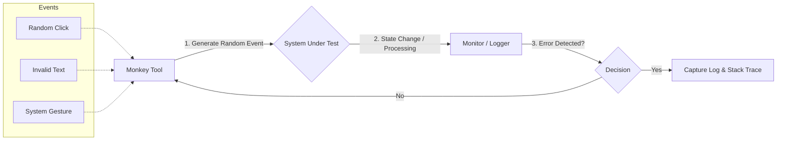

Parent: [[082.SW_테스트_유형]]

# 몽키 테스트(Monkey Test)

> [!info] **몽키 테스트란?**
> 마치 원숭이가 키보드를 무작위로 두드리는 것처럼, 시스템에 **무작위 입력(Random Input)**이나 이벤트를 발생시켜 예측하지 못한 상황에서의 시스템 **안정성(Stability)**과 **견고성(Robustness)**을 검증하는 테스트 기법입니다.

---

## 1. 몽키 테스트의 개요
### 가. 몽키 테스트의 정의
- 소프트웨어의 내부 구조나 논리적 흐름에 상관없이, 비정형화된 데이터를 무작위로 주입하여 시스템의 비정상 종료(Crash)나 예외 상황을 식별하는 기법

### 나. 등장 배경 및 필요성 (Why)
1. **예측 불가능한 사용자 행위**: 정형화된 테스트 케이스(TC)로는 발견하기 어려운 변칙적인 사용자 조작에 대한 내성 확인 필요
2. **안정성 및 스트레스 검증**: 장시간 무작위 조작을 통해 메모리 누수(Memory Leak)나 자원 경합(Race Condition) 발견
3. **효율적 결함 발견**: 최소한의 노력(자동화 도구 활용)으로 시스템의 치명적인 설계 결함을 조기에 적발

---

## 2. 몽키 테스트의 메커니즘 및 분류 (What & How)
### 가. 몽키 테스트 작동 흐름 (Mermaid)

### 나. 몽키 유형별 비교 분석 (Dumb vs Smart)

| 구분 | 덤 몽키 (Dumb Monkey) | 스마트 몽키 (Smart Monkey) |
| :--- | :--- | :--- |
| **지식 수준** | 시스템에 대한 지식 전무 | 화면 구조 및 비즈니스 로직 일부 인지 |
| **작동 방식** | 단순 무작위 이벤트 발생 | 데이터 흐름을 고려하여 유효한 경로 탐색 |
| **결함 발견** | 시스템 다운, 예외 처리 미흡 식별 | 논리적 오류, 복잡한 상태 전이 결함 |
| **복잡도** | 매우 낮음 (도구 설정 용이) | 보통 (스크립트 및 상태 정의 필요) |

---

## 3. 심화: 몽키 테스트 vs 탐색적 테스팅
### 가. 주요 차이점 비교 분석

| 비교 항목 | 몽키 테스트 (Monkey) | 탐색적 테스팅 (Exploratory) |
| :--- | :--- | :--- |
| **주체** | 주로 자동화 도구 (Bot) | 숙련된 테스터 (Human) |
| **의도성** | 무작위성 (Randomness) | 의도적 탐구 (Intentionality) |
| **학습 여부** | 없음 (Smart 제외) | 실행 중 실시간 학습 및 전략 수정 |
| **주요 목표** | 가용성 및 파괴적 결함 발견 | 리스크 식별 및 비즈니스 가치 검증 |

---

## 4. 기술사적 제언 및 실무 적용 방안
### 가. 실무 적용 시 고려사항 (Governance)
1. **재현 가능성 확보**: 무작위 테스트의 특성상 결함 발생 시 재현이 어려우므로, **이벤트 로그(Seed Value)**와 **스크린 녹화** 기능을 반드시 병행해야 함
2. **범위 통제**: 테스트 중 시스템 설정이 변경되거나 외부 API를 오호출하지 않도록 가상화 환경(Sandbox)에서 수행 권고

### 나. 기술사적 인사이트
- **모바일 에코시스템 필수**: 안드로이드의 `Monkey` 도구처럼, 모바일 앱은 다양한 터치 제스처와 환경 변화가 잦으므로 **안정성 확보**를 위해 몽키 테스트가 QA의 필수 관문이 되어야 함
- **Chaos Engineering과의 연계**: 운영 환경에서 무작위로 인프라 장애를 유발하는 **카오스 엔지니어링**의 정신을 애플리케이션 수준에서 구현한 것이 몽키 테스트이며, 이를 통해 시스템의 **회복 탄력성(Resilience)**을 극대화할 수 있음
- 결론적으로 몽키 테스트는 **'인간의 상상력이 미치지 못하는 사각지대를 기계의 무작위성으로 메우는 보완적 품질 활동'**임

---

## Related Notes
- [[082.SW_테스트_유형]]
- [[093.탐색적_테스팅(Exploratory_Testing)]]
- [[086.Shift-Right_Testing]] (카오스 엔지니어링 연계)
- [[103.위험기반_테스트(Risk_Based_Testing)]]
