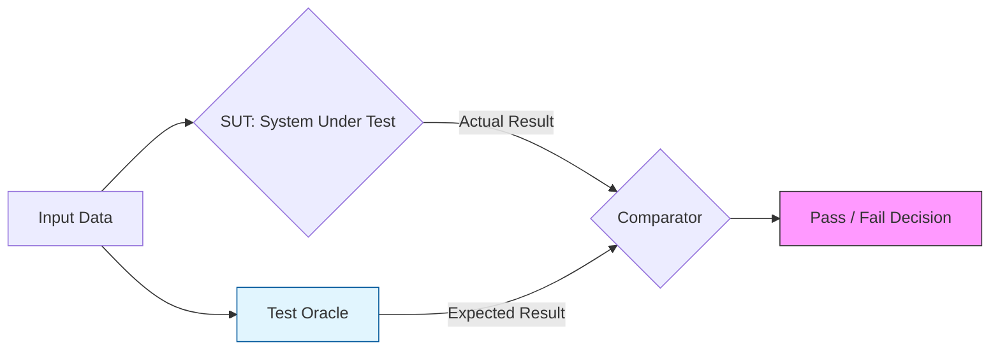

Parent: [[075.SW_테스트_일반]]

# 테스트 오라클(Test Oracle)

> [!info] **테스트 오라클이란?**
> 테스트 수행 결과가 올바른지 판단하기 위해 미리 정의된 **기대값(Expected Result)**과 실제 실행 결과(Actual Result)를 비교하는 메커니즘입니다. 모든 입력값에 대해 기대값을 생성하는 것은 불가능하다는 '오라클 문제'를 해결하기 위한 핵심 기술입니다.

---

## 1. 테스트 오라클의 개요
### 가. 테스트 오라클의 정의
- 테스트 케이스의 통과(Pass) 또는 실패(Fail) 여부를 결정하기 위해 기준이 되는 결과를 생성하거나 검증하는 규칙 및 방법

### 나. 테스트 오라클의 필요성 (Why)
1. **결과 검증의 객관성**: 테스터의 주관이 아닌 명확한 기준에 의해 품질 상태를 판단
2. **테스트 자동화의 필수 요소**: 사람의 개입 없이 수천 개의 테스트 결과를 기계적으로 판정하기 위해 필수적임
3. **오라클 문제(Oracle Problem) 대응**: 복잡한 시스템에서 모든 입력에 대한 정답을 알 수 없는 한계를 극복하기 위해 유형별 오라클 적용 필요

---

## 2. 테스트 오라클의 유형 및 메커니즘 (What & How)
### 가. 테스트 오라클 작동 프로세스 (Mermaid)

### 나. 주요 테스트 오라클 4대 유형

| 유형 | 상세 내용 | 특징 및 적용 사례 |
| :--- | :--- | :--- |
| **참 오라클 (True)** | 모든 입력값에 대해 정확한 기대값을 제공함 | 미션 크리티컬 시스템 (항공, 임베디드) |
| **샘플링 오라클 (Sampling)** | 특정 주요 입력값들에 대해서만 기대값을 제공함 | 일반적인 업무 시스템, 사용자 테스트 |
| **휴리스틱 오라클 (Heuristic)** | 샘플링 오라클을 보완하여, 특정 조건에서 추론(직관)으로 판정 | 복잡한 수학적 계산, 인공지능 결과 판정 |
| **일관성 검사 (Consistent)** | 애플리케이션의 변경 전후 결과가 동일한지 확인 | **회귀 테스트(Regression Test)** 시 활용 |

---

## 3. 심화: 오라클 유형별 상세 비교 및 한계점
### 가. 오라클 간 비교 분석표 (Comparison)

| 비교 항목 | 참 오라클 | 샘플링 / 휴리스틱 | 일관성 검사 |
| :--- | :--- | :--- | :--- |
| **적용 범위** | 전 범위 (Exhaustive) | 부분 범위 (Subset) | 변경 영향 범위 |
| **비용 및 노력** | 매우 높음 (기대값 산정 어려움) | 보통 | 낮음 |
| **신뢰도** | 최고 | 보통 | 변경 사항 없음 확인용 |
| **주요 용도** | 생명/재산과 직결된 시스템 | 데이터가 방대한 상용 서비스 | 유지보수 및 업그레이드 |

### 나. 메타모픽 테스팅 (Metamorphic Testing)
- 오라클 문제(정답을 모르는 경우)를 해결하기 위한 기법으로, 입력값의 변화에 따른 **출력값의 상관관계(Metamorphic Relation)**를 통해 결과의 정당성을 우회적으로 검증함
- 예: $\sin(x)$의 정답은 몰라도, $\sin(x) = \sin(\pi - x)$ 성질을 이용하여 일관성 확인

---

## 4. 기술사적 제언 및 실무 적용 방안
### 가. 테스트 오라클 선정 전략
- **리스크 기반 선정**: 모든 기능에 참 오라클을 적용하는 것은 예산 낭비이므로, **위험기반 테스트(RBT)** 결과에 따라 Zone 1 영역에만 참 오라클을 적용하고 나머지는 샘플링/일관성 검사를 활용해야 함

### 나. 기술사적 인사이트 및 향후 전망
- **AI/ML 모델의 오라클 문제**: 딥러닝 모델은 결과의 정답을 사전에 정의하기 어려우므로, **휴리스틱 오라클**이나 **다중 버전 테스팅(N-version Testing)**을 통한 다수결 판정 기법 도입이 가속화되고 있음
- **자동 오라클 생성**: 최근에는 소스 코드를 분석하여 기대값을 자동으로 추출하는 **Search-based Software Testing(SBST)** 연구가 활발하며, 이는 테스트 자동화의 진정한 완성을 의미함
- 결론적으로 테스트 오라클은 **'품질의 잣대'**이며, 시스템의 성격에 맞는 적절한 오라클 선정 능력이 기술사의 핵심 역량임

---

## Related Notes
- [[075.SW_테스트_일반]]
- [[102.회귀_테스트(Regression_Test)]]
- [[103.위험기반_테스트(Risk_Based_Testing)]]
- [[080.테스트_케이스(Test_Case)]]
