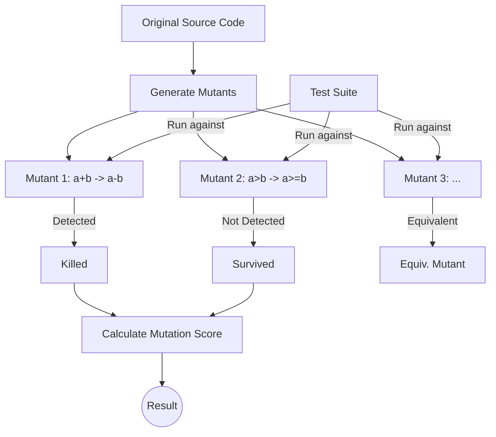

Parent: [[097.테스트_커버리지(Test_Coverage)]]

# 뮤테이션 테스트(Mutation Testing)

> [!info] **뮤테이션 테스트란?**
> 테스트 케이스의 **유효성(Effectiveness)**을 평가하기 위해 의도적으로 소스 코드에 미세한 오류를 주입(Mutation)하고, 기존 테스트 케이스가 이 오류를 찾아내는지 검증하는 결함 기반 테스트 기법입니다. '테스트를 테스트하는 기법'으로 불립니다.

---

## 1. 뮤테이션 테스트의 개요
### 가. 뮤테이션 테스트의 정의
- 프로그램의 코드를 변형시킨 **뮤턴트(Mutant)**를 생성하고, 테스트 케이스가 이를 제거(Kill)하는지 확인하여 테스트 세트의 결함 발견 능력을 정량적으로 측정하는 기법

### 나. 뮤테이션 테스트의 필요성 (Why)
1. **코드 커버리지의 한계 극복**: 코드가 실행되었다고 해서 로직의 오류를 반드시 찾는 것은 아니므로, 테스트 케이스의 실질적인 검증 능력을 확인 필요
2. **테스트 품질의 정량화**: **뮤테이션 점수(Mutation Score)**를 통해 테스트 세트의 신뢰도를 수치로 증명
3. **취약한 테스트 식별**: 뮤턴트를 찾아내지 못하는 '무의미한 테스트 케이스'를 식별하고 개선 유도
4. **고신뢰성 보장**: 항공, 국방 등 결함 발생 시 치명적인 분야에서 테스트 완결성 입증

---

## 2. 뮤테이션 테스트의 메커니즘 및 프로세스 (What & How)
### 가. 뮤테이션 테스트 작동 흐름 (Mermaid)

### 나. 핵심 구성 요소 및 용어

| 용어 | 설명 | 비고 |
| :--- | :--- | :--- |
| **뮤턴트 (Mutant)** | 원본 코드에서 연산자 등을 의도적으로 변경한 변종 코드 | 결함 주입물 |
| **뮤테이션 연산자** | 코드를 변조하는 규칙 (예: 산술/관계/논리 연산자 교체) | Mutation Operator |
| **살아남은 뮤턴트** | 테스트 케이스가 결함을 발견하지 못한 경우 (Survived) | 테스트 보완 필요 |
| **죽은 뮤턴트** | 테스트 케이스가 결함을 정상적으로 발견한 경우 (Killed) | 유효한 테스트 |
| **등가 뮤턴트** | 코드 변형 후에도 원본과 결과가 항상 동일한 경우 (Equivalent) | 점수 계산 시 제외 |

---

## 3. 심화: 뮤테이션 점수 및 커버리지 비교
### 가. 뮤테이션 점수(Mutation Score) 산출
$$Mutation\ Score = \frac{Killed\ Mutants}{Total\ Mutants - Equivalent\ Mutants} \times 100$$
> [!tip] 점수가 100%에 가까울수록 테스트 세트의 결함 발견 능력이 완벽함을 의미함

### 나. 코드 커버리지 vs 뮤테이션 테스트 비교 분석

| 비교 항목 | 코드 커버리지 (Code Coverage) | 뮤테이션 테스트 (Mutation Testing) |
| :--- | :--- | :--- |
| **측정 대상** | 소스 코드의 실행 여부 | 테스트 케이스의 **결함 발견 능력** |
| **핵심 질문** | "코드가 실행되었는가?" | "테스트가 결함을 찾을 수 있는가?" |
| **복잡도/비용** | 낮음 (자동화 용이) | 매우 높음 (수많은 뮤턴트 실행 필요) |
| **신뢰 수준** | 보통 (실행만 되어도 Pass) | **매우 높음** (로직 검증 강제) |

---

## 4. 기술사적 제언 및 실무 적용 방안
### 가. 실무 도입 시 한계 및 극복 방안
1. **계산 비용 문제**: 대규모 시스템에서 수만 개의 뮤턴트를 실행하는 것은 비현실적임 → **Selective Mutation**(핵심 연산자만 선택)이나 **Mutation Testing Tool**(PIT 등)의 병렬 처리 활용
2. **등가 뮤턴트 판별**: 소스 코드가 논리적으로 동일한지 판단하는 것은 정지 문제(Halting Problem)와 유사하게 어려움 → 수동 검토와 정적 분석 도구 병행

### 나. 기술사적 인사이트
- **테스트 피라미드의 정점**: 코드 커버리지가 80% 이상 확보된 성숙한 프로젝트에서, 최종적인 품질 완결성을 위해 **뮤테이션 테스트**를 도입하는 것이 바람직함
- **결함 주입(Fault Injection)과의 연계**: 운영 환경의 회복 탄력성을 검증하는 '카오스 엔지니어링'이 인프라의 뮤테이션이라면, 코드 레벨의 뮤테이션은 **소프트웨어 로직의 무결성**을 보장하는 상호 보완적 관계임
- 결론적으로 뮤테이션 테스트는 **'테스트의 양이 아닌 질(Quality of Testing)'**을 평가하는 최상위 수준의 품질 관리 기법임

---

## Related Notes
- [[098.코드_커버리지(Code_Coverage)]]
- [[099.MC_DC(Modified_Condition_Decision_Coverage)]]
- [[075.SW_테스트_일반]]
- [[086.Shift-Right_Testing]]
