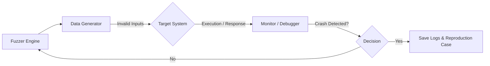

Parent: [[082.SW_테스트_유형]]

# 퍼즈 테스트(Fuzz Testing / Fuzzing)

> [!info] **퍼즈 테스트(Fuzzing)란?**
> 소프트웨어의 보안 취약점이나 결함을 발견하기 위해 **비정상적(Invalid), 예상치 못한(Unexpected), 무작위(Random)** 데이터를 입력(Fuzz)하여 시스템의 충돌(Crash)이나 예외 상황을 유발하는 자동화 테스트 기법입니다.

---

## 1. 퍼즈 테스트의 개요
### 가. 퍼즈 테스트의 정의
- 정형화된 입력값이 아닌 '노이즈'나 '변조된 데이터'를 주입하여 소프트웨어의 **견고성(Robustness)**과 **보안성(Security)**을 검증하는 블랙박스 기반의 동적 테스트

### 나. 필요성 및 장점 (Why)
1. **미지의 취약점(0-Day) 발굴**: 정적 분석이나 정형 테스트로 찾기 어려운 런타임 오류 및 보안 허점 식별
2. **비용 효율적 자동화**: 한 번 구축하면 사람의 개입 없이 수만 개의 케이스를 무한 반복 수행 가능
3. **공급망 보안 강화**: 외부 라이브러리나 바이너리 파일의 안정성을 검증하는 데 효과적임

---

## 2. 퍼즈 테스트의 메커니즘 및 분류 (What & How)
### 가. 퍼징 작동 프로세스 (Mermaid)

### 나. 데이터 생성 방식에 따른 분류

| 분류 | 상세 내용 | 특징 |
| :--- | :--- | :--- |
| **Generation-based** | 대상 시스템의 프로토콜이나 형식을 학습하여 처음부터 생성 | 유효한 구문을 생성하여 깊은 로직 탐입 가능 |
| **Mutation-based** | 기존의 정상적인 입력값(Seed)을 미세하게 변조 | 구현이 쉽고 빠르나, 형식 위반 시 초기에 차단됨 |
| **Protocol-based** | 특정 통신 규약(HTTP, TCP 등)에 특화된 데이터 주입 | 네트워크 장비 및 통신 소프트웨어 검증에 특화 |

---

## 3. 심화: 퍼즈 테스트의 진화 (Grey-box Fuzzing)
- **Black-box Fuzzing**: 시스템 내부를 전혀 모른 채 무작위 입력 (효율 낮음)
- **White-box Fuzzing**: 소스 코드를 분석하여 모든 경로 탐색 (비용 매우 높음)
- **Grey-box Fuzzing (AFL 등)**: 코드에 계측(Instrumentation)을 심어 **커버리지** 정보를 피드백 받아, 새로운 경로를 실행하는 입력값을 우선적으로 변조 (가장 효율적)

---

## 4. 기술사적 제언 및 실무 적용 방안
### 가. 실무 도입 시 고려사항
1. **오라클(Oracle) 설정**: 시스템이 단순히 죽는 것(Crash) 외에 메모리 누수나 무한 루프에 빠지는 상태를 감지할 수 있는 정교한 모니터링 체계 필요
2. **시드(Seed) 데이터 품질**: 변조의 기초가 되는 초기 데이터가 다양할수록 결함 발견 확률이 높아짐

### 나. 기술사적 인사이트
- **DevSecOps의 핵심**: 보안이 강조되는 최근 트렌드에서 퍼즈 테스트는 CI/CD 파이프라인의 **Security Gate** 역할을 수행해야 함
- **AI-Driven Fuzzing**: 강화학습(Reinforcement Learning)을 활용하여 결함을 잘 유발하는 입력 패턴을 스스로 학습하는 지능형 퍼징으로 발전 중
- 결론적으로 퍼즈 테스트는 **'공격자의 시각에서 시스템의 한계를 시험'**하여 보안 내구성을 완성하는 필수 활동임

---

## Related Notes
- [[104.몽키_테스트(Monkey_Test)]]
- [[082.SW_테스트_유형]]
- [[004.DevSecOps]]
