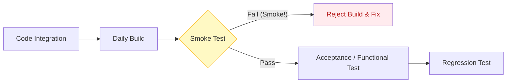

Parent: [[082.SW_테스트_유형]]

# 스모크 테스트(Smoke Test)

> [!info] **스모크 테스트란?**
> 새로운 빌드가 생성되었을 때, 시스템의 **주요 핵심 기능**이 기본적으로 작동하는지 확인하는 기초 테스트입니다. "장치에 전원을 켰을 때 연기가 나는지 확인한다"는 하드웨어 수리 개념에서 유래되었으며, **빌드 검증 테스트(BVT, Build Verification Test)**라고도 불립니다.

---

## 1. 스모크 테스트의 개요
### 가. 스모크 테스트의 정의
- 세부적인 테스트를 수행하기 전, 소프트웨어의 중대한 결함 유무를 파악하여 다음 단계의 테스트 진행 여부를 결정하는 얕고 넓은 테스트

### 나. 필요성 및 목적 (Why)
1. **시간 낭비 방지**: 기초적인 기능이 안 되는 빌드에 대해 상세 테스트를 수행하는 리소스 낭비 차단
2. **빌드 안정성 확인**: 배포된 빌드가 테스트 환경에서 정상적으로 구동(Install/Launch)되는지 검증
3. **조기 결함 식별**: 시스템의 핵심 경로(Critical Path)에서 발생하는 치명적 오류 조기 발견
4. **리스크 완화**: 잦은 통합(CI) 환경에서 매 빌드의 최소 품질 보장

---

## 2. 스모크 테스트의 특징 및 프로세스 (What & How)
### 가. 스모크 테스트 위치 및 흐름 (Mermaid)

### 나. 주요 특징 비교 분석

| 항목 | 스모크 테스트 (Smoke) | 새니티 테스트 (Sanity) |
| :--- | :--- | :--- |
| **범위** | 전체 시스템의 주요 기능 (Wide) | 특정 기능의 수정 사항 (Narrow) |
| **목적** | 빌드의 안정성/수용 가능성 확인 | 변경된 로직의 타당성 확인 |
| **깊이** | 얕음 (Basic Flow) | 깊음 (Detailed Logic) |
| **수행 시점** | 빌드 직후 (초기 단계) | 회귀 테스트 전 (중간 단계) |

---

## 3. 심화: 스모크 테스트 설계 및 자동화
### 가. 테스트 케이스 선정 기준
- **시스템 기동**: 로그인, 메인 화면 진입 가능 여부
- **핵심 시나리오**: 쇼핑몰의 경우 '상품 검색 -> 장바구니 담기' 등 핵심 비즈니스 로직 1개
- **연동 확인**: DB 연결 및 필수 외부 서비스 통신 상태

### 나. 자동화의 중요성
- 매 빌드마다 수행되므로 **CI/CD** 파이프라인 내에서 자동화가 필수적임
- 실행 시간은 보통 5~15분 내외로 짧게 유지하여 빠른 피드백 제공

---

## 4. 기술사적 제언 및 실무 적용 방안
### 가. 실무 도입 시 유의사항
- **업데이트 주기**: 기능이 추가되거나 변경됨에 따라 스모크 테스트 대상 시나리오도 주기적으로 업데이트되어야 함
- **환경 의존성 배제**: 네트워크나 DB 등 환경 문제로 실패할 경우 빌드 결함으로 오인할 수 있으므로 테스트 환경의 안정성 선행 필수

### 나. 기술사적 인사이트
- **Shift-Left의 관문**: 스모크 테스트는 개발자의 로컬 환경에서 먼저 수행(Pre-commit)되어야 하며, 이를 통해 통합 빌드 실패율을 획기적으로 낮출 수 있음
- **신뢰의 척도**: 성공적인 스모크 테스트는 테스터와 개발자 간의 신뢰를 구축하며, 품질 중심의 개발 문화를 정착시키는 첫걸음임
- 결론적으로 스모크 테스트는 **'소프트웨어 품질의 생존 신고'**이며, 안정적인 프로젝트 운영을 위한 최소한의 안전장치임

---

## Related Notes
- [[082.SW_테스트_유형]]
- [[112.새니티_테스트(Sanity_Test)]]
- [[005.CI_CD]]
