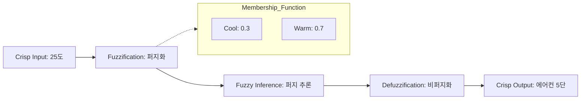

Parent: [[031.객체지향_개발방법론]] (기초 이론 관점)

# 퍼지 이론(Fuzzy Theory)

> [!info] **퍼지 이론이란?**
> 0과 1이라는 이분법적인 논리(Boolean Logic)를 벗어나, **'약간', '매우'**와 같이 인간이 사용하는 주관적이고 애매모호한 상태를 수치화하여 다루는 수학적 이론입니다. 1965년 로트피 자데(Lotfi A. Zadeh) 교수에 의해 제안되었습니다.

---

## 1. 퍼지 이론의 개요
### 가. 퍼지 이론의 정의
- 사물의 경계가 불분명한 상태를 **소속 함수(Membership Function)**를 통해 [0, 1] 사이의 연속적인 값으로 표현하는 논리 체계

### 나. 필요성 및 배경 (Why)
1. **현실 세계의 복잡성**: "덥다", "차갑다"와 같이 명확히 선을 긋기 어려운 연속적인 현상을 모델링 필요
2. **인간 중심의 제어**: 전문가의 주관적 지식과 노하우를 컴퓨터 시스템에 반영하기 위함
3. **유연한 의사결정**: 불확실성이 존재하는 환경에서 딱딱한 규칙이 아닌 부드러운 판단 근거 제공

---

## 2. 퍼지 이론의 핵심 메커니즘 (What & How)
### 가. 퍼지 집합과 소속 함수 (Mermaid)

### 나. 주요 구성 요소 및 절차

| 단계 | 설명 | 비고 |
| :--- | :--- | :--- |
| **퍼지 집합 (Fuzzy Set)** | 원소가 집합에 속하는 정도를 나타내는 집합 | 소속도(Grade) 사용 |
| **퍼지화 (Fuzzification)** | 구체적인 입력값(Crisp)을 소속 함수를 통해 퍼지값으로 변환 | "25도 -> 약간 더움" |
| **퍼지 추론 (Inference)** | "If-Then" 규칙을 기반으로 언어적 규칙을 적용 | "더우면 강풍을 틀어라" |
| **비퍼지화 (Defuzzification)** | 추론된 결과를 다시 구체적인 제어값(Crisp)으로 변환 | 무게중심법(Centroid) 등 활용 |

---

## 3. 심화: 퍼지 논리 vs 이진 논리 비교
### 가. 비교 분석표 (Comparison)

| 비교 항목 | 이진 논리 (Classical Logic) | 퍼지 논리 (Fuzzy Logic) |
| :--- | :--- | :--- |
| **기초 단위** | 0 또는 1 (Black or White) | [0, 1] 사이의 값 (Grey scale) |
| **소속 여부** | 포함되거나 되지 않음 (All or Nothing) | 부분적으로 포함 가능 |
| **정확도** | 정밀한 수치적 정확성 지향 | 의미적/언어적 타당성 지향 |
| **적용 분야** | 계산기, 하드웨어 제어, 정밀 물리 | 가전제품(세탁기, 에어컨), 주식 예측, 의료 진단 |

---

## 4. 기술사적 제언 및 실무 적용 방안
### 가. 실무 적용 사례
- **가전 제어**: 빨래의 양과 오염도에 따라 세탁 시간을 유연하게 조절하는 스마트 세탁기
- **자동 제어**: 엘리베이터의 급가속 방지, 지하철의 부드러운 정차 제어

### 나. 기술사적 인사이트
- **AI와의 융합**: 최근에는 퍼지 이론과 신경망을 결합한 **뉴로-퍼지(Neuro-Fuzzy)** 시스템이 각광받고 있으며, 이는 인공지능의 판단 근거를 설명할 수 있는 **XAI(Explainable AI)**의 기초 기술로 재조명받고 있음
- **데이터 분석의 확장**: 정형화되지 않은 비정형 데이터나 설문 조사 등의 주관적 데이터를 분석할 때 퍼지 통계 기법을 적용하여 분석의 유연성을 확보할 수 있음
- 결론적으로 퍼지 이론은 **'기계의 정밀함과 인간의 유연함을 연결'**하는 지능형 시스템의 핵심 논리임

---

## Related Notes
- [[010.도메인_주도_설계(DDD)]] (비즈니스 언어의 모호성 해결 관점)
- [[046.디자인_패턴(Design_Pattern)]] (Strategy 패턴 등과 연계 가능)
