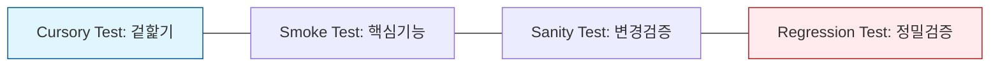

Parent: [[082.SW_테스트_유형]]

# 커서리 테스트(Cursory Test)

> [!info] **커서리 테스트란?**
> 정밀한 분석보다는 **겉핥기 식(Cursory)**으로 시스템의 전체적인 상태를 빠르게 훑어보는 테스트입니다. 상세한 테스트 케이스 없이 주요 기능이 명백하게 파손되었는지 여부만을 신속하게 확인하는 것이 목적입니다.

---

## 1. 커서리 테스트의 개요
### 가. 커서리 테스트의 정의
- 소프트웨어의 세부적인 로직을 검증하기 전, 인터페이스의 배치나 핵심 메뉴의 진입 가능성 등 가시적인 부분을 빠르게 점검하는 테스트

### 나. 필요성 및 배경 (Why)
1. **즉각적 피드백**: 배포 직후 1~2분 내에 시스템의 '생사'를 판단해야 하는 상황에서 수행
2. **효율적 리소스 배분**: 정밀 테스트팀이 투입되기 전, 최소한의 작동 보장을 확인하여 대기 시간 단축
3. **사용자 체감 품질**: 실제 사용자가 앱을 켰을 때 처음 마주하는 화면들의 정상 노출 여부 확인

---

## 2. 커서리 테스트의 특징 및 수행 방식 (What & How)
### 가. 테스트 수행 스펙트럼 (Mermaid)

### 나. 주요 특징 분석

| 구분 | 내용 | 비고 |
| :--- | :--- | :--- |
| **수행 시간** | 극히 짧음 (수분 이내) | Speed 최우선 |
| **테스트 깊이** | 매우 얕음 (Shallow) | 가시적 오류 중심 |
| **테스트 범위** | 넓음 (전체 화면/메뉴) | Breadth 위주 |
| **문서화** | 거의 없음 (Checklist 수준) | 비정형 수행 가능 |

---

## 3. 커서리 테스트 vs 스모크 테스트 심화 비교
- 실제 실무에서는 혼용되어 사용되나, 기술사적 관점에서는 다음과 같이 미세하게 구분할 수 있습니다.

| 비교 항목 | 커서리 테스트 (Cursory) | 스모크 테스트 (Smoke) |
| :--- | :--- | :--- |
| **핵심 관점** | **UI/UX 레이아웃, 링크 연결** | **비즈니스 핵심 로직 작동** |
| **검증 예시** | "로그인 버튼이 보이는가?" | "로그인이 실제로 성공하는가?" |
| **수행 주체** | 기획자, 디자이너, 테스터 | 개발자, 자동화 도구, 전문 테스터 |
| **실패 시 조치** | 즉각 수정 요청 (Minor/Major) | 빌드 반려 (Critical) |

---

## 4. 기술사적 제언 및 실무 적용 방안
### 가. 실무 활용 전략
- **배포 당일(D-Day) 활용**: 대규모 운영 배포 직후, 전 직원이 각자의 단말기에서 주요 페이지를 한 번씩 클릭해 보는 '전사 커서리 테스트'를 통해 대규모 장애를 조기에 방지할 수 있음
- **모바일 앱 검수**: 다양한 해상도의 단말기에서 화면 깨짐이나 폰트 누락 등을 확인하는 용도로 효과적임

### 나. 기술사적 인사이트
- **자동화와의 보완**: 정밀한 스크립트 기반 자동화는 '보이지 않는 곳의 로직'은 잘 찾지만, '화면이 이상하게 깨지는 현상'은 놓치기 쉬움. 이때 인간의 시각을 활용한 **커서리 테스트**가 보완재 역할을 함
- **품질 의식 고취**: 개발 단계 중간중간 커서리 테스트를 습관화하면, "일단 돌아가기만 하면 된다"는 안일한 생각을 버리고 사용자 관점의 품질을 상시 고민하게 됨
- 결론적으로 커서리 테스트는 **'기술적 무결성 이전에 사용자에게 보여지는 신뢰의 최소 단위'**를 점검하는 활동임

---

## Related Notes
- [[109.스모크_테스트(Smoke_Test)]]
- [[112.새니티_테스트(Sanity_Test)]]
- [[082.SW_테스트_유형]]
