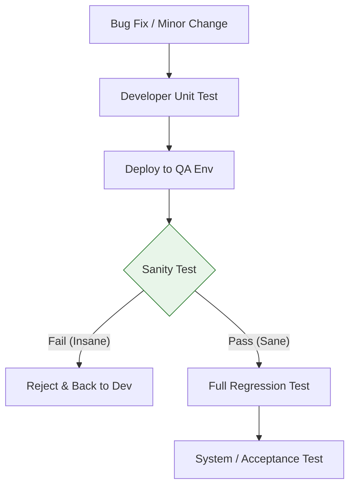

Parent: [[082.SW_테스트_유형]]

# 새니티 테스트(Sanity Test / 예비 테스트)

> [!info] **새니티 테스트란?**
> 소프트웨어의 **특정 기능 수정이나 버그 픽스**가 이루어진 후, 해당 변경 사항이 의도한 대로 작동하는지, 그리고 시스템이 논리적으로 '건전(Sane)'하게 유지되고 있는지 확인하는 좁고 깊은 테스트입니다.

---

## 1. 새니티 테스트의 개요
### 가. 새니티 테스트의 정의
- 특정 모듈의 변경이 시스템 전체를 망가뜨리지 않았음을 확인하고, 정밀한 회귀 테스트(Regression)를 수행할 가치가 있는지를 판단하는 선별적 테스트

### 나. 필요성 및 배경 (Why)
1. **결함 수정 유효성 확인**: 보고된 버그가 실제로 고쳐졌는지 즉시 검증
2. **회귀 테스트 비용 절감**: 새니티 테스트를 통과하지 못한 빌드는 리젝(Reject)하여 무의미한 전수 회귀 테스트 시간 낭비 방지
3. **논리적 일관성 확보**: 수정된 코드가 주변 로직과 모순을 일으키지 않는지 '건전성' 확인
4. **민첩한 배포 지원**: 긴급 패치(Hotfix) 시 빠른 검증 후 배포 결정의 근거 제공

---

## 2. 새니티 테스트의 메커니즘 및 위치 (What & How)
### 가. 테스트 수행 흐름도 (Mermaid)

### 나. 스모크 테스트 vs 새니티 테스트 비교 (Double-Check)

| 비교 항목 | 스모크 테스트 (Smoke) | 새니티 테스트 (Sanity) |
| :--- | :--- | :--- |
| **수행 대상** | 전체 시스템의 주요 경로 | 특정 변경/수정된 기능 중심 |
| **테스트 깊이** | 얕음 (Basic) | 상대적으로 깊음 (Detailed) |
| **수행 시점** | 매 빌드 초기 (Build Acceptance) | 버그 수정 후 (Regression Pre-check) |
| **테스트 케이스** | 정형화된 핵심 세트 | 비정형 또는 선별된 세트 |

---

## 3. 심화: 새니티 테스트의 전략적 가치
### 가. 회귀 테스팅의 부분 집합 (Subset of Regression)
- 새니티 테스트는 전체 회귀 테스트 케이스 중 변경 부분과 밀접한 연관이 있는 항목만을 추출하여 수행하는 **'Narrow Regression'**의 성격을 가짐

### 나. 의사결정 도구로서의 역할
- "이 소프트웨어는 아직 제정신(Sane)인가?"라는 질문에 답하는 과정으로, 시스템의 논리적 붕괴가 감지되면 즉시 테스트를 중단(Stop-test criteria)시키는 게이트웨이 역할을 함

---

## 4. 기술사적 제언 및 실무 적용 방안
### 가. 실무 적용 시 고려사항
- **선별 기준(Criteria)**: 무엇을 새니티 테스트 범위에 넣을 것인지에 대한 기준이 명확해야 함. 보통 결함 리포트의 **재현 시나리오**와 그 주변의 **Edge Case**를 포함함
- **자동화 활용**: 자주 발생하는 버그 패턴에 대해서는 새니티 테스트 스크립트를 작성하여 개발자가 즉시 돌려볼 수 있게 해야 함

### 나. 기술사적 인사이트
- **Risk-Based Sanity**: 변경된 코드의 복잡도(Complexity)와 중요도를 분석하여 새니티 테스트의 강도를 차등화하는 전략이 필요함
- **Agile의 필수 요소**: 매일 코드가 변경되는 애자일 환경에서 전수 회귀 테스트는 불가능에 가까우므로, 정교하게 설계된 **새니티 테스트**가 실질적인 품질 수호자 역할을 수행함
- 결론적으로 새니티 테스트는 **'불필요한 노력을 차단하고 핵심에 집중'**하게 만드는 테스트 프로세스의 윤활유임

---

## Related Notes
- [[109.스모크_테스트(Smoke_Test)]]
- [[102.회귀_테스트(Regression_Test)]]
- [[103.위험기반_테스트(Risk_Based_Testing)]]
