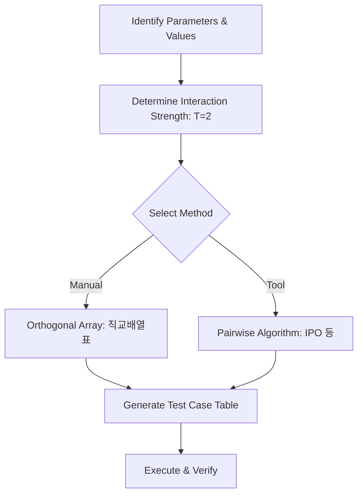

Parent: [[089.명세기반_테스트(Specification-based_Testing)]]

# 페어와이즈 테스트(Pairwise Testing)

> [!info] **페어와이즈 테스트란?**
> 대부분의 결함이 한두 개의 입력값 조합에서 발생한다는 원리에 착안하여, 모든 가능한 조합 대신 **모든 쌍(Pair)**의 조합을 최소 한 번 이상 실행하도록 테스트 케이스를 설계하는 기법입니다. **조합 폭발(Combinatorial Explosion)** 문제를 해결하는 핵심 기법입니다.

---

## 1. 페어와이즈 테스트의 개요
### 가. 페어와이즈 테스트의 정의
- 여러 개의 입력 변수가 있을 때, 각 변수 간의 가능한 모든 쌍(All-Pairs)의 조합을 포함하는 최소한의 테스트 세트를 구성하는 기법

### 나. 등장 배경 및 필요성 (Why)
1. **조합 폭발 방지**: 변수가 10개이고 각 변수가 2개의 값을 가질 때, 전수 테스트($2^{10}=1,024$) 대신 페어와이즈(약 10여 개)로 획기적 단축 가능
2. **결함 발견 효율성**: 통계적으로 결함의 약 70~90%는 단일 변수 혹은 두 변수 간의 상호작용에서 발생함
3. **자원 최적화**: 한정된 시간과 비용 내에서 최대의 결함 발견 효과를 거두기 위한 전략적 선택

---

## 2. 페어와이즈 테스트의 메커니즘 및 도출 (What & How)
### 가. 테스트 케이스 도출 프로세스 (Mermaid)

### 나. 핵심 도구 및 알고리즘

| 구분 | 상세 내용 | 특징 |
| :--- | :--- | :--- |
| **직교배열표 (OA)** | 수학적으로 설계된 정형화된 표를 활용하여 조합 도출 | 규칙적이고 안정적이나 값의 개수가 제한됨 |
| **IPO 알고리즘** | In-Parameter-Order 방식을 통해 파라미터를 하나씩 추가하며 조합 | 유연한 확장성, 대부분의 자동화 도구에서 채택 |
| **PICT (Microsoft)** | 가장 널리 사용되는 오픈소스 페어와이즈 도구 | 복잡한 제약 조건(Constraints) 반영 가능 |

---

## 3. 심화: 전수 테스트 vs 페어와이즈 비교
### 가. 테스트 커버리지 및 경제성 분석

| 비교 항목 | 전수 테스트 (Exhaustive) | 페어와이즈 테스트 (Pairwise) |
| :--- | :--- | :--- |
| **테스트 케이스 수** | $V^P$ (기하급수적 증가) | $O(V^2 \log P)$ (완만한 증가) |
| **결함 발견 범위** | 모든 상호작용 결함 발견 | **2-way 상호작용** 결함 완벽 발견 |
| **수행 비용** | 매우 높음 (현실적 불가능) | 매우 낮음 (고효율) |
| **신뢰 수준** | 100% | 약 80~95% (실무적 충분함) |

---

## 4. 기술사적 제언 및 실무 적용 방안
### 가. 실무 적용 시 유의사항 (Constraints)
- **제약 조건 반영**: "OS가 Windows일 때 Safari 브라우저는 선택 불가"와 같은 도메인별 제약 사항을 반영하여 유효하지 않은 조합을 사전에 제거해야 함
- **값의 대표성**: 각 파라미터의 값(Value) 선정 시 **동등 분할** 및 **경계값 분석**을 통해 최적의 대표값을 먼저 뽑는 것이 전제되어야 함

### 나. 기술사적 인사이트
- **설정(Configuration) 테스트의 필수**: 수많은 하드웨어 사양, OS 버전, 브라우저 조합을 검증해야 하는 호환성 테스트에서 페어와이즈는 선택이 아닌 필수임
- **N-way Testing 확장**: 극도의 안전성이 요구되는 시스템에서는 3-way, 4-way 등으로 상호작용 강도를 높여 리스크를 관리할 수 있음
- 결론적으로 페어와이즈 테스트는 **'수학적 최적화를 통해 품질의 가성비를 극대화'**하는 지능형 테스트 설계의 정수임

---

## Related Notes
- [[089.명세기반_테스트(Specification-based_Testing)]]
- [[103.위험기반_테스트(Risk_Based_Testing)]]
- [[080.테스트_케이스(Test_Case)]]
