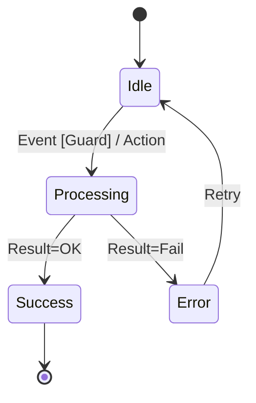

Parent: [[089.명세기반_테스트(Specification-based_Testing)]]

# 상태 전이 테스팅(State Transition Testing)

> [!info] **상태 전이 테스팅이란?**
> 시스템이 처한 **상태(State)**와 외부 **이벤트(Event)**에 따른 변화를 **상태 전이도(State Transition Diagram)**로 모델링하고, 모든 상태와 전이 경로가 올바르게 작동하는지 검증하는 명세기반 테스트 기법입니다.

---

## 1. 상태 전이 테스팅의 개요
### 가. 상태 전이 테스팅의 정의
- 시스템의 현재 상태와 입력 조건에 따라 다음 상태와 출력이 결정되는 **유한 상태 기계(FSM)** 모델을 기반으로 테스트 케이스를 설계하는 기법

### 나. 필요성 및 배경 (Why)
1. **복잡한 비즈니스 로직**: 주문-결제-배송 등 순서와 상태가 중요한 워크플로우 검증에 탁월
2. **비정상 경로 식별**: 특정 상태에서 발생해서는 안 되는 이벤트(예: 배송 완료 후 취소)에 대한 차단 여부 확인
3. **임베디드/실시간 시스템**: 하드웨어 제어 등 상태 변화가 핵심인 시스템의 안전성 보장
4. **누락 없는 검증**: 상태 전이 테이블을 통해 발생 가능한 모든 조합을 전수 검토 가능

---

## 2. 상태 전이 테스팅의 핵심 메커니즘 (What & How)
### 가. 상태 전이 구성 요소 (Mermaid)

### 나. 테스트 설계 4대 구성 요소

| 요소 | 설명 | 비고 |
| :--- | :--- | :--- |
| **상태 (State)** | 시스템이 머물러 있는 조건이나 상황 | 예: 대기중, 처리중, 완료 |
| **이벤트 (Event)** | 상태 변화를 일으키는 외부 입력 | 예: 버튼 클릭, 타임아웃 |
| **전이 (Transition)** | 이벤트에 의해 한 상태에서 다른 상태로 바뀌는 현상 | State A -> State B |
| **가드 (Guard)** | 전이가 일어나기 위해 만족해야 하는 불리언 조건 | [잔액 > 0] |

---

## 3. 심화: 상태 전이 테이블 및 커버리지
### 가. 상태 전이 테이블 (State Transition Table)
- 모든 상태와 모든 이벤트의 조합을 행과 열로 구성하여, 정의되지 않은 전이(Illegal Transition)를 찾는 데 유용함

### 나. 테스트 커버리지 기준
- **모든 상태 커버리지**: 시스템의 모든 상태를 최소 한 번씩 방문
- **모든 전이 커버리지**: 모든 화살표(Transition)를 최소 한 번씩 실행 (가장 보편적)
- **N-Switch 커버리지**: n개의 연속된 전이 경로를 검증 (복잡도 증가 시 사용)

---

## 4. 기술사적 제언 및 실무 적용 방안
### 가. 실무 적용 시 고려사항
- **상태 폭발(State Explosion)**: 상태가 너무 많아지면 모델링이 불가능해지므로, 계층적 상태도(Statechart)를 사용하거나 핵심 상태 위주로 추상화해야 함
- **가드 조건의 정밀도**: 이벤트뿐만 아니라 가드 조건에 따라 전이가 달라지므로, 가드 조건에 대해 **경계값 분석**을 병행 적용해야 함

### 나. 기술사적 인사이트
- **UI/UX 네비게이션**: 현대적인 웹/앱의 화면 흐름 자체가 거대한 상태 머신이므로, 화면 전환 결함을 잡는 데 최적의 도구임
- **보안 거버넌스**: 권한이 없는 상태에서의 기능 접근을 차단하는 '비인가 상태 전이' 테스트는 보안 취약점 점검의 필수 항목임
- 결론적으로 상태 전이 테스팅은 **'시간의 흐름과 사건의 인과관계를 품질로 치환'**하는 동적 정합성 보장의 핵심임

---

## Related Notes
- [[089.명세기반_테스트(Specification-based_Testing)]]
- [[069.UML_및_UML2.x]] (State Machine Diagram)
- [[107.퍼즈_테스트(Fuzz_Testing)]] (비정상 이벤트 주입)
