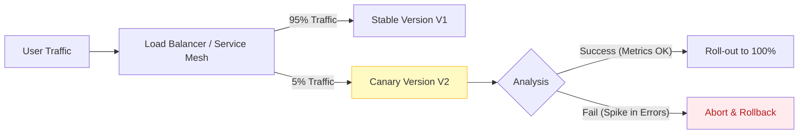

Parent: [[008.무중단배포(Zero-Downtime_Deployment)]]

# 카나리 테스트(Canary Test)

> [!info] **카나리 테스트란?**
> 새로운 버전의 소프트웨어를 전체 서버에 배포하기 전, **극히 일부의 사용자나 서버(카나리 그룹)**에게만 먼저 노출시켜 실전 환경에서의 문제를 모니터링하고 리스크를 최소화하는 점진적 배포 전략입니다. 광산의 유독가스를 감지하기 위해 카나리아 새를 넣었던 것에서 유래되었습니다.

---

## 1. 카나리 테스트의 개요
### 가. 카나리 테스트의 정의
- 운영 환경의 트래픽 중 일부(예: 1~5%)를 신규 버전(Canary)으로 유도하여 성능 및 오류 지표를 분석하고, 안정성이 확인되면 점진적으로 확산하는 테스트 기법

### 나. 필요성 및 배경 (Why)
1. **배포 리스크 완화**: 전체 배포 후 발생하는 대규모 장애(Blast Radius) 방지
2. **실전 환경 검증**: 테스트베드(QA)에서 발견하지 못한 실제 데이터 패턴 및 인프라 간섭 확인
3. **신속한 롤백**: 문제가 감지될 경우 트래픽 제어만으로 즉시 구 버전 복구 가능
4. **사용자 피드백 조기 확보**: 신규 기능에 대한 실제 사용자의 반응과 비즈니스 지표 확인

---

## 2. 카나리 테스트의 메커니즘 및 프로세스 (What & How)
### 가. 트래픽 제어 및 배포 흐름 (Mermaid)

### 나. 핵심 수행 단계

| 단계 | 활동 내용 | 핵심 기술 |
| :--- | :--- | :--- |
| **그룹 선정** | 테스트 대상 서버 혹은 사용자 군(Segment) 식별 | Sticky Session, Cookie |
| **트래픽 분산** | 로드밸런서나 서비스 메시를 통해 트래픽 일부 우회 | Istio, Nginx, AWS ALB |
| **지표 모니터링** | 에러율, 응답시간, CPU/MEM 등 골든 시그널 비교 | Prometheus, Grafana |
| **의사결정** | 분석 결과에 따라 승격(Promotion) 또는 폐기(Abort) | 자동 배포 파이프라인(Spinnaker) |

---

## 3. 심화: 블루-그린 배포 vs 카나리 테스트 비교
### 가. 배포 전략 간 비교 분석 (Comparison)

| 비교 항목 | 블루-그린 (Blue-Green) | 카나리 (Canary) |
| :--- | :--- | :--- |
| **배포 방식** | 전체 서버 교체 (All or Nothing) | 단계적/점진적 배포 (Incremental) |
| **리스크 노출** | 모든 사용자에게 일시 노출 | 극소수 사용자에게만 노출 |
| **인프라 비용** | 일시적으로 2배의 리소스 필요 | 기존 리소스 내에서 수행 가능 |
| **주요 목적** | 무중단 배포 및 빠른 롤백 | 실전 환경의 안전성 및 품질 검증 |

---

## 4. 기술사적 제언 및 실무 적용 방안
### 가. 성공적인 카나리 테스트를 위한 요건
- **가관측성(Observability) 확보**: 카나리 그룹과 스테이블 그룹의 지표를 실시간으로 비교 분석할 수 있는 대시보드가 필수임
- **자동화된 판단 (Analysis Strategy)**: 사람이 수동으로 판단하기보다, 에러율이 n% 이상 증가 시 자동으로 롤백되는 **Automated Canary Analysis(ACA)** 도입 권고

### 나. 기술사적 인사이트
- **Blast Radius 통제**: 현대 아키텍처의 핵심은 장애를 안 만드는 것이 아니라 **장애의 파급 범위를 최소화**하는 것이며, 카나리는 이를 실현하는 가장 현실적인 기술임
- **A/B 테스트와의 조화**: 카나리가 '시스템 안정성'에 초점을 맞춘다면, 동일한 메커니즘을 '비즈니스 효과' 검증으로 확장한 것이 A/B 테스트임
- 결론적으로 카나리 테스트는 **'신뢰할 수 없는 운영 환경에서 신뢰를 구축하는 점진적 신중함'**의 미학임

---

## Related Notes
- [[008.무중단배포(Zero-Downtime_Deployment)]]
- [[019.서비스_메시(Service_Mesh)]]
- [[086.Shift-Right_Testing]]
- [[101.성능_시험_결과보고서]]
