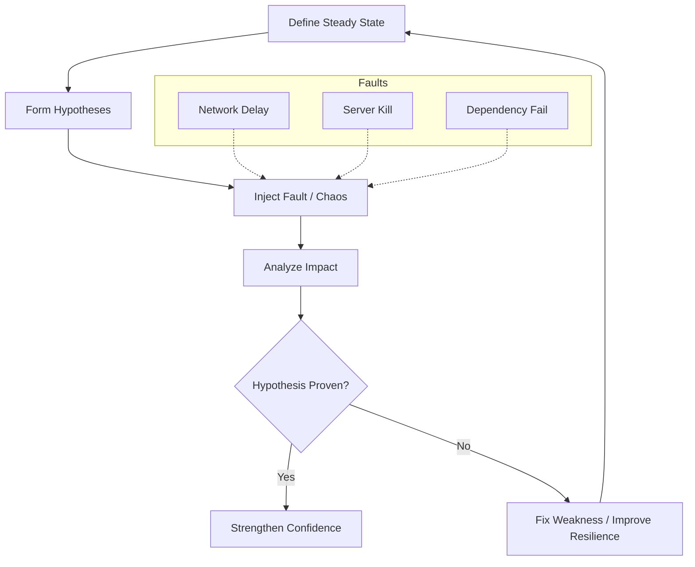

Parent: [[086.Shift-Right_Testing]]

# 카오스 테스트(Chaos Test / Chaos Engineering)

> [!info] **카오스 테스트란?**
> 분산 시스템의 **회복 탄력성(Resilience)**을 확인하기 위해 운영 환경에 의도적으로 **장애(Chaos)**를 주입하여, 예기치 못한 상황에서도 시스템이 신뢰성 있게 작동하는지 검증하는 기법입니다. "장애는 반드시 발생한다"는 전제하에 수행되는 능동적 방어 활동입니다.

---

## 1. 카오스 테스트의 개요
### 가. 카오스 테스트의 정의
- 시스템의 안정적인 상태(Steady State)를 정의하고, 가상의 장애 시나리오를 주입하여 시스템이 스스로 복구하거나 영향을 최소화하는지 실험하는 공학적 접근

### 나. 등장 배경 및 필요성 (Why)
1. **복잡한 분산 시스템(MSA)**: 수많은 서비스 간의 연쇄 장애(Cascading Failure) 예측 불가능
2. **클라우드 불확실성**: 인스턴스 종료, 네트워크 지연 등 인프라 장애 상시 발생
3. **가용성 보장**: 장애 발생 시 사용자 체감 품질을 유지하기 위한 **Graceful Degradation** 확인 필요
4. **신뢰성 문화 확산**: 장애를 두려워하지 않고 대비하는 **SRE(Site Reliability Engineering)** 문화 정착

---

## 2. 카오스 테스트의 5단계 프로세스 (What & How)
### 가. 카오스 엔지니어링 실험 루프 (Mermaid)

### 나. 카오스 테스트 수행 원칙 (Principles)

| 원칙 | 상세 내용 | 비고 |
| :--- | :--- | :--- |
| **정상 상태 정의** | 정상적인 시스템 작동 지표(TPS, 에러율 등)를 기준점으로 설정 | Baseline |
| **가설 수립** | "특정 서버가 죽어도 에러율은 1% 미만일 것이다"와 같은 가설 | Hypothesis |
| **현실적 장애 주입** | 실제 발생 가능한 장애(네트워크 단절, DB 부하 등) 주입 | Blast Radius 통제 |
| **운영 환경 실행** | 테스트베드가 아닌 **실제 운영 환경**에서의 실행 권장 | Shift-Right |

---

## 3. 심화: 카오스 테스트 도구 및 기술
### 가. 대표적 도구 (Tooling)
- **Chaos Monkey**: 넷플릭스에서 개발한 인스턴스를 무작위로 종료시키는 최초의 도구
- **Chaos Mesh**: 쿠버네티스 환경에 특화된 장애 주입 도구 (Network, Pod, I/O 등)
- **AWS Fault Injection Simulator (FIS)**: 클라우드 리소스에 대한 제어된 장애 실험 서비스

### 나. 안티-프래질(Anti-fragile)과 복원력
- **Robustness**: 충격을 견뎌내는 힘
- **Resilience**: 충격 후 원래 상태로 돌아오는 힘
- **Anti-fragility**: 충격을 받을수록 오히려 더 강해지는 성질 (카오스 테스트의 궁극적 목표)

---

## 4. 기술사적 제언 및 실무 적용 방안
### 가. 실무 도입 시 리스크 관리
- **Blast Radius (파급 범위) 통제**: 장애 주입 시 실제 고객에게 미치는 영향을 최소화하기 위해 카나리 그룹이나 비핵심 모듈부터 단계적으로 수행해야 함
- **비상 정지 장치 (Dead Man's Switch)**: 실험 중 예상치 못한 치명적 장애 발생 시 즉시 실험을 중단하고 복구하는 자동화된 메커니즘 필수

### 나. 기술사적 인사이트
- **시스템 가관측성(Observability)의 전제**: 장애의 영향을 분석하기 위해서는 정교한 모니터링 체계가 먼저 갖춰져야 함. 즉, 카오스 테스트는 **품질 성숙도의 완성 단계**임
- **Zero Trust와 카오스**: 인프라뿐만 아니라 보안 정책의 구멍을 찾기 위해 보안 장애를 주입하는 **Security Chaos Engineering**으로 영역이 확장되고 있음
- 결론적으로 카오스 테스트는 **'불확실성을 통제된 실험으로 전환하여 시스템의 면역력을 높이는 과정'**임

---

## Related Notes
- [[086.Shift-Right_Testing]]
- [[001.SRE(Site_Reliability_Engineering)]]
- [[012.서킷_브레이커(Circuit_Breaker)]]
- [[115.카나리_테스트(Canary_Test)]]
