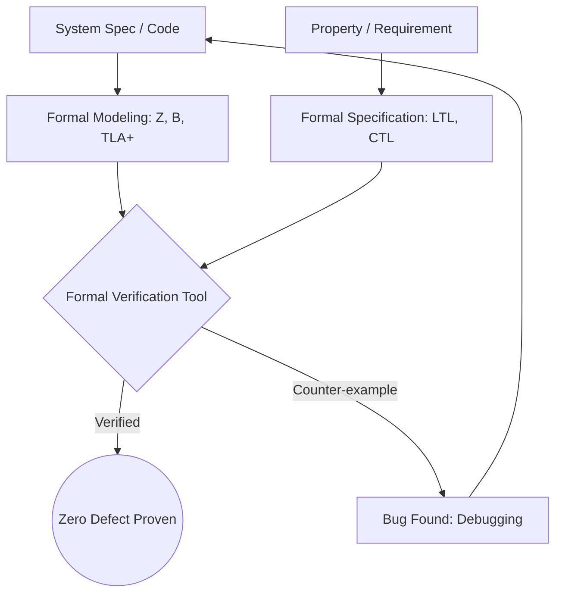

Parent: [[075.SW_테스트_일반]]

# 정형 검증(Formal Verification)

> [!info] **정형 검증이란?**
> 소프트웨어나 하드웨어 시스템의 명세와 구현이 일치함을 **수학적 논리**를 바탕으로 증명하는 기법입니다. 테스트가 특정 입력에 대한 결과를 확인한다면, 정형 검증은 모든 가능한 경우에 대해 시스템의 **무결성(Correctness)**을 보장하는 최고 수준의 검증 활동입니다.

---

## 1. 정형 검증의 개요
### 가. 정형 검증의 정의
- 시스템의 동작을 수학적 모델로 추상화하고, 논리적 추론을 통해 요구사항(속성)을 만족하는지 엄격하게 검증하는 방법

### 나. 필요성 및 배경 (Why)
1. **테스트의 한계 극복**: "테스팅은 결함이 있음을 보여줄 뿐, 없음을 증명할 수 없다"는 한계 극복
2. **미션 크리티컬 시스템**: 오작동 시 대규모 인명/재산 피해가 발생하는 원자력, 항공, 의료 시스템 필수
3. **보안 취약점 근절**: 암호화 알고리즘이나 보안 프로토콜의 논리적 허점을 완벽히 차단
4. **설계 오류 조기 발견**: 코딩 전 설계 명세 단계에서 논리적 모순을 수학적으로 식별

---

## 2. 정형 검증의 주요 기법 및 메커니즘 (What & How)
### 가. 정형 검증의 두 가지 핵심 접근법 (Comparison)

| 기법 | 상세 내용 | 특징 |
| :--- | :--- | :--- |
| **모델 체킹 (Model Checking)** | 시스템을 유한 상태 모델로 만들고 모든 상태를 전수 조사 | 자동화 용이, **상태 폭발(State Explosion)** 리스크 |
| **정리 증명 (Theorem Proving)** | 시스템과 속성을 수식으로 표현하고 수학적 귀납법 등으로 증명 | 무한 상태 대응 가능, 높은 수준의 수학적 숙련도 필요 |

### 나. 정형 검증 프로세스 (Mermaid)

---

## 3. 심화: 정형 기술의 분류 및 언어
### 가. 정형 명세 언어
- **Z-Notation**: 집합론과 술어 논리 기반의 명세 언어
- **VDM (Vienna Development Method)**: 모델 중심의 정형 방법론
- **TLA+**: 분산 시스템의 시간 논리 모델링에 특화 (AWS 등에서 사용)

### 나. 테스트 vs 정형 검증 비교

| 비교 항목 | 소프트웨어 테스트 (Testing) | 정형 검증 (Formal Verification) |
| :--- | :--- | :--- |
| **검증 방식** | 표본 실행 (Sampling) | 수학적 증명 (Mathematical Proof) |
| **결함 발견** | 발견 가능하나 부재 증명 불가 | **결함 부재(Absence of Defects) 증명 가능** |
| **복잡성/비용** | 보통 | 매우 높음 |
| **대상** | 구현된 코드 중심 | 설계 명세 및 알고리즘 중심 |

---

## 4. 기술사적 제언 및 실무 적용 방안
### 가. 실무 도입 시 고려사항 (Governance)
- **부분적 적용 (Selective Application)**: 전체 시스템에 적용하기엔 비용이 너무 크므로, 커널, 보안 프로토콜, 결제 로직 등 **Critical Core**에 집중 적용해야 함
- **숙련도 확보**: 정형 기술은 학습 곡선이 매우 높으므로 전문 도구 활용 교육 및 전문가 그룹 확보 필요

### 나. 기술사적 인사이트
- **현대적 적용 사례**: 아마존(AWS)은 클라우드 서비스의 동기화 알고리즘 검증에 **TLA+**를 사용하여 수조 건의 요청 중 발생할 수 있는 드문 레이스 컨디션을 사전에 제거함
- **자동화의 진화**: 최근에는 소스 코드를 자동으로 정형 모델로 변환하거나, SMT Solver를 활용한 자동 모델 체킹 기술이 발전하며 실무 적용 장벽이 낮아지고 있음
- 결론적으로 정형 검증은 **'품질의 우연성을 배제하고 수학적 필연성을 확보'**하는 가장 강력한 고신뢰 보장 기술임

---

## Related Notes
- [[075.SW_테스트_일반]]
- [[076.소프트웨어_테스트_7대_원리]]
- [[108.콘콜릭_테스트(Concolic_Testing)]]
- [[114.상태_전이_테스팅(State_Transition_Testing)]]
