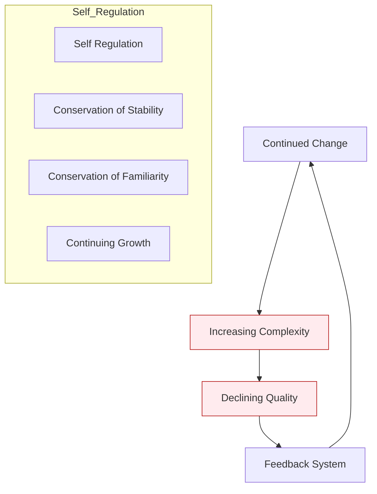

Parent: [[119.소프트웨어_유지보수(Software_Maintenance)]]

# 리먼(Lehman) 소프트웨어 변화 원리

> [!info] **리먼의 소프트웨어 변화 원리란?**
> 소프트웨어가 실세계(Real-world) 환경에서 사용됨에 따라 발생하는 지속적인 변경과 진화 과정을 설명하는 이론입니다. 벨 연구소의 리먼(M. Lehman)이 제시하였으며, 대규모 시스템의 **복잡성 증가**와 **품질 감소** 현상을 8가지 법칙으로 정립하였습니다.

---

## 1. 리먼의 소프트웨어 분류 (SPE 모델)
### 가. 시스템의 성격에 따른 분류
- 소프트웨어가 실세계와 맺는 관계에 따라 S, P, E 유형으로 구분됩니다.

| 유형 | 명칭 | 상세 설명 | 비고 |
| :--- | :--- | :--- | :--- |
| **S-type** | **Static** | 명확한 수학적 명세가 존재하며 변경이 거의 없는 시스템 | 정렬 알고리즘 등 |
| **P-type** | **Practical** | 현실의 문제를 휴리스틱하게 해결하며 환경 변화를 수반하는 시스템 | 체스 프로그램 등 |
| **E-type** | **Embedded** | 실세계 환경의 일부가 되어 **지속적으로 진화**해야 하는 시스템 | 대부분의 비즈니스 SW |

### 나. 진화의 필요성 (Why)
- **E-type 시스템**은 사용자 요구와 비즈니스 환경이 끊임없이 변하므로, 진화하지 않으면 가치를 상실(Old Software)하게 됩니다.

---

## 2. 리먼의 8가지 소프트웨어 진화 법칙 (What & How)
### 가. 소프트웨어 변화의 메커니즘 (Mermaid)

### 나. 8가지 법칙 상세 (계자조친 피지증감)

| 번호 | 법칙 명칭 | 핵심 내용 |
| :--- | :---: | :--- |
| **1** | **계속적 변경** | 소프트웨어는 사용 환경이 변함에 따라 끊임없이 변경되어야 함 |
| **2** | **자가 규제** | 소프트웨어 증가 추세는 통계적으로 예측 가능하며 자가 규제됨 |
| **3** | **조직적 안정화** | SW 생명주기 동안 개발 인력을 늘려도 생산성은 일정하게 유지됨 |
| **4** | **친근성 유지** | 소프트웨어의 복잡도가 증가해도 변화 속도는 일정 수준을 유지함 |
| **5** | **피드백 시스템** | 진화 과정은 다중 루프, 다중 계층의 피드백 시스템으로 구성됨 |
| **6** | **지속적 성장** | 소프트웨어의 기능(정보량)은 사용자 만족을 위해 계속 커져야 함 |
| **7** | **증가하는 복잡도** | 변경이 계속될수록 소프트웨어 구조의 복잡도는 증가함 (엔트로피 증가) |
| **8** | **감소하는 품질** | 적절한 유지보수나 리팩토링 없이는 품질이 점차 하락함 |

---

## 3. 심화: 기술 부채(Technical Debt)와 진화의 한계
### 가. 엔트로피(Entropy) 증가와 소프트웨어 노후화
- 리먼의 법칙 7번(복잡도 증가)과 8번(품질 감소)에 의해, 소프트웨어는 시간이 갈수록 수정이 어려워지는 **노후화(Software Aging)** 현상을 겪게 됩니다.

### 나. 진화 전략의 전환
- **Proactive Maintenance**: 복잡도가 임계치를 넘기 전, 주기적인 **리팩토링(Refactoring)**을 통해 구조를 개선해야 진화의 지속성을 확보할 수 있습니다.

---

## 4. 기술사적 제언 및 실무 적용 방안
### 가. 실무 적용 시 고려사항
1. **모니터링 체계**: 순환 복잡도(Cyclomatic Complexity) 등 지표를 통해 복잡도 증가 추세를 상시 모니터링해야 함
2. **기술 부채 관리**: 단기적 기능 추가보다 장기적 안정성을 고려한 아키텍처 설계(DIP, SoC 등)가 필수적임

### 나. 기술사적 인사이트
- **현대적 관점의 재해석**: 리먼의 법칙은 과거 폭포수 모델 중심이었으나, 오늘날의 **Agile/DevOps** 환경에서도 짧은 주기의 반복적 진화(Iteration)라는 형태로 그 원리가 여전히 유효함
- **클라우드 네이티브 진화**: MSA로의 전환은 '증가하는 복잡도'를 서비스 단위로 격리(Isolation)하여, 전체 시스템의 진화 능력을 유지하려는 리먼 법칙의 현대적 해법임
- 결론적으로 리먼의 법칙은 **'소프트웨어의 성장은 피할 수 없으며, 이를 관리하기 위한 공학적 노력이 동반되어야 한다'**는 진화론적 통찰을 제공함

---

## Related Notes
- [[119.소프트웨어_유지보수(Software_Maintenance)]]
- [[041.객체지향_설계_원칙(SOLID)]]
- [[009.Microservices_Architecture]]
