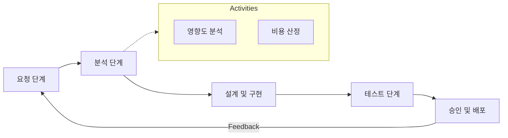

Parent: [[075.SW_테스트_일반]] (품질 보증 관점)

# 소프트웨어 유지보수(Software Maintenance)

> [!info] **소프트웨어 유지보수란?**
> 소프트웨어가 사용자에게 인도된 후, 발견된 **오류를 수정**하거나 **성능을 향상**시키고, 변화된 **환경에 적응**시키기 위해 수행하는 일련의 활동입니다. 소프트웨어 전체 생명주기 비용(TCO)의 70% 이상을 차지하는 가장 긴 단계입니다.

---

## 1. 소프트웨어 유지보수의 개요
### 가. 유지보수의 정의
- 배포 후 소프트웨어 제품의 수정 활동으로, **결함 제거**, **기능 개선**, **환경 전이**를 포괄하는 프로세스

### 나. 유지보수의 필요성 (Why)
1. **품질 신뢰성**: 운영 중 발견된 잠재적 결함(Residual Defects)을 제거하여 서비스 가용성 확보
2. **비즈니스 민첩성**: 비즈니스 요구사항 변화에 맞춰 기능을 지속적으로 확장 및 개선
3. **기술 환경 대응**: 하드웨어 업그레이드, OS/미들웨어 패치 등 이질적 환경에서의 호환성 유지
4. **소프트웨어 노후화 방지**: 리먼의 법칙에 따른 품질 감소 현상을 억제하고 수명 연장

---

## 2. 유지보수의 유형 및 프로세스 (What & How)
### 가. 유지보수 4대 유형 (수완예적)

| 유형 | 영문명 | 핵심 활동 내용 | 비고 |
| :--- | :--- | :--- | :--- |
| **수정 (Corrective)** | Corrective | 운영 중 발견된 물리적/논리적 오류 수정 (AS) | 결함 제거 |
| **완전 (Perfective)** | Perfective | 사용자의 신규 요구 반영, 성능 개선, 기능 고도화 | 가장 큰 비중 |
| **예방 (Preventive)** | Preventive | 잠재적 오류 예방을 위한 코드 리팩토링, 노후화 대응 | 유지보수성 향상 |
| **적응 (Adaptive)** | Adaptive | HW, OS, DB 등 외부 환경 변화에 따른 이식 및 변경 | 환경 전이 |

### 나. 표준 유지보수 프로세스 (Mermaid)

---

## 3. 심화: 유지보수 관리 지표 및 경제성
### 가. 유지보수 생산성 측정 지표
- **MTBF (Mean Time Between Failures)**: 장애 발생 평균 간격 (신뢰성 지표)
- **MTTR (Mean Time To Repair)**: 장애 복구 평균 시간 (유지보수성 지표)
- **SLA (Service Level Agreement)**: 서비스 수준 협약에 따른 목표 달성율

### 나. 유지보수 비용 산정 모델 (Belady & Lehman)
- $M = p + K^{c-d}$
- 유지보수 비용은 소프트웨어의 복잡도와 정형화된 프로세스 유무에 따라 지수적으로 증가함을 의미

---

## 4. 기술사적 제언 및 실무 적용 방안
### 가. 유지보수성(Maintainability) 향상 전략
1. **문서화 최신성 유지**: 코드와 문서 간의 **동기화(Synchronization)**가 깨지면 유지보수 비용이 폭증함
2. **표준 코딩 가이드 준수**: 가독성이 높은 코드는 MTTR을 획기적으로 줄이는 핵심 요소임

### 나. 기술사적 인사이트 및 향후 전망
- **SRE(Site Reliability Engineering)**: 단순 유지보수를 넘어 시스템의 신뢰성을 엔지니어링 관점에서 관리하는 구글식 운영 모델 도입 가속화
- **Refactoring & Re-engineering**: 리먼의 법칙에 의한 소프트웨어 부패를 막기 위해, 단순 수정을 넘어선 **재공학(Re-engineering)**적 접근이 주기적으로 필요함
- **AI-Ops 연계**: 로그 분석 및 결함 예측 AI를 활용하여 '수정 유지보수'에서 **'예측적 유지보수'**로 패러다임이 전환되고 있음
- 결론적으로 유지보수는 개발의 끝이 아니라 **'소프트웨어 가치 극대화를 위한 새로운 창조의 과정'**임

---

## Related Notes
- [[118.리먼(Lehman)_소프트웨어_변화_원리]]
- [[001.SRE(Site_Reliability_Engineering)]]
- [[007.형상관리(Configuration_Management)]]
- [[102.회귀_테스트(Regression_Test)]]
