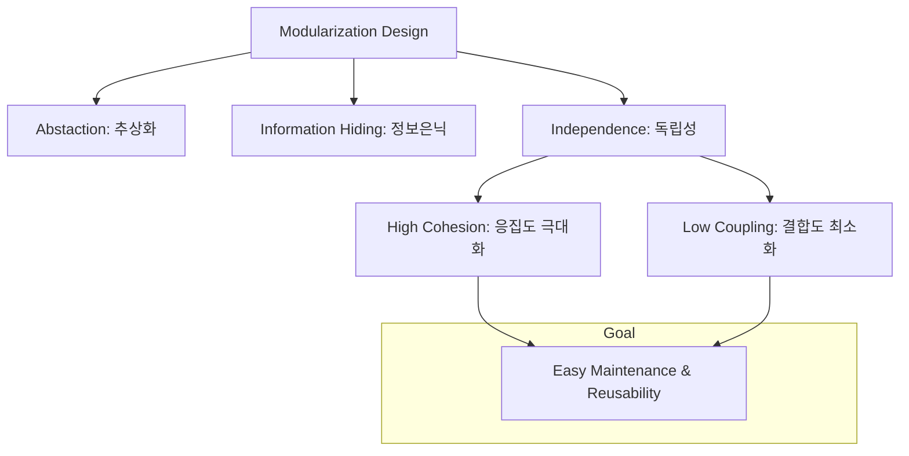

Parent: [[031.객체지향_개발방법론]]

# 모듈화(Modularization)

> [!info] **모듈화란?**
> 소프트웨어의 복잡도를 관리하기 위해 시스템을 독립적인 기능을 수행하는 단위인 **모듈(Module)**로 분해하고 추상화하는 설계 기법입니다. **관심사의 분리(SoC)**를 통해 유지보수성, 재사용성, 확장성을 극대화하는 것이 핵심 목적입니다.

---

## 1. 모듈화의 개요
### 가. 모듈화의 정의
- 프로그램을 기능별로 나누어 독립적으로 작성하고, 이들의 조합으로 전체 시스템을 구축하는 설계 및 구현 전략

### 나. 모듈화의 필요성 (Why)
1. **복잡도 감소 (Divide & Conquer)**: 거대 시스템을 이해 가능한 작은 단위로 분리하여 인지 부하 감소
2. **품질 향상**: 독립적인 테스트 및 검증이 용이해져 결함 격리 및 제거 가속화
3. **재사용성 증대**: 검증된 모듈을 타 프로젝트나 기능에서 중복 활용 가능 (Cost Reduction)
4. **병렬 개발**: 모듈 간 인터페이스가 명확할 경우 여러 개발자가 독립적으로 동시 개발 가능

---

## 2. 모듈화의 설계 원칙 및 핵심 메커니즘 (What & How)
### 가. 모듈화의 핵심 설계 원칙 (Mermaid)

### 나. 모듈 설계의 평가 지표: 응집도와 결합도

| 지표 | 정의 | 목표 방향 | 분류 (강함/높음 -> 약함/낮음) |
| :--- | :--- | :--- | :--- |
| **응집도 (Cohesion)** | 모듈 내부 요소들이 얼마나 밀접하게 관련되어 있는가 | **극대화 (Maximize)** | 기능 > 순차 > 통신 > 절차 > 시간 > 논리 > 우연 |
| **결합도 (Coupling)** | 모듈 간 상호 의존도가 얼마나 높은가 | **최소화 (Minimize)** | 자료 < 스탬프 < 제어 < 외부 < 공통 < 내용 |

---

## 3. 심화: 컴포넌트 설계 원칙 (Deep-dive)
- 모듈화를 넘어 바이너리 형태의 재사용 단위인 **컴포넌트(Component)** 수준에서의 설계 원칙입니다.

### 가. 컴포넌트 응집도 원칙 (Cohesion Principles)
- **REP (Release/Reuse Equivalency)**: 재사용 단위는 릴리스 단위와 같아야 함
- **CCP (Common Closure)**: 동일한 시점에 동일한 이유로 변경되는 클래스는 같은 컴포넌트로 묶어야 함 (SRP의 컴포넌트판)
- **CRP (Common Reuse)**: 컴포넌트 사용자가 필요하지 않은 것에 의존하도록 강제하지 말아야 함 (ISP의 컴포넌트판)

### 나. 컴포넌트 결합도 원칙 (Coupling Principles)
- **ADP (Acyclic Dependencies)**: 의존성 그래프에 순환(Cycle)이 있어서는 안 됨
- **SDP (Stable Dependencies)**: 안정된 방향으로 의존해야 함 (더 안정된 쪽에 의존)
- **SAP (Stable Abstractions)**: 안정성과 추상화 정도는 비례해야 함

---

## 4. 기술사적 제언 및 실무 적용 방안
### 가. 모듈화 적용 시 고려사항
1. **적정 크기(Granularity) 결정**: 모듈이 너무 작으면 인터페이스 오버헤드가 증가하고, 너무 크면 재사용성이 떨어지므로 비즈니스 로직의 완결성을 기준으로 설계해야 함
2. **인터페이스 표준화**: 모듈 간 통신은 철저히 공개된 인터페이스(API)를 통해서만 이루어지도록 강제하여 내부 구현 변경의 파급 효과를 차단해야 함

### 나. 기술사적 인사이트
- **MSA와의 관계**: 모듈화의 궁극적인 형태가 **마이크로서비스(MSA)**이며, 서비스 간의 '느슨한 결합'과 '높은 응집'을 달성하기 위해 **도메인 주도 설계(DDD)**의 바운디드 컨텍스트(Bounded Context) 개념을 적극 도입해야 함
- **기술 부채 방지**: 설계를 무시한 무분별한 참조는 '스파게티 코드'와 '강한 결합'을 야기하여 기술 부채로 이어지므로, **의존성 역전 원칙(DIP)**을 생활화하여 유연한 구조를 유지해야 함
- 결론적으로 모듈화는 **'변화에 유연하고 성장이 가능한 소프트웨어 아키텍처'**를 구축하는 가장 원자적인 실천 강령임

---

## Related Notes
- [[041.객체지향_설계_원칙(SOLID)]]
- [[010.도메인_주도_설계(DDD)]]
- [[009.Microservices_Architecture]]
- [[121.Fan-in_및_Fan-out]]
