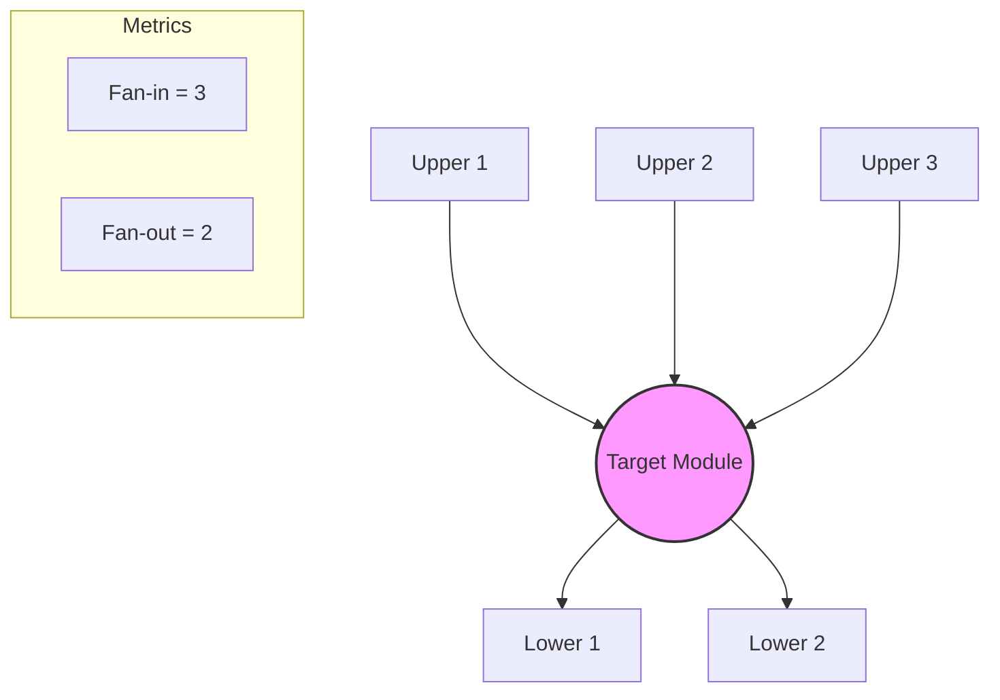

Parent: [[120.모듈화(Modularization)]]

# Fan-in 및 Fan-out

> [!info] **Fan-in 및 Fan-out이란?**
> 소프트웨어 구조 설계에서 모듈 간의 의존성 관계를 수치화한 지표입니다. **Fan-in**은 해당 모듈을 호출하는 상위 모듈의 수(들어오는 의존성)를, **Fan-out**은 해당 모듈이 호출하는 하위 모듈의 수(나가는 의존성)를 의미하며, 시스템의 **복잡도와 안정성**을 평가하는 척도로 사용됩니다.

---

## 1. Fan-in 및 Fan-out의 개요
### 가. 정의 및 측정 기준
- **Fan-in**: 특정 모듈로 유입되는 제어의 흐름. 해당 모듈을 재사용하는 상위 컴포넌트의 총합
- **Fan-out**: 특정 모듈에서 유출되는 제어의 흐름. 해당 모듈이 기능을 수행하기 위해 의존하는 하위 컴포넌트의 총합

### 나. 필요성 및 배경 (Why)
1. **복잡도 정량화**: 단순 직관이 아닌 수치를 통해 시스템의 구조적 취약점 식별
2. **유지보수성 평가**: 변경 발생 시 영향도(Impact)를 예측하고 리팩토링 대상 선별
3. **설계 최적화**: 재사용성이 높은 모듈(High Fan-in)과 로직이 복잡한 모듈(High Fan-out)을 구분하여 관리

---

## 2. Fan-in 및 Fan-out의 메커니즘과 설계 원칙 (What & How)
### 가. 지표 시각화 및 개념도 (Mermaid)

### 나. 설계 최적화 가이드라인

| 구분 | 설계 목표 | 기술사적 해석 |
| :--- | :---: | :--- |
| **Fan-in** | **높을수록 좋음** | 재사용성이 높음을 의미하나, 변경 시 영향 범위가 광범위하므로 철저한 검증(TDD) 필수 |
| **Fan-out** | **낮을수록 좋음** | 다른 모듈에 대한 의존성이 낮아 독립적이며, 테스트 및 이해가 쉬운 상태 유지 |

---

## 3. 심화: 구조적 복잡도 산정 (Henry & Selig 모델)
- Fan-in과 Fan-out을 활용하여 모듈의 실질적인 복잡도($C$)를 계산하는 수식입니다.

### 가. 복잡도 산식
$$Complexity(C) = Length \times (Fan\text{-}in \times Fan\text{-}out)^2$$
- **의미**: Fan-in과 Fan-out이 동시에 높으면 복잡도가 기하급수적으로 증가함. 즉, '중앙 집중형 오버로딩 모듈'이 시스템의 가장 위험한 지점임.

### 나. 관리 전략 비교

| 지표 상태 | 의미 | 관리 방안 |
| :--- | :--- | :--- |
| **High Fan-in** | 공통 모듈, 유틸리티, 라이브러리 | 인터페이스 불변성 유지, 회귀 테스트 강화 |
| **High Fan-out** | 오케스트레이터, 거대 제어 로직 | 하위 모듈 분해(Decomposition), 추상화 도입 |

---

## 4. 기술사적 제언 및 실무 적용 방안
### 가. 설계 리뷰 시 체크포인트
1. **Fan-in이 높은 모듈의 안정성**: 이 모듈은 시스템의 기초(Base)이므로 절대적으로 안정되어야 함. (Stable Dependencies Principle 연계)
2. **Fan-out이 급격히 높아지는 지점**: 특정 모듈이 너무 많은 일을 하고 있다는 신호이므로, **파사드(Facade)**나 **중재자(Mediator)** 패턴을 적용하여 복잡도를 위임해야 함

### 나. 기술사적 인사이트
- **클린 아키텍처의 의존성 규칙**: Fan-in과 Fan-out 지표는 소스 코드 의존성 방향을 검증하는 도구가 됨. 비즈니스 로직(Entity)은 높은 Fan-in을 가져야 하며, 외부 프레임워크는 Fan-out의 끝에 위치해야 함
- **자동화된 메트릭 도구 활용**: SonarQube, ArchUnit 등을 CI/CD 파이프라인에 통합하여, Fan-out 수치가 임계치를 넘을 경우 빌드를 차단하는 **Quality Gate** 운영이 필요함
- 결론적으로 Fan-in/out은 **'보이지 않는 소프트웨어의 무게'**를 측정하여 시스템의 무너짐을 방지하는 아키텍처 수호 지표임

---

## Related Notes
- [[120.모듈화(Modularization)]]
- [[041.객체지향_설계_원칙(SOLID)]]
- [[046.디자인_패턴(Design_Pattern)]]
- [[090.화이트박스_테스트(White-box_Testing)]]
