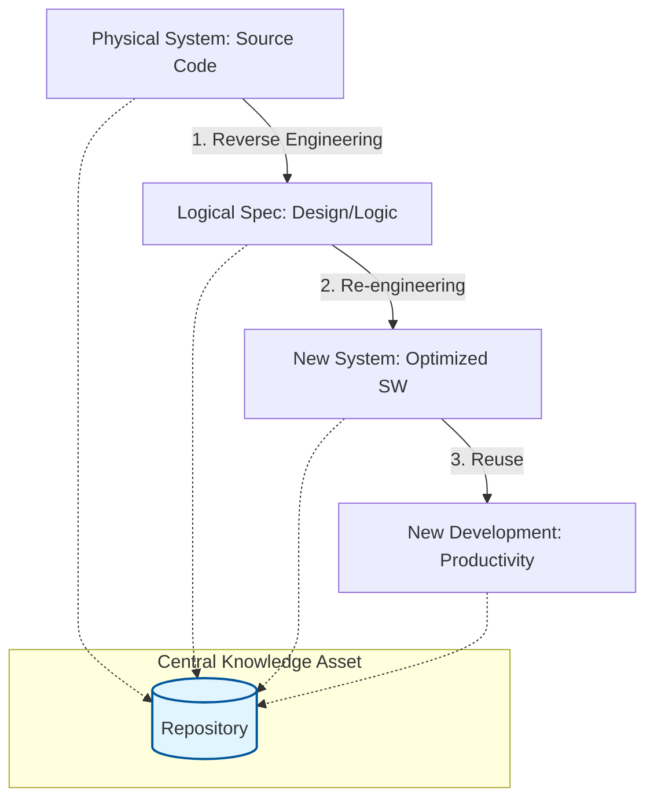

Parent: [[119.소프트웨어_유지보수(Software_Maintenance)]]

# 3R(Reverse, Re-engineering, Reuse)

> [!info] **3R이란?**
> 소프트웨어 위기를 극복하고 생산성을 극대화하기 위해 **레포지토리(Repository)**를 기반으로 **역공학(Reverse Engineering), 재공학(Re-engineering), 재사용(Reuse)** 기법을 유기적으로 결합하여 사용하는 공학적 접근법입니다.

---

## 1. 3R의 개요 및 배경
### 가. 3R의 정의
- 기존 소프트웨어 자산을 분석하여 논리적 정보를 추출하고(역공학), 이를 수정/보완하여(재공학), 새로운 시스템 개발에 활용(재사용)하는 일련의 자산 최적화 체계

### 나. 등장 배경 및 필요성 (Why)
1. **SW 위기 대응**: 소프트웨어 개발 비용의 70% 이상을 차지하는 유지보수 비용(TCO) 절감
2. **유지보수성 향상**: 노후화된 레거시 시스템의 구조를 개선하여 시스템 수명 연장
3. **생산성 극대화**: 이미 검증된 자산을 재활용하여 개발 기간 단축 및 품질 확보
4. **지식 자산화**: 개발 과정의 산출물을 레포지토리에 저장하여 조직의 지식 자산으로 관리

---

## 2. 3R의 구성 요소 및 아키텍처 (What & How)
### 가. 3R의 개념도 (Mermaid)

### 나. 3R 핵심 구성 요소 비교

| 구분 | 핵심 정의 | 주요 활동 | 지향점 |
| :--- | :--- | :--- | :--- |
| **역공학 (Reverse)** | **물리 -> 논리** 정보 추출 | 소스 코드 분석, 재문서화, 설계 복구 | 기존 시스템의 이해 |
| **재공학 (Re-Eng)** | **시스템 재설계 및 교체** | 재구조화, 재모듈화, 기능 수정 | 시스템의 가치 복원 |
| **재사용 (Reuse)** | **자산의 다회성 활용** | 컴포넌트 활용, 디자인 패턴, CBD | 개발 생산성 극대화 |

---

## 3. 심화: 레포지토리(Repository)의 역할
- **중심점 역할**: 3R의 모든 산출물(설계서, 소스코드, 데이터 구조)을 통합 관리하는 데이터베이스
- **일관성 보장**: 역공학을 통해 추출된 정보와 재공학된 정보 간의 정합성을 유지하여 **추적성(Traceability)** 확보 지원

---

## 4. 기술사적 제언 및 실무 적용 방안
### 가. 3R 도입 시 고려사항
1. **자동화 도구(CASE Tool) 활용**: 수작업에 의한 3R은 오류 가능성이 높고 비효율적이므로, 상용 스캐닝 및 리팩토링 도구 도입 필수
2. **데이터 거버넌스**: 레포지토리에 저장되는 자산의 품질을 관리하지 않으면 'Garbage In, Garbage Out' 현상이 발생하므로 엄격한 등록/갱신 절차 수립

### 나. 기술사적 인사이트
- **Legacy Modernization**: 최근 클라우드 전환(Cloud Transformation) 시 레거시 시스템을 MSA로 전환하는 과정에서 3R 기법은 **영향도 분석**과 **서비스 분리**의 핵심 방법론으로 재조명받고 있음
- **Open Source 에코시스템**: 현대의 재사용은 조직 내부를 넘어 오픈소스 생태계로 확장되었으며, 이에 따른 **오픈소스 거버넌스(OSS Governance)**와 3R의 결합이 중요해짐
- 결론적으로 3R은 **'과거의 유산(Legacy)을 미래의 자산(Asset)으로 변환'**하는 소프트웨어 경제학의 핵심 실천 전략임

---

## Related Notes
- [[123.역공학(Reverse_Engineering)]]
- [[124.재공학(Re-Engineering)]]
- [[125.재사용(Reuse)]]
- [[119.소프트웨어_유지보수(Software_Maintenance)]]
