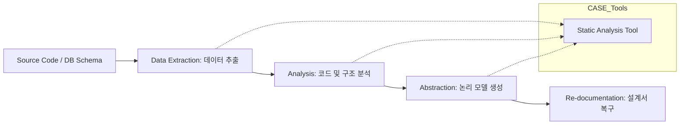

Parent: [[122.3R(Reverse_Reengineering_Reuse)]]

# 역공학(Reverse Engineering)

> [!info] **역공학이란?**
> 이미 완성된 소프트웨어 제품의 하위 단계(소스 코드, 바이너리)로부터 상위 단계(설계서, 요구사항)의 정보를 추출하는 과정입니다. **물리적 수준**의 정보를 **논리적 수준**의 정보로 변환하여 시스템의 이해도를 높이는 것이 핵심입니다.

---

## 1. 역공학의 개요
### 가. 역공학의 정의
- 대상 시스템을 분석하여 구성 요소와 그 관계를 식별하고, 시스템의 추상화된 표현을 생성하는 절차

### 나. 필요성 및 배경 (Why)
1. **문서 부재 해결**: 설계서가 유실되거나 최신화되지 않은 레거시 시스템의 동작 원리 파악
2. **유지보수성 향상**: 기존 코드의 복잡한 로직을 가시화하여 수정 및 확장 시 리스크 감소
3. **영향도 분석**: 코드 변경 시 타 모듈에 미치는 파급 효과(Ripple Effect)를 설계 수준에서 확인
4. **보안 및 취약점 분석**: 악성코드 분석이나 바이너리 레벨의 보안 구멍을 식별하기 위한 필수 기술

---

## 2. 역공학의 절차 및 유형 (What & How)
### 가. 역공학 프로세스 (Mermaid)

### 나. 역공학의 주요 유형 및 활동

| 유형 | 상세 내용 | 비고 |
| :--- | :--- | :--- |
| **논리 역공학** | 소스 코드로부터 제어 흐름, 알고리즘, 비즈니스 로직 추출 | 소스 -> 로직 |
| **자료 역공학** | DB 스키마, 파일 구조로부터 데이터 모델 및 관계 추출 | 물리DB -> ERD |
| **재문서화 (Redoc)** | 소스 코드 분석을 통해 최신화된 설계서 및 매뉴얼 자동 생성 | 문서 동기화 |
| **설계 복구** | 단순 로직을 넘어 시스템의 아키텍처 및 설계 의도 파악 | 고수준 추상화 |

---

## 3. 심화: 역공학의 법적/기술적 한계
### 가. 법적 고려사항
- 저작권법에 따라 역공학은 상호운용성 확보 등 정당한 사유가 있을 때만 허용되며, 무단 복제나 상업적 경쟁 목적으로 사용 시 법적 분쟁 리스크 존재

### 나. 기술적 한계: 난독화(Obfuscation)
- 보안을 위해 코드를 복잡하게 꼬아놓은 경우 역공학의 효율이 급격히 떨어지며, 이를 해독하기 위한 **역난독화(De-obfuscation)** 기술이 병행되어야 함

---

## 4. 기술사적 제언 및 실무 적용 방안
### 가. 실무 적용 시 유의사항
1. **도구의 한계 인정**: 자동화 도구로 추출된 정보는 원본 작성자의 '설계 의도'까지 100% 복구할 수 없으므로, 아키텍트의 분석 역량이 반드시 동반되어야 함
2. **지속적 역공학**: 개발 완료 후 일회성으로 수행하기보다, CI 파이프라인에 통합하여 상시적으로 최신 구조를 가시화해야 함

### 나. 기술사적 인사이트
- **Legacy Modernization의 시작**: 노후 시스템을 클라우드로 이전(Re-hosting/Re-platforming)하기 전, 역공학을 통해 서비스 간의 거대한 의존성을 파악하는 것이 실패 확률을 줄이는 지름길임
- **SBOM과 퍼징 연계**: 최근에는 보안 관점에서 퍼즈 테스트(Fuzzing)를 수행하기 전, 역공학을 통해 취약할 가능성이 높은 경로를 먼저 식별하여 테스트의 정밀도를 높이는 추세임
- 결론적으로 역공학은 **'보이지 않는 블랙박스 시스템을 화이트박스로 전환'**하여 기술 거버넌스를 확보하는 핵심 수단임

---

## Related Notes
- [[122.3R(Reverse_Reengineering_Reuse)]]
- [[124.재공학(Re-Engineering)]]
- [[107.퍼즈_테스트(Fuzz_Testing)]]
- [[007.형상관리(Configuration_Management)]]
