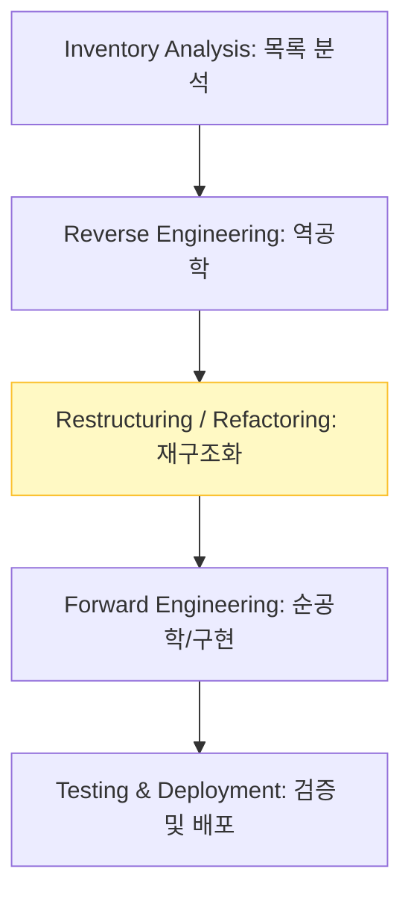

Parent: [[122.3R(Reverse_Reengineering_Reuse)]]

# 재공학(Re-Engineering)

> [!info] **재공학이란?**
> 현재 운영 중인 소프트웨어를 대상으로 새로운 기능을 추가하거나 기존 로직을 수정하여 **유지보수성, 성능, 확장성**을 향상시키기 위해 시스템을 재구조화(Restructuring)하고 개선하는 활동입니다.

---

## 1. 재공학의 개요
### 가. 재공학의 정의
- 기존 소프트웨어의 핵심 로직과 가치를 유지하면서, 최신 기술 환경에 맞게 내부 구조를 변경하거나 플랫폼을 전이시키는 공학적 행위

### 나. 필요성 및 장점 (Why)
1. **유지보수 비용(TCO) 절감**: 스파게티 코드를 정돈하여 향후 변경 발생 시 투입되는 리소스 최소화
2. **수명 연장 (Anti-Aging)**: 리먼의 법칙에 의한 소프트웨어 부패를 방지하고 시스템의 가치를 지속적으로 보존
3. **리스크 감소**: 완전히 새로운 시스템을 구축(Scratch 개발)하는 것보다 검증된 로직을 재활용하므로 개발 리스크 낮음
4. **최신 기술 적용**: 모놀리식 구조를 마이크로서비스(MSA)로 전환하거나, 클라우드 네이티브 환경에 맞게 최적화

---

## 2. 재공학의 절차 및 핵심 기술 (What & How)
### 가. 재공학 수행 단계 (Mermaid)

### 나. 재공학의 주요 기법

| 기법 | 상세 내용 | 특징 |
| :--- | :--- | :--- |
| **재구조화 (Restructuring)** | 기능 변경 없이 내부 로직의 순서나 제어 흐름을 개선 | 코드 품질 향상 |
| **재모듈화 (Remodularization)** | 거대 모듈을 독립적인 작은 단위로 재분할 | 응집도 향상, 결합도 저하 |
| **리팩토링 (Refactoring)** | 외부 행위는 유지하면서 코드의 가독성과 구조를 정돈 | 클린 코드 지향 |
| **재플랫폼화 (Re-platforming)** | 운영 체제나 DB, 클라우드 환경으로 시스템을 이전 | 환경 적응성 확보 |

---

## 3. 심화: 재공학 vs 신규 개발(Re-development) 비교
### 가. 경제성 및 리스크 분석

| 비교 항목 | 재공학 (Re-Engineering) | 신규 개발 (Re-development) |
| :--- | :--- | :--- |
| **주요 목적** | 기존 자산의 점진적 개선 | 시스템의 완전한 교체 |
| **구축 비용** | 상대적으로 저렴 | 매우 높음 |
| **개발 기간** | 단기/중기 | 장기 |
| **데이터 리스크** | 낮음 (기존 데이터 유지) | 높음 (데이터 이관 및 정제 필요) |
| **기술적 부채** | 일부 잔존 가능 | 제로 베이스에서 시작 |

---

## 4. 기술사적 제언 및 실무 적용 방안
### 가. 재공학 성공을 위한 전략
1. **비즈니스 로직 보존**: 재공학 과정에서 가장 중요한 것은 기존의 검증된 업무 규칙(Business Rule)이 훼손되지 않도록 하는 것이며, 이를 위해 **회귀 테스트 자동화**가 선행되어야 함
2. **점진적 전환 (Strangler Fig Pattern)**: 거대 시스템을 한꺼번에 재공학하기보다, 핵심 모듈부터 차례대로 전환하여 서비스 중단 리스크를 최소화해야 함

### 나. 기술사적 인사이트
- **기술 부채의 상환**: 재공학은 그동안 쌓아온 기술적 부채를 상환하는 '투자' 행위임. ROI 분석 시 단순 개발비가 아닌 **'운영 단계의 운영 절감액'**을 포함하여 타당성을 입증해야 함
- **MSA 전환의 교두보**: 현대적인 재공학은 단순 코드 수정을 넘어 시스템 아키텍처를 MSA로 변환하는 과정을 포함하며, 이는 조직의 **Agility**를 결정짓는 중대한 전환점이 됨
- 결론적으로 재공학은 **'과거의 가치를 미래의 경쟁력으로 승화시키는 소프트웨어 재생 전략'**임

---

## Related Notes
- [[122.3R(Reverse_Reengineering_Reuse)]]
- [[123.역공학(Reverse_Engineering)]]
- [[102.회귀_테스트(Regression_Test)]]
- [[009.Microservices_Architecture]]
