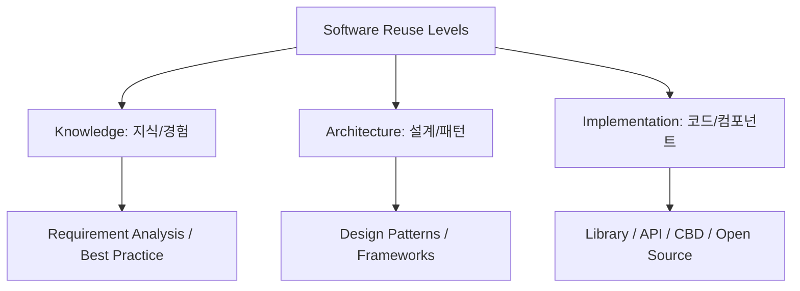

Parent: [[122.3R(Reverse_Reengineering_Reuse)]]

# 재사용(Reuse)

> [!info] **재사용이란?**
> 이미 개발되어 검증된 소프트웨어 자산(요구사항, 설계서, 코드, 테스트 케이스 등)을 새로운 소프트웨어 개발에 다시 활용하는 활동입니다. 개발 시간 단축, 비용 절감, 품질 향상을 동시에 달성하는 소프트웨어 공학의 핵심 가치입니다.

---

## 1. 재사용의 개요
### 가. 재사용의 정의
- 개발 지식이나 결과물을 표준화하여 저장하고, 필요 시 검색 및 조립을 통해 새로운 시스템을 구축하는 일련의 행위

### 나. 재사용의 필요속성 및 기대효과 (Why)
1. **신뢰성 (Reliability)**: 이미 운영 환경에서 검증된 자산을 사용하므로 오류 발생 가능성 감소
2. **생산성 (Productivity)**: 무에서 유를 창조하는 'Wheel Reinvention' 방지를 통한 개발 가속화
3. **유지보수성 (Maintainability)**: 표준화된 자산 사용으로 전체 시스템의 일관성 확보 및 관리 용이
4. **비용 절감 (Cost Efficiency)**: 중복 개발을 제거하여 인건비 및 인프라 비용 최적화

---

## 2. 재사용의 기법 및 메커니즘 (What & How)
### 가. 재사용의 계층적 수준 (Mermaid)

### 나. 재사용 구현 핵심 기법

| 기법 | 상세 내용 | 특징 |
| :--- | :--- | :--- |
| **디자인 패턴** | 공통적으로 발생하는 문제에 대한 검증된 설계 솔루션 | 개발자 간 의사소통 효율화 |
| **프레임워크** | 특정 기능 수행을 위한 기본 구조와 라이브러리의 집합 | **제어의 역전(IoC)** 특징 |
| **CBD (Component Based)** | 독립적인 기능을 수행하는 바이너리 단위(컴포넌트) 조립 | 부품화된 소프트웨어 개발 |
| **SOA / MSA** | 서비스 단위의 재사용 및 네트워크 기반 호출 | 비즈니스 민첩성 극대화 |

---

## 3. 심화: 재사용의 두 가지 관점 (Approach)
### 가. 합성 중심 (Composition-based)
- 작은 부품(컴포넌트)들을 조립하여 전체 시스템을 구축하는 방식 (Building Block 접근법)

### 나. 생성 중심 (Generation-based)
- 추상화된 명세를 입력하면 자동화된 도구가 소스 코드를 생성하는 방식 (MDA, Low-code 기법 등)

---

## 4. 기술사적 제언 및 실무 적용 방안
### 가. 재사용 활성화를 위한 장애요인 및 대응
1. **NIH (Not Invented Here) 증후군**: 타인이 만든 것을 신뢰하지 않는 문화를 타파하고, **조직 차원의 인센티브** 제공 필요
2. **자산 관리의 어려움**: 자산이 어디에 있는지 모르면 재사용이 불가하므로, 고도화된 **검색 및 카탈로그 시스템(Repository)** 구축 필수

### 나. 기술사적 인사이트
- **재사용의 경제학**: 재사용을 위한 자산을 만드는 비용(Development for Reuse)은 일반 개발보다 2~3배 높으므로, **재사용 횟수가 손익분기점(BEP)**을 넘는지 철저히 분석해야 함
- **클라우드와 오픈소스**: 이제 재사용의 범위는 내부 자산을 넘어 **Serverless Function(AWS Lambda)**이나 글로벌 **Open Source** 라이브러리 활용으로 확장되었으며, 이에 따른 **공급망 보안(Supply Chain Security)**이 핵심 경쟁력이 됨
- 결론적으로 재사용은 **'기술적 행위를 넘어 품질과 속도를 지배하는 조직의 성숙도'**를 의미함

---

## Related Notes
- [[122.3R(Reverse_Reengineering_Reuse)]]
- [[032.CBD_방법론]]
- [[046.디자인_패턴(Design_Pattern)]]
- [[058.오픈소스_소프트웨어(OSS)]]
