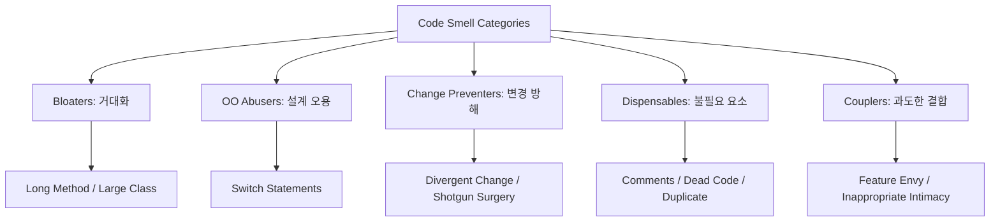

Parent: [[127.소프트웨어_리팩토링(Refactoring)]]

# 코드 스멜(Code Smell)

> [!info] **코드 스멜이란?**
> 소스 코드 내에서 이해하기 어렵고, 수정이 힘들며, 확장이 어려운 구조적 결함을 의미합니다. 컴파일 에러나 실행 오류는 아니지만, 향후 버그의 원인이 되거나 유지보수 비용을 폭증시키는 **리팩토링(Refactoring)**의 필요성을 알리는 전조 현상입니다.

---

## 1. 코드 스멜의 개요
### 가. 코드 스멜의 정의
- 프로그램의 기능은 정상이나, 설계 원칙 위배로 인해 품질 저하가 우려되는 **기술 부채(Technical Debt)**의 가시적 징후

### 나. 필요성 및 배경 (Why)
1. **기술 부채 가시화**: 보이지 않는 설계의 결함을 식별하여 조기에 해결할 수 있는 기준 제공
2. **유지보수성 향상**: 가독성을 해치고 변경을 어렵게 하는 요인을 제거하여 생산성 유지
3. **결함 예방**: 복잡도가 높은 코드에서 발생할 수 있는 잠재적 논리 오류를 사전에 차단
4. **리팩토링 트리거**: "언제 리팩토링을 해야 하는가?"에 대한 실무적 가이드라인 역할

---

## 2. 주요 코드 스멜 유형 및 특징 (What & How)
### 가. 코드 스멜의 분류 체계 (Mermaid)

### 나. 핵심 코드 스멜 상세 (중거메파 변기데주 확산)

| 유형 | 상세 설명 | 리팩토링 기법 (Mapping) |
| :--- | :--- | :--- |
| **Divergent Change** | **확산적 변경**: 하나의 클래스가 다양한 이유로 자주 변경됨 | Extract Class (클래스 분리) |
| **Shotgun Surgery** | **산탄총 수술**: 하나의 변경을 위해 여러 클래스를 수정해야 함 | Move Method/Field (기능 이동) |
| **Feature Envy** | **기능에 대한 욕심**: 타 클래스의 데이터를 과도하게 참조함 | Move Method |
| **Data Clumps** | **데이터 덩어리**: 항상 함께 몰려다니는 데이터 집합 | Extract Class / Introduce Parameter Object |
| **Bloaters** | 긴 메소드, 거대 클래스, 긴 파라미터 리스트 | Extract Method / Replace Temp with Query |

---

## 3. 심화: 변경 방해 요소의 대조 분석
### 가. 확산적 변경(Divergent Change) vs 산탄총 수술(Shotgun Surgery)

| 비교 항목 | 확산적 변경 (Divergent Change) | 산탄총 수술 (Shotgun Surgery) |
| :--- | :--- | :--- |
| **관계** | 1:N (클래스 1 : 변경 이유 N) | N:1 (클래스 N : 변경 이유 1) |
| **원인** | **낮은 응집도 (Low Cohesion)** | **높은 결합도 (High Coupling)** |
| **증상** | 클래스 내부에 너무 많은 책임이 존재 | 비즈니스 로직이 여러 곳에 파편화됨 |
| **해결책** | 클래스 분리 (Extract Class) | 기능 통합 및 이동 (Move Method) |

---

## 4. 기술사적 제언 및 실무 적용 방안
### 가. 코드 스멜 관리 전략 (Governance)
1. **정적 분석 도구 활용**: SonarQube, Checkstyle 등 자동화 도구를 CI/CD에 통합하여 코드 스멜 임계치(Threshold) 관리
2. **보이스카우트 규칙**: 캠핑장을 처음보다 더 깨끗하게 유지하듯, 코드 수정 시 주변의 코드 스멜을 하나씩 제거하는 문화 정착

### 나. 기술사적 인사이트
- **주석(Comments)의 재해석**: 주석은 코드를 설명하는 친절함의 상징이 아니라, **'코드의 가독성이 낮음'**을 증명하는 강력한 스멜임. 주석이 필요한 로직은 **Rename Method**나 **Extract Method**를 통해 코드 자체로 설명되도록 해야 함
- **추측성 일반화(Speculative Generality)**: "나중에 필요할 거야"라는 생각으로 만든 인터페이스나 추상 클래스는 불필요한 복잡도만 높이므로 과감히 삭제(Delete)해야 함
- 결론적으로 코드 스멜은 **'소프트웨어 부패를 알리는 경고음'**이며, 이를 인지하고 즉시 대응하는 능력이 시니어 엔지니어의 핵심 역량임

---

## Related Notes
- [[127.소프트웨어_리팩토링(Refactoring)]]
- [[041.객체지향_설계_원칙(SOLID)]]
- [[120.모듈화(Modularization)]]
- [[118.리먼(Lehman)_소프트웨어_변화_원리]]
