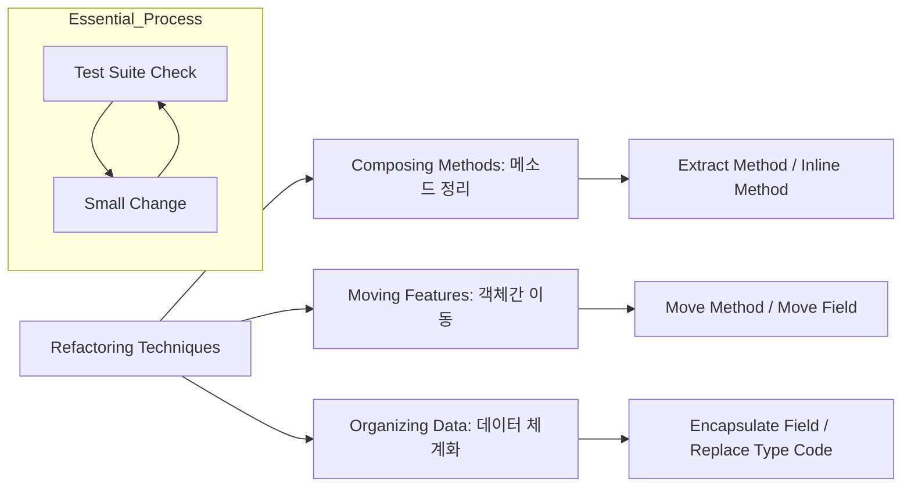

Parent: [[126.코드_스멜(Code_Smell)]]

# 소프트웨어 리팩토링(Refactoring)

> [!info] **리팩토링이란?**
> 소프트웨어의 **외부적 기능(Behavior)은 유지**한 채, 내부 구조를 변경하여 **이해하기 쉽고 수정이 용이**하도록 개선하는 기법입니다. 설계의 질을 높여 소프트웨어 부패를 방지하고 향후 개발 생산성을 보장하는 핵심 품질 활동입니다.

---

## 1. 리팩토링의 개요
### 가. 리팩토링의 정의
- 겉으로 드러나는 동작의 변화 없이, 내부 코드를 정돈하여 **가독성**, **유지보수성**, **확장성**을 향상시키는 공학적 행위

### 나. 필요성 및 목적 (Why)
1. **디자인 개선**: 누적된 변경으로 인해 엉망이 된 프로그램의 설계를 지속적으로 정화
2. **생산성 유지**: 코드가 명확해짐에 따라 버그 수정 및 기능 추가에 드는 시간 단축
3. **버그 발견**: 코드를 깊이 있게 검토하는 과정에서 숨겨진 논리 오류 식별 용이
4. **소프트웨어 노후화 방지**: 리먼의 법칙에 의한 복잡도 증가를 억제하고 시스템 수명 연장

---

## 2. 리팩토링의 핵심 기법 및 메커니즘 (What & How)
### 가. 리팩토링의 3대 핵심 기법 (Mermaid)

### 나. 상세 기법 분류 (MEPPI: 이동, 분리, 일반화, 통합)

| 관점 | 주요 기법 | 상세 내용 |
| :--- | :--- | :--- |
| **이동 (Move)** | Move Method / Field | 책임이 적절한 클래스로 기능과 데이터를 이동하여 결합도 낮춤 |
| **분리 (Extract)** | Extract Class / Method | 거대 요소를 작은 단위로 쪼개어 응집도 향상 |
| **일반화 (Generalize)** | Pull Up Method / Field | 중복된 기능을 상위 클래스로 올려 코드 중복 제거 |
| **전문화 (Specialize)** | Push Down Method / Field | 특정 하위 클래스에만 필요한 기능을 아래로 내림 |
| **통합 (Inline)** | Inline Class / Method | 과도하게 쪼개진 요소를 하나로 합쳐 복잡도 감소 |

---

## 3. 심화: 리팩토링의 경제성 및 절차
### 가. 리팩토링 적용 시점: 삼진 규칙 (Rule of Three)
- 처음에는 그냥 하고, 두 번째 유사한 일을 할 때 중복을 의심하며, **세 번째 중복**이 발생하면 반드시 리팩토링을 수행함

### 나. 리팩토링 vs 재공학 vs 재구조화 비교

| 비교 항목 | 리팩토링 (Refactoring) | 재구조화 (Restructuring) | 재공학 (Re-engineering) |
| :--- | :--- | :--- | :--- |
| **수행 단계** | 구현/유지보수 (Micro) | 유지보수 (Macro) | 폐기 직전/전환 (System) |
| **기능 변화** | **절대 없음** | 거의 없음 | 기능 추가/변경 포함 가능 |
| **주요 활동** | 코드 가독성 및 구조 개선 | 제어 흐름 개선, 로직 정돈 | 역공학을 통한 시스템 전면 개편 |

---

## 4. 기술사적 제언 및 실무 적용 방안
### 가. 안전한 리팩토링을 위한 전제 조건
1. **테스트 자동화**: 리팩토링 전후의 기능 동일성을 보장하기 위해 **단위 테스트(Unit Test)** 커버리지가 충분히 확보되어야 함
2. **작은 단계의 반복**: 한꺼번에 많은 것을 바꾸지 말고, 컴파일이 가능한 작은 단위로 나누어 수행함으로써 리스크 최소화

### 나. 기술사적 인사이트
- **TDD와의 시너지**: TDD의 'Red-Green-Refactor' 루프에서 보듯, 리팩토링은 개발 프로세스의 일부로 내재화되어야 함. 별도의 '리팩토링 기간'을 갖는 것은 이미 기술 부채가 임계치를 넘었음을 의미함
- **Clean Code 거버넌스**: 단순히 코드를 예쁘게 만드는 것이 아니라, **SOLID 원칙**을 준수하는 설계로 진화시키는 과정임. 이는 개발자의 숙련도를 나타내는 척도가 됨
- 결론적으로 리팩토링은 **'미래의 변경 비용을 현재의 노력으로 지불'**하여 시스템의 지속 가능한 성장을 도모하는 전략적 투자임

---

## Related Notes
- [[126.코드_스멜(Code_Smell)]]
- [[041.객체지향_설계_원칙(SOLID)]]
- [[054.테스트_주도_개발(TDD)]]
- [[124.재공학(Re-Engineering)]]
