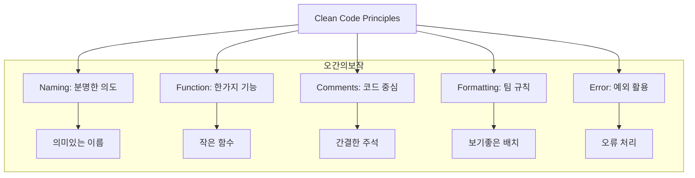

Parent: [[127.소프트웨어_리팩토링(Refactoring)]]

# 클린 코드(Clean Code)

> [!info] **클린 코드란?**
> 작성자의 의도와 목적이 명확하여 가독성이 높고, 중복이 없으며, 한 가지 작업(Single Responsibility)만 수행하여 타인에 의한 변경이 용이한 코드를 의미합니다. 소프트웨어의 **지속 가능성**과 **유지보수 생산성**을 결정짓는 핵심 척도입니다.

---

## 1. 클린 코드의 개요
### 가. 클린 코드의 정의
- 단순한 기능 구현을 넘어, 코드를 읽는 사람(Human)을 배려하여 **추상화 수준**이 적절하고 **결합도**가 낮은 고품질의 소스 코드

### 나. 필요성 및 배경 (Why)
1. **유지보수 비용(TCO) 절감**: 개발 시간의 80% 이상이 기존 코드를 읽고 분석하는 데 소요되므로 가독성 확보가 필수적임
2. **기술 부채(Technical Debt) 방지**: '빨리 가기 위해' 작성된 나쁜 코드는 결국 프로젝트의 발목을 잡는 부채로 작용함
3. **전문가적 책임**: 소프트웨어 장인정신(Software Craftsmanship)의 기초이며 팀 협업의 신뢰 기반
4. **소프트웨어 수명 연장**: 부패하기 쉬운 소프트웨어의 엔트로피 증가를 억제하여 시스템 가치를 보존

---

## 2. 클린 코드 작성을 위한 5대 원칙 및 방법 (What & How)
### 가. 클린 코드 작성의 핵심 메커니즘 (Mermaid)

### 나. 분야별 상세 작성 가이드라인

| 분류 | 상세 지침 (Best Practice) | 핵심 포인트 |
| :--- | :--- | :--- |
| **이름 (Naming)** | 분명한 작성 의도, 일관성 있는 클래스/함수명, 문맥에 맞는 단어 선정 | **그릇된 정보(False Lead)** 배제 |
| **함수 (Function)** | 작게 쪼개기, **단일 책임(SRP)**, 인수(Parameter) 최소화, 사이드 이펙트 제거 | 한 가지만 수행할 것 |
| **주석 (Comment)** | 주석 없이도 이해되는 코드 지향, 명쾌한 의도 파악이 안 될 때만 최소화 | **코드의 실패**를 변명하지 말 것 |
| **형식 (Format)** | 팀 내 표준 규칙 준수, 신문 기사처럼 고수준에서 저수준으로 배치 | 세로/가로 형식의 일관성 |
| **오류 (Error)** | **Null 반환 금지**, 예외(Exception) 사용, 오류 처리와 비즈니스 로직 분리 | 안정적인 흐름 확보 |

---

## 3. 심화: 소프트웨어 노후화 징후 및 대응
### 가. 소프트웨어 노후화(Aging) 지표 (오문의높아)
- **오염 (Pollution)**: 깨진 유리창 법칙처럼 나쁜 코드가 주변을 오염시킴
- **문서 부족 (Lack of Documentation)**: 코드 자체로 설명되지 않고 문서도 유실된 상태
- **의미 없는 이름 (Obscure Naming)**: 변수나 함수명이 역할을 대변하지 못함
- **높은 결합도 (High Coupling)**: 한 곳을 고치면 사방에서 에러가 발생하는 경직성
- **아키텍처 침식 (Erosion)**: 초기 설계 원칙이 무너지고 임기응변식 코드가 난무함

### 나. 나쁜 코드 vs 클린 코드 대조

| 비교 항목 | 나쁜 코드 (Bad Code / Smell) | 클린 코드 (Clean Code) |
| :--- | :--- | :--- |
| **가독성** | 작성자 본인만 이해 가능 | 누구나 한눈에 의도 파악 가능 |
| **중복성** | Copy & Paste 기반 중복 다수 | **DRY (Don't Repeat Yourself)** 실천 |
| **변경성** | 수정 시 Side Effect 예측 불가 | 단위 테스트 기반 안전한 변경 가능 |
| **비용** | 시간이 갈수록 기하급수적 증가 | 일정 수준에서 유지보수 비용 수렴 |

---

## 4. 기술사적 제언 및 실무 적용 방안
### 가. 클린 코드 정착을 위한 거버넌스
1. **코드 리뷰(Peer Review)의 생활화**: 클린 코드는 주관적일 수 있으므로, 팀 내 지속적인 리뷰를 통해 '좋은 코드'에 대한 합의된 기준을 마련해야 함
2. **정적 분석 도구의 강제**: SonarQube 등 자동화 도구를 빌드 파이프라인에 통합하여 기술 부채 점수를 관리해야 함

### 나. 기술사적 인사이트
- **TDD와의 연계**: 클린 코드를 만드는 가장 확실한 방법은 **TDD(Test Driven Development)**임. 테스트 가능한 코드를 짜다 보면 자연스럽게 함수가 작아지고 응집도가 높아짐
- **보이스카우트 규칙**: "캠핑장은 처음 왔을 때보다 더 깨끗하게 해놓고 떠나라"는 원칙을 적용하여, 코드 수정 시 주변의 '노후화 징후'를 하나씩 제거하는 점진적 개선이 중요함
- 결론적으로 클린 코드는 **'소프트웨어의 부패 속도를 늦추고 비즈니스의 민첩성을 확보하는 가장 강력한 무기'**임

---

## Related Notes
- [[126.코드_스멜(Code_Smell)]]
- [[127.소프트웨어_리팩토링(Refactoring)]]
- [[041.객체지향_설계_원칙(SOLID)]]
- [[054.테스트_주도_개발(TDD)]]
