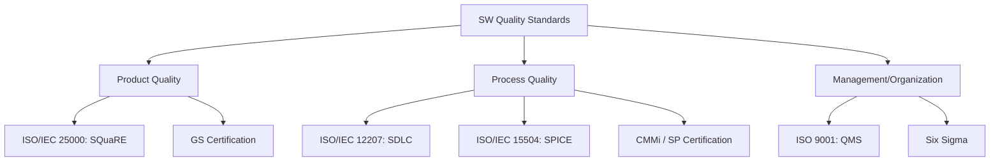

Parent: [[075.SW_테스트_일반]]

# 소프트웨어 품질 표준

> [!info] **소프트웨어 품질 표준이란?**
> 소프트웨어 제품(Product) 및 프로세스(Process)가 갖추어야 할 명확한 특성을 정의하고, 이를 객관적으로 평가하기 위한 기준 항목의 집합입니다. 품질 목표 달성을 통해 사용자 만족도를 높이고 유지보수 비용을 최적화하는 기준점이 됩니다.

---

## 1. 소프트웨어 품질의 개요 및 목표
### 가. 품질의 정의
- 명시되거나 묵시적인 요구사항을 만족시키는 소프트웨어의 전체적인 특성 및 기능의 총합

### 나. 소프트웨어 품질의 3대 목표 (McCall 모델 기반)
1. **운영 (Product Operation)**: 정확성, 신뢰성, 효율성, 무결성, 사용성
2. **변경 (Product Revision)**: 유지보수 용이성, 유연성, 테스트 용이성
3. **전환 (Product Transition)**: 이식성, 재사용성, 상호운용성

---

## 2. 소프트웨어 품질 표준의 체계 (What & How)
### 가. 품질 표준 분류도 (Mermaid)

### 나. 주요 품질 표준 및 인증 제도

| 구분 | 표준명 | 핵심 내용 |
| :--- | :--- | :--- |
| **제품 품질** | **ISO 25010** | SW 제품의 8대 품질 특성 및 부특성 정의 |
| **프로세스** | **CMMi / SP** | 조직의 SW 개발 공정 성숙도 평가 및 인증 |
| **인증제도** | **GS 인증** | 국산 SW의 품질을 종합적으로 평가하여 등급 부여 |
| **인증제도** | **SP 인증** | SW 기업의 프로세스 품질 역량 수준 인증 |

---

## 3. 심화: 소프트웨어 품질 확인 및 검증 (V&V)
### 가. 확인(Validation) 및 검증(Verification) 기법
- **정적 기법 (Static)**: 코드를 실행하지 않고 인스펙션(Inspection), 워크스루(Walkthrough), 동료 검토(Peer Review) 수행
- **동적 기법 (Dynamic)**: 프로그램을 실행하여 명세기반, 구조기반, 경험기반 테스트 수행

### 나. 품질 측정 도구의 분류
- **정적 분석 도구**: 코드 복잡도(Cyclomatic), 메트릭 분석, 코딩 스타일 체크 (SonarQube 등)
- **동적 분석 도구**: 메모리 모니터, 브레이크포인트(Breakpoint)를 통한 실행 흐름 분석

---

## 4. 기술사적 제언 및 실무 적용 방안
### 가. 품질 거버넌스 수립 전략
1. **소프트웨어 진흥법 준수**: 공공 소프트웨어 사업 시 품질인증 제품(GS) 우선구매 및 품질 관리 기준을 엄격히 적용해야 함
2. **품질 비용(CoQ) 최적화**: 예방 비용(Prevention Cost)을 높여 실패 비용(Failure Cost)을 줄이는 **Shift-Left** 전략이 필수적임

### 나. 기술사적 인사이트
- **품질의 정량화**: "품질이 좋다"는 주관적 판단을 배제하고, **ISO 25000** 기반의 **Metrics**를 수립하여 수치로 관리하는 데이터 기반 QA 체계가 핵심임
- **현대적 품질 대응**: AI, 클라우드 등 신기술 도입 시에는 기존 품질 모델에 **안전성(Safety)**과 **윤리성(Ethics)** 지표를 추가한 확장된 품질 모델(ISO 25010:2023 등) 적용이 요구됨
- 결론적으로 품질 표준은 **'기술적 부채를 상시 상환하고 고객의 신뢰를 유지'**하기 위한 조직의 최소한의 약속임

---

## Related Notes
- [[130.ISO_25000(SQuaRE)]]
- [[131.ISO_IEC_25010]]
- [[075.SW_테스트_일반]]
- [[082.SW_테스트_유형]]
