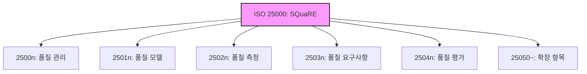

Parent: [[129.소프트웨어_품질_표준]]

# ISO 25000(SQuaRE)

> [!info] **ISO 25000(SQuaRE)이란?**
> 소프트웨어 제품의 품질 요구사항 정의와 품질 평가를 위한 국제 표준입니다. 기존의 ISO 9126(품질 모델)과 ISO 14598(품질 평가)을 통합 및 보완하여 **SQuaRE(Software Quality Requirements and Evaluation)**라는 명칭으로 체계화되었습니다.

---

## 1. ISO 25000의 개요
### 가. ISO 25000의 정의
- 소프트웨어 제품의 품질을 측정하고 평가하기 위한 모델, 측정 기법, 요구사항 및 평가 방안을 통합한 프레임워크 표준

### 나. 등장 배경 및 필요성 (Why)
1. **표준 통합**: 파편화된 품질 관련 표준들을 일관성 있게 통합하여 사용자의 혼선 방지
2. **요구사항 강화**: 단순 평가를 넘어 개발 초기 단계의 **품질 요구사항(Part 3)** 정의 강조
3. **전 생명주기 품질 관리**: 분석, 설계, 구현, 평가 전 과정에 걸친 품질 거버넌스 제공
4. **객관적 지표**: 정량적 메트릭(Metrics)을 통해 제품 간 품질 비교의 객관성 확보

---

## 2. ISO 25000의 구성 체계 (What & How)
### 가. SQuaRE 구성도 (Mermaid)

### 나. 5개 주요 분야별 세부 내용 (요모관측평)

| 분야 | 표준 번호 | 주요 내용 | 핵심 역할 |
| :--- | :--- | :--- | :--- |
| **품질 관리** | **2500n** | 용어 정의, 모델 가이드라인, 관리 계획 | 공통 아키텍처 및 관리 |
| **품질 모델** | **2501n** | 내/외부 품질, 사용 품질 모델 정의 | **품질 특성** 정의 (ISO 25010) |
| **품질 측정** | **2502n** | 품질 측정을 위한 수학적 메트릭 및 가이드 | 정량적 수치화 |
| **품질 요구사항** | **2503n** | 이해관계자의 품질 요구사항 도출 및 정의 | 품질 목표 설정 |
| **품질 평가** | **2504n** | 평가 프로세스, 평가자 및 개발자 가이드 | 최종 합격 여부 판정 |

---

## 3. 심화: ISO 25000의 진화 및 특징
### 가. ISO 9126 대비 주요 변경 사항
- **통합성**: 측정(2502n)과 평가(2504n)를 분리하여 더 정밀한 프로세스 제공
- **확장성**: 데이터 품질(ISO 25012) 등 데이터 중심의 품질 표준 추가 수용
- **사용자 중심**: 사용 품질(Quality in Use)의 중요성을 강화하여 실질적 만족도 측정

### 나. 품질 요구사항(2503n)의 중요성
- 개발 완료 후 '평가'만 하는 것이 아니라, 요구분석 단계에서 품질 목표를 **수치화된 요구사항**으로 명시하여 **Build-in Quality** 실현

---

## 4. 기술사적 제언 및 실무 적용 방안
### 가. 실무 도입 시 고려사항
1. **Metrics 선정**: 모든 지표를 측정하는 것은 불가능하므로, 비즈니스 목표에 부합하는 핵심 성과 지표(KPI)를 **2502n**에서 선별하여 적용해야 함
2. **도구 자동화**: 수동 측정의 한계를 극복하기 위해 정적/동적 분석 도구를 활용하여 실시간 품질 대시보드 구축 필요

### 나. 기술사적 인사이트
- **GS 인증과의 연계**: 국내 GS 인증의 평가 기준이 바로 **ISO 25000**임. 따라서 공공 사업 참여 기업은 이 표준을 내재화하여 설계 단계부터 대응하는 것이 전략적임
- **데이터 품질의 시대**: 최근 AI 모델의 성능은 데이터 품질에 의존하므로, SQuaRE의 확장판인 **ISO 25012**를 참고하여 데이터 거버넌스 체계를 병행 구축해야 함
- 결론적으로 ISO 25000은 **'좋은 소프트웨어를 만들기 위한 공학적 설계도'**이며, 조직의 품질 역량을 증명하는 글로벌 공용어임

---

## Related Notes
- [[129.소프트웨어_품질_표준]]
- [[131.ISO_IEC_25010]]
- [[055.요구공학(Requirements_Engineering)]]
