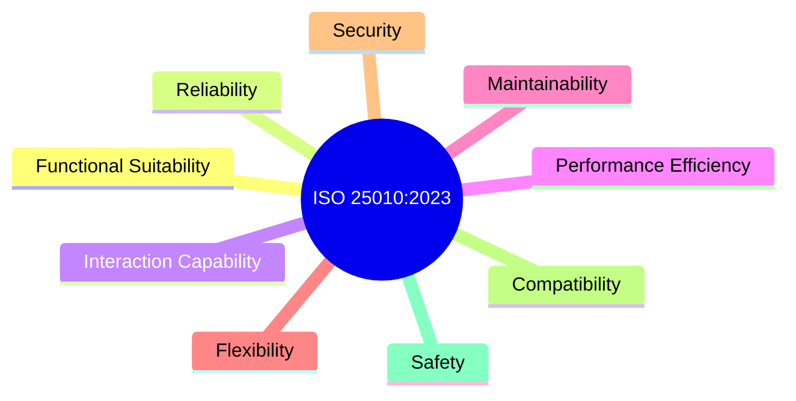

Parent: [[130.ISO_25000(SQuaRE)]]

# ISO/IEC 25010

> [!info] **ISO/IEC 25010이란?**
> 소프트웨어 제품의 품질을 평가하기 위한 **품질 특성(Characteristics)**과 세부 품질 속성(Sub-characteristics)을 정의한 국제 표준입니다. ISO 9126을 계승하여 SQuaRE 시리즈의 핵심인 품질 모델(2501n) 분야를 담당하며, 최근 **ISO/IEC 25010:2023**으로 개정되었습니다.

---

## 1. ISO/IEC 25010의 개요
### 가. ISO/IEC 25010의 정의
- 소프트웨어 제품 및 시스템의 품질을 이해관계자가 합의할 수 있도록 **8대 품질 특성**과 그에 따른 세부 지표를 정의한 모델

### 나. 필요성 및 배경 (Why)
1. **공통 언어 제공**: 개발자, 고객, 테스터 간의 모호한 품질 요구사항을 표준화된 용어로 정의
2. **평가 기준 수립**: 성능, 보안, 사용성 등 비기능적 요구사항의 구체적인 평가 메트릭 제공
3. **결함 예방**: 설계 단계부터 각 품질 속성을 고려하여 아키텍처의 견고성 확보
4. **최신 트렌드 반영**: 2023년 개정을 통해 **안전성(Safety)**과 **유연성(Flexibility)** 강화

---

## 2. ISO/IEC 25010:2023 품질 모델 (What & How)
### 가. 9대 품질 특성 체계도 (Mermaid)

### 나. 9대 품질 특성 상세 내용 (기신상효유연보호안)

| 주요 특성 | 상세 속성 (Sub-characteristics) | 핵심 설명 |
| :--- | :--- | :--- |
| **기능적합성** | 기능 완전성, 정확성, 적절성 | 요구된 기능을 얼마나 정확하고 완전하게 수행하는가 |
| **신뢰성** | 성숙성, 가용성, 결함허용성, 복구 가능성 | 일정한 조건에서 성능 수준을 유지할 수 있는가 |
| **상호작용능력** | 적절 인지성, 학습성, 운용성, 오류방지성 | 사용자가 시스템을 얼마나 쉽고 효율적으로 사용하는가 |
| **성능 효율성** | 시간 반응성, 자원 효율성, 용량성 | 자원 소모 대비 처리 속도와 용량이 적절한가 |
| **유지보수성** | 모듈성, 재사용성, 분석성, 수정성, 시험성 | 제품 수정 및 개선이 얼마나 용이한가 |
| **유연성** | 적응성, 확장성, 설치성, 대체성 | 변화하는 환경에 얼마나 민감하게 대응하는가 |
| **보안성** | 기밀성, 무결성, 부인방지, 책임성, 인증성 | 정보 및 데이터를 불법적인 접근으로부터 보호하는가 |
| **호환성** | 공존성, 상호운용성 | 타 시스템과 정보를 교환하거나 환경을 공유하는가 |
| **안전성 (New)** | 위험 식별, 실패 안전, 위험 경고, 안전 통합 | 운영 제약 내에서 위험을 최소화하고 사고를 예방하는가 |

---

## 3. 심화: 제품 품질(Product) vs 사용 품질(In Use)
### 가. 품질 모델의 이원화
- **제품 품질 모델**: 소프트웨어 자체의 정적인 구조와 동적인 기능을 측정 (위 9대 특성)
- **사용 품질 모델 (ISO 25019 이관)**: 실제 환경에서 사용자가 느끼는 가치 측정 (**효생안만**: 효과성, 생산성, 안전성, 만족도)

### 나. ISO 9126 대비 주요 변화
- '사용성'이 '상호작용 능력'으로, '이식성'이 '유연성'의 일부로 재편됨
- **보안성**과 **호환성**이 독립적인 주특성으로 격상되어 중요도 강조

---

## 4. 기술사적 제언 및 실무 적용 방안
### 가. 실무 적용 시 고려사항 (Tailoring)
- 프로젝트 성격에 따라 중요 품질 특성이 달라짐. 예: 뱅킹 시스템은 **보안성/신뢰성**, 게임은 **상호작용/성능**, 자율주행은 **안전성**에 가중치 부여 필요

### 나. 기술사적 인사이트
- **Architecture-Quality Alignment**: 품질 특성은 아키텍처 결정(Architecture Decision)의 근거가 됨. 예를 들어, 높은 **유지보수성**을 위해 MSA 아키텍처를 선택하는 식의 논리적 연결이 필요함
- **Safety by Design**: 2023년 표준에 추가된 **Safety(안전성)**는 AI 및 로보틱스 분야에서 필수 항목임. 설계 단계부터 **Fail-safe** 메커니즘을 반영하여 표준을 준수해야 함
- 결론적으로 ISO 2510은 **'소프트웨어 가치를 정량적으로 증명하는 품질 명세서'**이며, 기술사는 이를 비즈니스 목표와 정렬시키는 전략가여야 함

---

## Related Notes
- [[130.ISO_25000(SQuaRE)]]
- [[129.소프트웨어_품질_표준]]
- [[062.소프트웨어_아키텍처(Software_Architecture)]]
- [[068.품질_속성_시나리오]]
