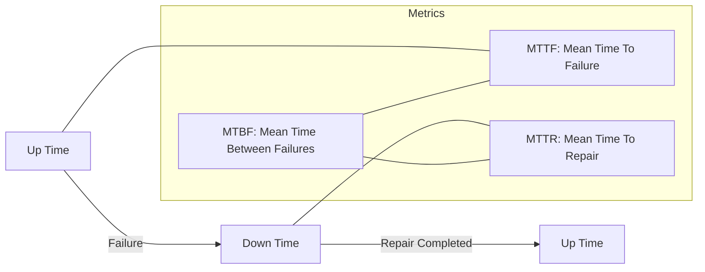

Parent: [[131.ISO_IEC_25010]]

# 소프트웨어 신뢰성과 가용성

> [!info] **신뢰성과 가용성이란?**
> **신뢰성(Reliability)**은 지정된 환경에서 일정 기간 동안 고장 없이 서비스를 제공할 확률이며, **가용성(Availability)**은 어느 시점에서나 서비스를 즉시 이용할 수 있는 상태에 있을 확률을 의미합니다. 현대 시스템에서는 이 둘을 결합하여 고신뢰/고가용 시스템(High Availability)을 구축하는 것이 핵심입니다.

---

## 1. 신뢰성과 가용성의 개요
### 가. 신뢰성(Reliability)과 가용성(Availability)의 정의
- **신뢰성**: 고장 간격이 얼마나 긴가(How long?)에 집중. 결함 없는 소프트웨어 지향
- **가용성**: 필요할 때 서비스가 제공되는가(When?)에 집중. 빠른 복구와 무중단 서비스 지향

### 나. 필요성 및 배경 (Why)
1. **비즈니스 연속성(BCP)**: 금융, 전자상거래 등 서비스 중단이 직접적인 금전적 손실로 이어지는 환경
2. **미션 크리티컬 시스템**: 자율주행, 의료, 국방 등 오작동이나 중단이 생명과 직결되는 분야
3. **사용자 경험(UX)**: 상시 연결된(Always-on) 환경에서 시스템 지연 및 중단에 대한 사용자 인내심 감소

---

## 2. 신뢰성 및 가용성 측정 지표와 메커니즘 (What & How)
### 가. 가용성 측정 타임라인 (Mermaid)

### 나. 핵심 측정 지표 및 산식

| 지표 | 상세 내용 | 산식 |
| :--- | :--- | :--- |
| **MTTF** | 시스템이 고장 나기 전까지 가동된 평균 시간 | $\sum(Up\ Time) / Count$ |
| **MTTR** | 고장 발생 후 복구까지 걸린 평균 시간 | $\sum(Down\ Time) / Count$ |
| **MTBF** | 고장과 다음 고장 사이의 평균 시간 | $MTTF + MTTR$ |
| **가용도(A)** | 전체 시간 중 가동 중인 시간의 비율 | $\frac{MTTF}{MTTF+MTTR} \times 100$ |

---

## 3. 심화: 가용성 확보 방안 및 수준 (Nine-scale)
### 가. 가용성 향상 4대 전략
1. **결함 탐지**: Ping & Echo, Heartbeat, Exception Handling 등을 통한 실시간 상태 감시
2. **결함 복구**: Active/Passive 다중화, Redundancy, Spare 구성, Voting(투표) 메커니즘
3. **재가동(Restart)**: Checkpoint/Rollback, State Re-Sync, Shadow Operation 적용
4. **결함 방지**: Transaction 관리, Process Monitor, 모듈 독립성 강화(SoC)

### 나. 가용성 수준 (The Nines)

| 등급 | 가용도 (%) | 연간 장애 허용 시간 | 비고 |
| :--- | :--- | :--- | :--- |
| **Three Nines** | 99.9% | 약 8.76 시간 | 일반 서버 |
| **Four Nines** | 99.99% | 약 52.6 분 | 엔터프라이즈 |
| **Five Nines** | **99.999%** | **약 5.26 분** | **고가용성(HA) 목표** |

---

## 4. 기술사적 제언 및 실무 적용 방안
### 가. 신뢰성 향상을 위한 개발 문화
- **Coding Rule 강제**: 정적 분석 도구와 연계하여 잠재적 오류를 코딩 단계에서 제거
- **TDD 및 커버리지 관리**: 단위 테스트를 강화하고 MC/DC 등 정밀 커버리지를 측정하여 로직 무결성 확보

### 나. 기술사적 인사이트
- **SRE 관점의 가용성**: "장애는 피할 수 없다"는 전제하에 **에러 예산(Error Budget)**을 수립하고, 장애 복구 시간(MTTR)을 획기적으로 줄이는 자동화된 **SRE 운영 모델**이 필수적임
- **클라우드 복원력(Resilience)**: 단일 장비의 신뢰성보다 **Chaos Engineering** 등을 통해 분산 환경에서의 자가 치유(Self-healing) 능력을 검증하는 것이 현대 시스템의 핵심임
- 결론적으로 가용성은 **'기술적 장치(What)'**와 **'운영 프로세스(How)'**가 결합되었을 때 비로소 달성되는 신뢰의 결과물임

---

## Related Notes
- [[095.성능_테스트(Performance_Testing)]]
- [[001.SRE(Site_Reliability_Engineering)]]
- [[116.카오스_테스트(Chaos_Test)]]
- [[012.서킷_브레이커(Circuit_Breaker)]]
