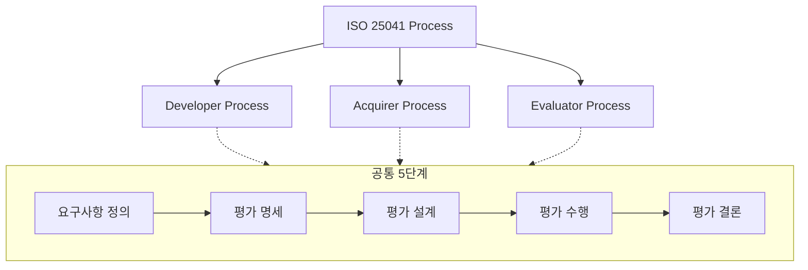

Parent: [[130.ISO_25000(SQuaRE)]]

# ISO/IEC 25041 (구 ISO 14598)

> [!info] **ISO/IEC 25041이란?**
> 소프트웨어 제품 평가를 수행하기 위한 **절차, 기본 상황 및 평가 프로세스**에 대한 국제 표준입니다. ISO 25010에서 정의한 품질 모델을 사용하여, 개발자, 획득자, 평가자 각각의 관점에서 소프트웨어를 어떻게 평가해야 하는지에 대한 상세 가이드라인을 제공합니다.

---

## 1. ISO/IEC 25041의 개요
### 가. ISO 25041의 정의
- 소프트웨어 품질 모델(ISO 25010)을 실질적으로 적용하기 위한 평가 프로세스 표준 (SQuaRE 시리즈의 Part 4 영역)

### 나. 필요성 및 배경 (Why)
1. **평가 객관성**: 평가 주체별로 상이할 수 있는 평가 방식을 표준화하여 투명성과 신뢰성 확보
2. **품질 보증**: 제품 출시 전 국제 표준에 근거한 엄격한 평가를 통해 결함 유출 방지
3. **구매 의사결정**: 획득자(구매자)가 제품의 적합성을 객관적으로 판단할 수 있는 기준 제공
4. **프로세스 체계화**: 요구사항 분석부터 결과 보고까지의 일관된 평가 워크플로우 정립

---

## 2. ISO/IEC 25041의 평가 프로세스 모델 (What & How)
### 가. 평가 주체별 프로세스 구성 (Mermaid)

### 나. 주체별 평가 프로세스 상세

| 구분 | 주요 목적 | 활동 특징 |
| :--- | :--- | :--- |
| **개발자 프로세스** | 자체 품질 목표 달성 검증 | 개발 생명주기 내에서 수시 평가 및 피드백 |
| **획득자(구매자) 프로세스** | 요구사항 충족 및 구매 결정 | 상용 SW(COTS)의 도입 적정성 및 성능 비교 평가 |
| **평가자(제3자) 프로세스** | 독립적인 품질 인증 및 검증 | 전문 시험기관(TTA 등)에서 공인된 메트릭으로 평가 |

---

## 3. 심화: 품질 평가의 핵심 메커니즘
### 가. 평가 명세 및 설계 (Specification & Design)
- **메트릭(Metrics) 선정**: ISO 2502n에서 정의된 측정 항목 중 프로젝트 성격에 맞는 지표 선별
- **평가 등급 정의**: 등급별 가중치를 설정하고, 합격/불합격의 임계치(Threshold) 결정

### 나. ISO 14598에서 ISO 25041로의 변화
- **통합성**: SQuaRE(ISO 25000) 시리즈의 한 파트로 편입되면서 요구사항(2503n) 및 모델(2501n)과의 연계성 강화
- **최신 기술 반영**: 클라우드, 오픈소스 등 현대적 SW 환경에 맞는 평가 시나리오 수용

---

## 4. 기술사적 제언 및 실무 적용 방안
### 가. 실무 도입 시 고려사항
1. **평가 모듈(Evaluation Module) 구축**: 반복되는 평가를 효율화하기 위해 도구, 메트릭, 절차를 패키지화하여 자산화해야 함
2. **이해관계자 협의**: 평가 결과에 대한 분쟁을 막기 위해 평가 설계 단계에서 합격 기준에 대한 사전 합의가 필수적임

### 나. 기술사적 인사이트
- **V&V와의 정렬**: 본 표준은 검증(Verification)과 확인(Validation)을 실질적으로 구현하는 도구이며, 특히 제3자 평가를 통해 **품질의 객관적 증빙**을 확보하는 것이 공공 사업 및 해외 진출의 핵심임
- **SBOM 기반 평가**: 최근에는 코드 품질뿐만 아니라 구성 요소의 보안성을 평가하기 위해 **SBOM(Software Bill of Materials)** 분석을 평가 프로세스에 통합하는 추세임
- 결론적으로 ISO 25041은 **'품질이라는 추상적 가치를 숫자로 증명'**하여 비즈니스의 신뢰를 담보하는 강력한 거버넌스 표준임

---

## Related Notes
- [[130.ISO_25000(SQuaRE)]]
- [[131.ISO_IEC_25010]]
- [[134.ISO_IEC_25051(RUSP_품질_요구사항_및_시험)]]
