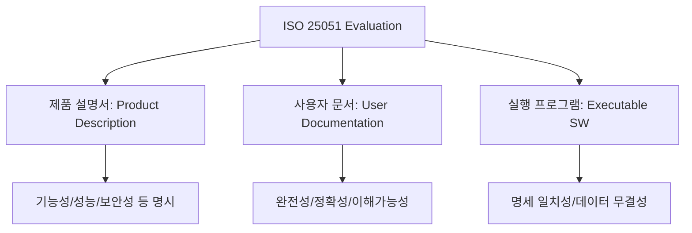

Parent: [[130.ISO_25000(SQuaRE)]]

# ISO/IEC 25051 (구 ISO 12119)

> [!info] **ISO/IEC 25051이란?**
> 기성 소프트웨어 제품인 **RUSP(Ready-to-Use Software Product, 패키지 SW)**의 품질 요구사항과 이를 검증하기 위한 시험 절차를 규정한 국제 표준입니다. 국내 **GS(Good Software) 인증**의 직접적인 근거가 되는 핵심 표준입니다.

---

## 1. ISO/IEC 25051의 개요
### 가. ISO 25051의 정의
- 불특정 다수에게 판매되는 상용 패키지 소프트웨어의 품질을 보장하기 위해 제품 설명서, 사용자 문서, 실행 프로그램에 대한 요구사항 및 시험 지침을 제공하는 표준

### 나. 필요성 및 배경 (Why)
1. **제품 신뢰도 향상**: 패키지 SW의 특성상 구매 전 품질 확인이 어려우므로 표준화된 인증을 통해 소비자 신뢰 확보
2. **GS 인증의 근간**: 국산 SW의 품질 등급을 부여하는 GS 인증 평가의 기준 항목으로 활용
3. **유통 활성화**: 객관적인 품질 지표를 제공하여 SW 시장의 공정 거래 및 선택 기준 마련
4. **글로벌 호환성**: 해외 패키지 SW와의 품질 비교 및 수출 경쟁력 확보

---

## 2. ISO/IEC 25051의 평가 대상 및 절차 (What & How)
### 가. 품질 평가의 3대 대상 (Mermaid)

### 나. 주요 평가 대상별 품질 기준

| 평가 대상 | 핵심 품질 항목 | 설명 |
| :--- | :--- | :--- |
| **제품 설명서** | 식별성, 기능적합성, 신뢰성 등 | 제품이 제공하는 가치를 명확히 기술했는가 |
| **사용자 문서** | 완전성, 정확성, 일관성, 가독성 | 사용자가 문서를 보고 시스템을 운영할 수 있는가 |
| **실행 프로그램** | 기능, 성능, 보안, 이식성 등 | 실제 동작이 설명서 및 요구사항과 일치하는가 |

---

## 3. 심화: ISO 25051 기반의 시험 절차
### 가. 시험 단계 (구패요시-51)
1. **제품 설명서 시험**: 명시된 기능의 적절성 및 과장 광고 여부 확인
2. **사용자 문서 시험**: 설치 및 운영 매뉴얼의 정확성 검증
3. **실행 프로그램 시험**: 실제 환경에서의 기능 작동 및 성능 측정
4. **시험 기록 및 보고서 작성**: 발견된 결함과 개선 권고 사항 도출

### 나. ISO 12119에서 ISO 25051로의 변화
- **명칭 변경**: 기존의 '패키지 소프트웨어'에서 '사용 준비 완료된 소프트웨어(RUSP)'로 용어 구체화
- **ISO 25010 연계**: SQuaRE 통합 모델에 따라 품질 특성을 8대 특성으로 재편하여 일관성 유지

---

## 4. 기술사적 제언 및 실무 적용 방안
### 가. GS 인증 획득 전략
- **문서와 실제품의 정합성**: 실행 프로그램이 아무리 훌륭해도 제품 설명서나 사용자 문서와 내용이 다르면 감점 요인이 됨. **RTM(요구사항 추적표)**을 활용한 일치성 관리가 필수적임
- **비기능적 요소 강화**: 국내 SW는 기능성은 우수하나 **성능 효율성**과 **보안성** 문서화가 미흡한 경우가 많으므로 이 분야의 정량적 메트릭 확보 필요

### 나. 기술사적 인사이트
- **마켓플레이스 품질 거버넌스**: SaaS나 앱스토어와 같은 현대적 SW 유통 환경에서 ISO 25051은 플랫폼 운영자가 입점 제품의 품질을 필터링하는 **Quality Gate** 역할을 수행할 수 있음
- **Open Source 패키지 검증**: 오픈소스를 패키지화하여 재배포하는 경우에도 본 표준을 적용하여 공급망 리스크를 관리하는 '디지털 신뢰' 구축이 필요함
- 결론적으로 ISO 25051은 **'사용자가 즉시 믿고 쓸 수 있는 소프트웨어'**임을 증명하는 품질 라이선스임

---

## Related Notes
- [[129.소프트웨어_품질_표준]]
- [[130.ISO_25000(SQuaRE)]]
- [[133.ISO_IEC_25041]]
- [[057.요구사항_명세서(SRS)_및_IEEE830]]
